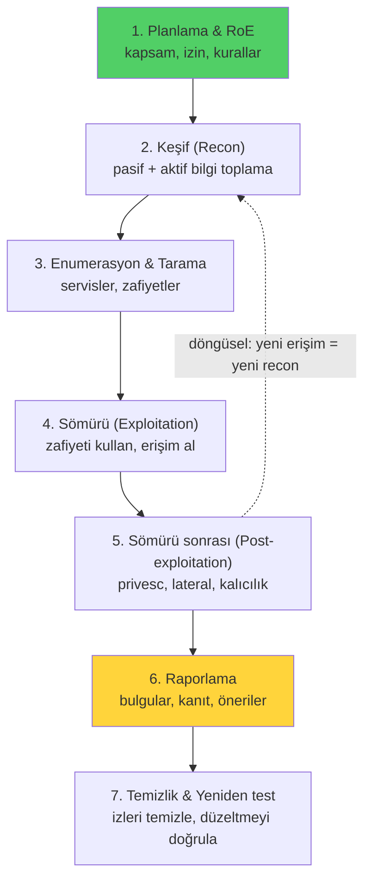

# 🎯 Pentest Metodolojisi ve Rules of Engagement

Sızma testi (penetration testing), bir sistemin güvenliğini **saldırganı taklit ederek, ama izinli ve yapılandırılmış şekilde** test etmektir. Bu dosya, bir pentest'in yasal/etik çerçevesini (rules of engagement) ve standart yaşam döngüsünü kurar. **Bu, sonraki tüm saldırgan-taraflı dosyaların ön koşuludur** — teknikler ancak yetki çerçevesinde meşrudur.

> Devamı: [kesif-enumerasyon.md](kesif-enumerasyon.md), [somuru-ve-sonrasi.md](somuru-ve-sonrasi.md).

---

## 1. ⚖️ Önce yetki: Rules of Engagement (RoE)

> **Mutlak kural:** Bir sistemi izin olmadan test etmek — tarama dahil — birçok ülkede (Türkiye'de TCK 243-245, ABD'de CFAA) **suçtur**. "Öğreniyordum" bir savunma değildir. Tüm bu modüldeki teknikler yalnızca (a) kendine ait sistemlerde, (b) yazılı izinli hedeflerde, veya (c) kasıtlı açık laboratuvarlarda (TryHackMe, HackTheBox, kendi VM'in) uygulanır.

**Rules of Engagement (RoE)**, bir pentest'in kurallarını yazılı olarak belirleyen anlaşmadır. İş başlamadan önce netleşmesi gerekenler:

| Öğe | Soru |
|-----|------|
| **Kapsam (scope)** | Hangi IP/alan adı/uygulama test edilecek? Hangileri **kapsam dışı**? |
| **Zamanlama** | Ne zaman? (iş saatleri içi/dışı — DoS riski) |
| **İzin verilen teknikler** | Sosyal mühendislik dahil mi? DoS testi yapılacak mı? |
| **İletişim** | Kritik bulgu anında kimi ararsın? "Acil durdur" prosedürü? |
| **Yetki mektubu** | "Get out of jail" — testi yetkilendiren yazılı imza |
| **Veri işleme** | Ele geçirilen hassas veri nasıl saklanır/imha edilir? |

> **Kapsam disiplini yaşamsaldır:** Yanlışlıkla kapsam dışı bir sisteme (ör. paylaşımlı barındırmada komşu müşteri, bir üçüncü taraf servis) saldırmak hem yasal hem etik ihlaldir. CIDR'ı ([subnetting-cidr.md](../01-ag-networking/subnetting-cidr.md)) doğru anlamak burada kritiktir — `/24` mi `/16` mı taradığını bilmek zorundasın.

### Pentest türleri (bilgi seviyesine göre)
| Tür | Saldırgana verilen bilgi |
|-----|--------------------------|
| **Black box** | Hiçbir bilgi yok (dış saldırgan taklidi) |
| **Gray box** | Kısmi bilgi (ör. bir kullanıcı hesabı) |
| **White box** | Tam bilgi (kaynak kod, mimari — en kapsamlı) |

---

## 2. Pentest yaşam döngüsü

Standart bir pentest, yapılandırılmış aşamalardan geçer (PTES/OSSTMM gibi metodolojilere dayanır):

| Aşama | Amaç | İlgili dosya |
|-------|------|--------------|
| **1. Planlama & RoE** | Yasal/kapsam çerçevesi | (bu dosya) |
| **2. Keşif** | Hedefi tanı (pasif/aktif) | [kesif-enumerasyon.md](kesif-enumerasyon.md) |
| **3. Enumerasyon** | Servis/zafiyet detayı | [kesif-enumerasyon.md](kesif-enumerasyon.md) |
| **4. Sömürü** | Erişim elde et | [somuru-ve-sonrasi.md](somuru-ve-sonrasi.md), [metasploit-rehberi.md](metasploit-rehberi.md) |
| **5. Sömürü sonrası** | Yükselt, yayıl, koru | [somuru-ve-sonrasi.md](somuru-ve-sonrasi.md) |
| **6. Raporlama** | Değeri teslim et | [pratik-lab/](pratik-lab/tryhackme-oda-notlari-sablonu.md) |

> Bu döngü [Cyber Kill Chain](../07-tehdit-modelleme-cerceveler/cyber-kill-chain.md) ve [MITRE ATT&CK](../07-tehdit-modelleme-cerceveler/mitre-attck.md) ile aynı saldırı akışının **savunma testi** çerçevesindeki hâlidir.

---

## 3. Raporlama — pentest'in asıl ürünü

> **Kritik gerçek:** Bir pentest'in değeri "hackledim" demekte değil, **rapordadır**. Müşteri, bulguları düzeltmek için net, önceliklendirilmiş, tekrar üretilebilir bir belge ister. Kötü bir rapor, mükemmel bir teknik işi değersizleştirir.

İyi bir bulgu şunları içerir:
| Bölüm | İçerik |
|-------|--------|
| **Başlık & önem** | Ne + ciddiyet (CVSS → [somuru-ve-sonrasi.md](somuru-ve-sonrasi.md)) |
| **Açıklama** | Zafiyet nedir, neden önemli |
| **Etki (impact)** | İstismar edilirse ne olur (iş diline çevir) |
| **Yeniden üretim (PoC)** | Adım adım, kanıt (ekran görüntüsü, istek/yanıt) |
| **Düzeltme (remediation)** | Nasıl giderilir (somut, uygulanabilir) |
| **Referanslar** | CVE, OWASP, CWE |

- **Yönetici özeti (executive summary):** Teknik olmayan yöneticiler için risk resmi.
- **Teknik detay:** Ekip için tekrar üretilebilir adımlar.

---

## 4. Etik ve profesyonellik

- **En az zarar:** Testler üretim sistemlerini bozmamalı; DoS/veri imha yalnızca açıkça izinliyse.
- **Gizlilik:** Ele geçirilen veri (parola, kişisel veri) sorumlu şekilde işlenir, rapordan sonra imha edilir.
- **Kapsamda kal:** "İlginç" görünen kapsam dışı bir sistemi test etme dürtüsüne direnç — RoE kutsaldır.
- **Dürüst raporlama:** Bulunmayan zafiyeti abartma, bulunanı gizleme. Test edilemeyen kısımları belirt.
- **Sorumlu ifşa (responsible disclosure):** Kendi araştırmanda bir zafiyet bulursan, kamuya açmadan önce satıcıya bildir ve makul süre tanı → [bug bounty](../15-projeler/spesifikasyon-sonrasi-yol-haritasi.md).

---

## 5. Sertifikalar ve öğrenme yolu (bağlam)

Pentest kariyeri için tanınan sertifikalar (bilgi amaçlı):
- **Başlangıç:** eJPT, PNPT, CompTIA PenTest+
- **Orta/ileri:** **OSCP** (pratik, çok saygın), CRTP/CRTE (Active Directory)
- **Uzman:** OSEP, OSED (exploit geliştirme)

> Bu modül + pratik lab'lar (TryHackMe, HackTheBox), OSCP gibi pratik sınavlara giden temeli kurar → [spesifikasyon-sonrasi-yol-haritasi.md](../15-projeler/spesifikasyon-sonrasi-yol-haritasi.md).

---

## 6. Saldırı–savunma kesişimi (özet)

- **Pentest = kontrollü saldırı:** Amaç zarar değil, savunmayı gerçek saldırıdan önce test etmek. Kırmızı takım saldırır ki mavi takım ([11-soc](../11-soc-mavi-takim/siem-edr-soar.md)) güçlensin.
- **RoE savunmayı da korur:** Test sırasında SOC'un uyarı vermesi (pentester'ı yakalaması) aslında iyi haberdir — tespit yeteneğinin çalıştığını gösterir. Mor takım bu ikisini birleştirir.
- **Rapor iyileştirmeye dönüşür:** Pentest bulguları, [risk yönetimi](../08-grc-yonetisim-risk-uyum/risk-yonetimi.md) ile önceliklenip savunma yatırımına ([kontrol matrisi](../08-grc-yonetisim-risk-uyum/guvenlik-kontrolleri-matrisi.md)) dönüşür — döngü kapanır.

> **Sonraki:** [kesif-enumerasyon.md](kesif-enumerasyon.md).
