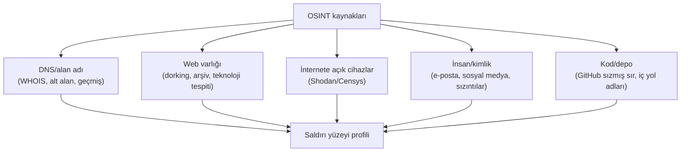
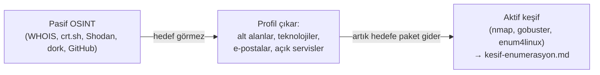

# 🕵️ OSINT — Açık Kaynak İstihbaratı (Derinlemesine)

**OSINT** (Open Source Intelligence), hedefe hiç dokunmadan, herkese açık kaynaklardan bilgi toplama disiplinidir ([kesif-enumerasyon.md](kesif-enumerasyon.md) "pasif keşif"). Bu dosya, o pasif keşfin araçlarını ve **neden işe yaradığını** kurar — çünkü sistemi anlayan bir hacker için OSINT bir "araç listesi" değil, "insanların ve kuruluşların bilmeden sızdırdığı bilgiyi sistematik toplama" mantığıdır.

> Ön koşul: [kesif-enumerasyon.md](kesif-enumerasyon.md) (pasif vs aktif ayrımı), [../01-ag-networking/dns-derinlemesine.md](../01-ag-networking/dns-derinlemesine.md) (DNS kayıtları).

> ⚠️ OSINT teknik olarak "pasif" (hedefe paket göndermez) olsa da, elde ettiğin bilgiyle ne yapacağın RoE'ye tabidir ([metodoloji-ve-rules-of-engagement.md](metodoloji-ve-rules-of-engagement.md)).

---

## 1. Neden OSINT bu kadar değerli?

**Temel içgörü:** İnsanlar ve kuruluşlar, fark etmeden sürekli bilgi sızdırır — bir iş ilanı ("Django 4.2 deneyimi arıyoruz" → teknoloji yığını ifşası), bir LinkedIn profili ("IT Yöneticisi, şirket X'te 5 yıl" → sosyal mühendislik hedefi → [../12-sosyal-muhendislik-phishing/phishing-analizi.md](../12-sosyal-muhendislik-phishing/phishing-analizi.md)), bir GitHub commit'i ([../14-scripting-otomasyon/git-temelleri.md](../14-scripting-otomasyon/git-temelleri.md) sızmış sırlar), bir DNS kaydı ([../01-ag-networking/dns-derinlemesine.md](../01-ag-networking/dns-derinlemesine.md)). Saldırgan bunların hiçbirine "saldırmaz" — sadece **toplar ve birleştirir**. Bu yüzden OSINT genelde bir sızma testinin **en ucuz, en az riskli ve en çok bilgi veren** aşamasıdır.



---

## 2. DNS ve alan adı istihbaratı

```bash
# Kayıt sahipliği, kayıt tarihi, isim sunucuları
whois hedef.com

# Tüm kayıt türlerini iste (→ ../01-ag-networking/dns-derinlemesine.md)
dig hedef.com ANY
dig hedef.com MX          # e-posta altyapısı → hangi sağlayıcı (Google/Microsoft)?
dig hedef.com TXT         # SPF/doğrulama kayıtları → kullanılan üçüncü taraf servisler
```

### Alt alan (subdomain) keşfi
Bir kuruluşun "gölge BT'si" (shadow IT) — unutulmuş test sunucuları, eski personel portalları — çoğunlukla ana siteden daha zayıftır. Alt alanları bulmak saldırı yüzeyini genişletir:
```bash
# Sertifika şeffaflığı (Certificate Transparency) logları — pasif ve çok güçlü
# Her yayınlanan TLS sertifikası (→ ../05-kriptografi/pki-x509.md) bu loglara girer,
# bu yüzden bir alan adının TÜM geçmiş alt alanları burada görünür (hedefe hiç dokunmadan!)
curl -s "https://crt.sh/?q=%.hedef.com&output=json" | jq -r '.[].name_value' | sort -u

# Aktif brute-force ile alt alan tarama (artık pasif değil — DNS sunucusuna sorgu gider)
subfinder -d hedef.com
amass enum -d hedef.com
```
> **Kesişim — CT logları neden bu kadar güçlü:** Sertifika şeffaflığı ([../05-kriptografi/pki-x509.md](../05-kriptografi/pki-x509.md)), CA'ların kötü niyetli sertifika verip vermediğini denetlemek için var oldu — ama yan etkisi, **her** yayınlanan sertifikanın (dolayısıyla her alt alan adının) kalıcı, herkese açık bir kayda girmesidir. Savunma amaçlı şeffaflık, saldırganın keşif aracına dönüşür — güvenlik kontrollerinin çoğu zaman iki tarafı olduğunun bir örneği.

---

## 3. Google dorking (arama motoru operatörleri)

Arama motorları, sitelerin **taradığı ama görmemesi gereken** dosyaları da indeksler. "Dork" (özel arama operatörü), bunları hedefli bulmayı sağlar:

```text
site:hedef.com filetype:pdf                    # sadece o alan adındaki PDF'ler
site:hedef.com inurl:admin                      # "admin" içeren URL'ler
site:hedef.com intitle:"index of"                # açık dizin listeleme
site:hedef.com ext:sql | ext:env | ext:log       # yanlışlıkla açığa çıkmış hassas dosyalar
site:pastebin.com "hedef.com" password           # sızıntı kontrolü
```
**GHDB** (Google Hacking Database), bilinen etkili dork kalıplarını kataloglar (kaynak: [exploit-db.com/google-hacking-database](https://www.exploit-db.com/google-hacking-database)). Mantık: arama motoru zaten tüm interneti taradı ve indeksledi — sen sadece doğru soruyu (dork) soruyorsun; hedefe hiç dokunmadan.

---

## 4. Shodan / Censys — internete açık cihazları arama

Nmap ([kesif-enumerasyon.md](kesif-enumerasyon.md)) *senin* seçtiğin bir hedefi tarar; **Shodan** internetin tamamını **sürekli** tarayıp sonucu bir arama motoru gibi sunar (kaynak: [shodan.io](https://www.shodan.io/)). "Hedefi tara" yerine "zaten taranmış veriyi sorgula" — bu da onu tamamen pasif (hedefe paket gitmez) yapar.

```text
# Shodan arama söz dizimi örnekleri
org:"Hedef Şirket"                    # bir kuruluşa ait tüm cihazlar
hostname:hedef.com                    # bir alan adına bağlı cihazlar
port:3389 country:TR                  # Türkiye'de açık RDP portları
product:"MySQL" version:"5.5"         # bilinen zafiyetli sürüm
```
> **Neden korkutucu ölçüde etkili:** Shodan, güvenlik kameraları, endüstriyel kontrol sistemleri (SCADA/ICS → [../09-cloud-virtualizasyon/temel-kavramlar.md](../09-cloud-virtualizasyon/temel-kavramlar.md) benzeri kalıcı zafiyet yüzeyi), yönetim panelleri, veritabanlarını **hiç şifre denemeden**, sadece "kim internete açık ve yanlış yapılandırılmış" diye arayarak bulur. Savunma: gereksiz servisleri internete asla açma ([../02-linux-windows/pratik-lab/linux-hardening-checklist.md](../02-linux-windows/pratik-lab/linux-hardening-checklist.md)) — Shodan zaten seni bulacaktır.

---

## 5. E-posta ve insan istihbaratı

```bash
# theHarvester: bir alan adına bağlı e-posta/alt alan/isim topla (çoklu kaynak)
theHarvester -d hedef.com -b google,linkedin,crtsh

# Hunter.io / e-posta desen tespiti: "ad.soyad@hedef.com" gibi bir kalıp bulunca,
# LinkedIn'den çalışan isimleriyle olası e-postalar üretilir → phishing hedef listesi
```
> **Kesişim — sosyal mühendisliğin girdisi:** theHarvester'ın çıkardığı e-posta listesi, doğrudan bir **spear phishing** kampanyasının hedef listesidir ([../12-sosyal-muhendislik-phishing/phishing-analizi.md](../12-sosyal-muhendislik-phishing/phishing-analizi.md)). LinkedIn'de "IT Departmanı, Sistem Yöneticisi" araması, kimin **yüksek yetkili** olduğunu (whaling hedefi) ele verir. OSINT ve sosyal mühendislik burada birleşir: OSINT "kime saldıracağını" bulur, phishing "nasıl saldıracağını" uygular.

### Kimlik bilgisi sızıntıları
Geçmiş veri ihlallerinde (breach) sızan e-posta/parola çiftleri, halka açık veritabanlarında aranabilir (ör. Have I Been Pwned API). Bir kurumsal e-postanın geçmiş bir sızıntıda çıkması, o kişinin **parola tekrar kullanımı** ([../10-pentest-metodolojisi/somuru-ve-sonrasi.md](somuru-ve-sonrasi.md) credential stuffing) riskini işaret eder.

---

## 6. Kod deposu sızıntıları (GitHub dorking)

```text
# GitHub arama söz dizimi ile sızmış sır arama
org:hedef-sirket "AWS_SECRET_ACCESS_KEY"
org:hedef-sirket filename:.env
org:hedef-sirket "BEGIN RSA PRIVATE KEY"
```
Bu, [../14-scripting-otomasyon/git-temelleri.md](../14-scripting-otomasyon/git-temelleri.md)'deki "Git her şeyi hatırlar, sızan sır geçmişte kalır" dersinin **saldırgan tarafıdır** — orada savunma perspektifinden ("sızarsa hemen iptal et") anlatılan aynı olgu, burada bir keşif tekniği olarak görünür. Saldırganlar tam olarak bu dork'ları otomatikleştirip yeni public commit'leri sürekli tarar.

---

## 7. Pasif → aktif geçiş noktası

OSINT'in bittiği ve aktif keşfin ([kesif-enumerasyon.md](kesif-enumerasyon.md)) başladığı sınır nettir: **hedefe bir paket/istek gönderdiğin an pasif olmaktan çıkarsın.** `crt.sh` sorgusu pasiftir (üçüncü tarafa gider); `subfinder` ile bulunan alt alanı `nmap` ile taramak aktiftir (hedefe doğrudan gider, RoE kapsamına girer).



---

## 8. Saldırı–savunma kesişimi (özet)

- **Kuruluşun kendi ayak izi:** Savunmacı, saldırgandan önce kendi OSINT ayak izini çıkarmalı ("bizim hakkımızda internette ne var?") — bu, [../08-grc-yonetisim-risk-uyum/risk-yonetimi.md](../08-grc-yonetisim-risk-uyum/risk-yonetimi.md)'deki saldırı yüzeyi değerlendirmesinin bir parçasıdır.
- **Şeffaflık ödünleşmesi:** CT logları gibi savunma amaçlı şeffaflık mekanizmaları, aynı zamanda keşif aracıdır — güvenlik kontrollerini tasarlarken "bu bilgiyi kim başka nasıl kullanabilir?" sorusu sorulmalı.
- **İnsan katmanı en büyük sızıntı kaynağı:** Teknik kontroller ne kadar sıkı olursa olsun, bir iş ilanı veya LinkedIn profili teknoloji yığınını ifşa edebilir — bu, [../12-sosyal-muhendislik-phishing/phishing-analizi.md](../12-sosyal-muhendislik-phishing/phishing-analizi.md)'deki "insan en zayıf halka" temasının keşif aşamasındaki hâlidir.

> **Sonraki:** [kesif-enumerasyon.md](kesif-enumerasyon.md) (aktif keşif — nmap).
