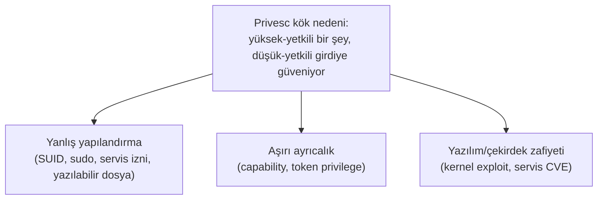
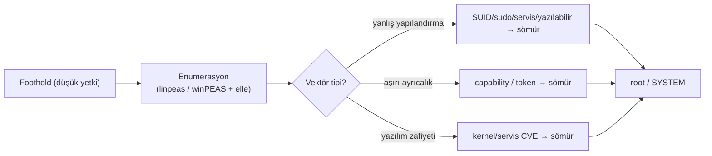

# 🧗 Ayrıcalık Yükseltme (Privilege Escalation) — Derinlemesine

İlk erişim (foothold) neredeyse her zaman **düşük yetkili** bir hesapladır (`www-data`, standart kullanıcı → [somuru-ve-sonrasi.md](somuru-ve-sonrasi.md)). Privilege escalation (yetki yükseltme), bu düşük yetkiden `root`/`SYSTEM`'e tırmanmaktır. Bu dosya, enumerasyon komutlarının ötesine geçip **her vektörün neden çalıştığını** kurar — çünkü personamızın farkı, `linpeas` çıktısını okuyup "bunu neden sömürebiliyorum?" sorusunu cevaplayabilmesidir.

> Ön koşul: [somuru-ve-sonrasi.md](somuru-ve-sonrasi.md) (dikey/yatay privesc), [../02-linux-windows/linux-temelleri.md](../02-linux-windows/linux-temelleri.md) (SUID, sudo, izinler), [../02-linux-windows/windows-temelleri.md](../02-linux-windows/windows-temelleri.md) (token, servis, ayrıcalık), [../03-isletim-sistemi-ici/kullanici-cekirdek-modu.md](../03-isletim-sistemi-ici/kullanici-cekirdek-modu.md) (Ring 0, syscall).

> ⚠️ Yalnızca izinli hedeflerde ([metodoloji-ve-rules-of-engagement.md](metodoloji-ve-rules-of-engagement.md)).

---

## 1. Temel içgörü: privesc bir "yanlış güven" avıdır

Her privesc vektörü aynı temaya indirgenir: **yüksek yetkiyle çalışan bir şey (bir program, servis, zamanlanmış görev, çekirdek), düşük yetkili kullanıcının kontrol edebildiği bir girdiye/nesneye güveniyor.** Sistemi anlayan hacker, "bu makinede `root` olarak ne çalışıyor ve o şeyin hangi parçasını ben değiştirebiliyorum?" diye sorar. Cevap her zaman şu üç kategoriden biridir:



Enumerasyon (aşağıdaki komutlar + `linpeas.sh`/`winPEAS`) bu üç kategoriyi tarar; ama araç "bulur", sen "sömürürsün" — ve sömürebilmek için mekanizmayı bilmen gerekir.

---

## 2. Linux privesc vektörleri

### 2.1 SUID/SGID ikilileri — GTFOBins mantığı
Bir dosyada **SUID bit** varsa, kim çalıştırırsa çalıştırsın **dosyanın sahibinin** (genelde root) yetkisiyle çalışır ([../02-linux-windows/linux-temelleri.md](../02-linux-windows/linux-temelleri.md)). Sorun: bazı programlar, tasarımları gereği komut çalıştırabilir, dosya okuyabilir veya shell açabilir. Böyle bir program SUID root ise, onun bu yeteneğini root yetkisiyle kullanırsın.

```bash
# SUID'li dosyaları bul (privesc enumerasyonunun ilk komutu)
find / -perm -4000 -type f 2>/dev/null
```
Çıktıda **beklenmedik** bir ikili görürsen (ör. `find`, `vim`, `nano`, `python`, `bash`, `cp`, `less`), bu bir yükseltme yoludur. Örnekler:
```bash
# find SUID root ise: -exec ile root komut çalıştır
find . -exec /bin/sh -p \; -quit          # -p: SUID yetkisini koru

# python SUID root ise: doğrudan root shell
./python -c 'import os; os.setuid(0); os.system("/bin/sh")'

# cp SUID root ise: /etc/passwd'yi ez veya /etc/shadow'u oku
```
> **GTFOBins** ([gtfobins.github.io](https://gtfobins.github.io/)) tam olarak bunu kataloglar: "şu ikili SUID/sudo ise, işte onu root'a çeviren tek satır." Ama ezberlemek yerine mantığı gör: bunların hepsi "root yetkisiyle çalışan bir program bana komut/dosya erişimi veriyor" temasıdır ([enjeksiyon-aileleri.md](../04-web-guvenligi/zafiyet-siniflari/enjeksiyon-aileleri.md) "meşru yetenek kötüye kullanımı" ile aynı ruh).

### 2.2 sudo yanlış yapılandırması
`sudo -l`, bu kullanıcının hangi komutları root olarak çalıştırabileceğini gösterir ([../02-linux-windows/linux-temelleri.md](../02-linux-windows/linux-temelleri.md)):
```bash
sudo -l
# Örnek çıktı:
# (root) NOPASSWD: /usr/bin/vim
```
`vim`'i root olarak çalıştırabiliyorsan, vim'in içinden shell açarsın (GTFOBins): `sudo vim -c ':!/bin/sh'`. Aynı mantık `less`, `awk`, `find`, `nmap` (eski `--interactive`), `tar --checkpoint-action` için geçerli.

- **`LD_PRELOAD` / `env_keep`:** sudoers'da `env_keep+=LD_PRELOAD` varsa, kendi zararlı paylaşımlı kütüphaneni yükletip root kod çalıştırabilirsin.
- **Sudo sürüm CVE'leri:** Bazı sudo sürümleri kendileri zafiyetlidir. En bilineni **Baron Samedit / CVE-2021-3156** (Ocak 2021, Qualys): `sudoedit -s` ile tetiklenen heap-based buffer overflow, varsayılan yapılandırmada herhangi bir yerel kullanıcıyı root'a çıkarır. Etkilenen sürümler: eski (legacy) hattında **1.8.2 – 1.8.31p2** ve kararlı (stable) hattında **1.9.0 – 1.9.5p1**; **1.9.5p2** ile yamalandı (kaynak: [Qualys advisory](https://blog.qualys.com/vulnerabilities-threat-research/2021/01/26/cve-2021-3156-heap-based-buffer-overflow-in-sudo-baron-samedit), [NVD CVE-2021-3156](https://nvd.nist.gov/vuln/detail/CVE-2021-3156)). Pratikte: `sudo --version` ile sürümü oku, yukarıdaki aralıkta mı diye bak; daha yeni CVE'ler de çıkabildiği için kritik bir hedefte güncel sudo advisory'sini de teyit et.

### 2.3 Cron işleri
Root olarak çalışan zamanlanmış görevler ([../02-linux-windows/linux-temelleri.md](../02-linux-windows/linux-temelleri.md)):
```bash
cat /etc/crontab ; ls -la /etc/cron.*
```
- **Yazılabilir script:** Cron root olarak `/opt/temizle.sh` çalıştırıyor ve bu dosya sana yazılabilirse → içine reverse shell koy, cron çalışınca root shell.
- **Wildcard injection:** Cron `tar -czf yedek.tar.gz *` gibi bir joker (wildcard) kullanıyorsa, dizine `--checkpoint-action=exec=...` adında dosyalar koyarak `tar`'a argüman enjekte edersin (wildcard, dosya adlarını argümana genişletir).
- **PATH hijacking:** Cron script'i `backup` gibi mutlak yol olmadan bir komut çağırıyor ve PATH'te senin yazabildiğin bir dizin önce geliyorsa, o adla zararlı bir dosya koyarsın ([../02-linux-windows/linux-temelleri.md](../02-linux-windows/linux-temelleri.md) PATH hijacking).

### 2.4 Capabilities
Capabilities, root yetkisini parçalara böler ([../03-isletim-sistemi-ici/kullanici-cekirdek-modu.md](../03-isletim-sistemi-ici/kullanici-cekirdek-modu.md)). Bir ikilide tehlikeli bir capability varsa privesc olur:
```bash
getcap -r / 2>/dev/null
# Örnek: /usr/bin/python3 = cap_setuid+ep  → setuid(0) yapıp root olabilirsin
./python3 -c 'import os; os.setuid(0); os.system("/bin/sh")'
```

### 2.5 Yazılabilir hassas dosyalar
- **`/etc/passwd` yazılabilirse:** Kendi root kullanıcını ekle. Klasik: parola hash'ini `openssl passwd` ile üretip ikinci bir UID 0 satırı ekle.
  ```bash
  openssl passwd -1 -salt x parola123           # $1$x$... hash üret
  echo 'hacker:$1$x$...:0:0:root:/root:/bin/bash' >> /etc/passwd
  su hacker                                       # root'a geç
  ```
- **NFS `no_root_squash`:** Uzak bir NFS paylaşımı `no_root_squash` ile dışa aktarılmışsa, kendi makinende SUID root bir ikili oluşturup paylaşıma koyarsın; hedefte root yetkisiyle çalışır.

### 2.6 Çekirdek exploitleri (son çare)
Çekirdek Ring 0'da çalıştığı için ([../03-isletim-sistemi-ici/kullanici-cekirdek-modu.md](../03-isletim-sistemi-ici/kullanici-cekirdek-modu.md)), bir çekirdek zafiyeti doğrudan tam sistem kontrolü verir. `uname -a` ile sürümü alıp bilinen exploit ararsın (ör. **DirtyCOW/CVE-2016-5195**, **PwnKit/CVE-2021-4034** — pkexec). Riskli: yanlış exploit sistemi çökertebilir (üretimde dikkat). Bu yüzden **en son** denenir, önce yanlış yapılandırmalara bakılır.

---

## 3. Windows privesc vektörleri

### 3.1 Servis yanlış yapılandırmaları
Windows servisleri genelde yüksek yetkiyle (SYSTEM) çalışır ([../02-linux-windows/windows-temelleri.md](../02-linux-windows/windows-temelleri.md)). Zayıf yapılandırma = SYSTEM'e yol:
- **Unquoted service path (tırnaksız yol):** Bir servisin ikili yolu tırnaksız ve boşluk içeriyorsa (`C:\Program Files\Bir Servis\app.exe`), Windows onu `C:\Program.exe`, `C:\Program Files\Bir.exe` sırasıyla dener. Bu yollardan birine yazma iznin varsa, oraya zararlı bir `.exe` koyarsın; servis (yeniden) başlarken SYSTEM olarak seni çalıştırır.
  ```cmd
  wmic service get name,pathname,startmode | findstr /i "auto" | findstr /i /v "c:\windows\\" | findstr /i /v """
  ```
- **Zayıf servis izinleri (weak permissions):** Servisin ikili yolunu (`binPath`) değiştirme veya ikilinin bulunduğu klasöre yazma iznin varsa, ikiliyi kendi payload'ınla değiştir.
  ```cmd
  sc qc <servis>                    # servis yapılandırması (yol, hesap)
  sc config <servis> binPath= "cmd /c net user hacker Parola123! /add"
  sc stop <servis> & sc start <servis>
  ```

### 3.2 Token ayrıcalıkları — Potato ailesi
`whoami /priv` ([../02-linux-windows/windows-komut-referansi.md](../02-linux-windows/windows-komut-referansi.md)) çıktısında bazı ayrıcalıklar doğrudan SYSTEM'e giden yollardır:
```text
SeImpersonatePrivilege        Enabled
```
**`SeImpersonatePrivilege`** (servis hesaplarında sık bulunur), bir başka güvenlik bağlamını taklit etme (impersonation) yetkisidir. **Potato ailesi** (JuicyPotato, PrintSpoofer, RoguePotato, GodPotato) bu ayrıcalığı kötüye kullanarak SYSTEM token'ı elde eder — bir SYSTEM sürecini sahte bir uç noktaya kimlik doğrulamaya kandırıp token'ını çalar. Bu, [../02-linux-windows/windows-temelleri.md](../02-linux-windows/windows-temelleri.md)'deki token impersonation kavramının silahlandırılmış hâlidir. Benzer şekilde `SeBackupPrivilege` (her dosyayı oku → SAM/SYSTEM hive'larını dök → offline hash çıkar → [../05-kriptografi/pratik-lab/hash_kirma_john_hashcat.md](../05-kriptografi/pratik-lab/hash_kirma_john_hashcat.md)) ve `SeDebugPrivilege` (LSASS'a eriş → kimlik çal) yükseltme yollarıdır.

### 3.3 AlwaysInstallElevated
İki registry anahtarı da açıksa (`HKLM` ve `HKCU`'da `AlwaysInstallElevated=1`), herhangi bir `.msi` paketi **SYSTEM olarak** kurulur — kendi zararlı MSI'ını yaparsın ([metasploit-rehberi.md](metasploit-rehberi.md) msfvenom `-f msi`).
```cmd
reg query HKLM\Software\Policies\Microsoft\Windows\Installer /v AlwaysInstallElevated
reg query HKCU\Software\Policies\Microsoft\Windows\Installer /v AlwaysInstallElevated
```

### 3.4 DLL hijacking, saklı kimlik bilgileri, yamalar
- **DLL hijacking:** Yüksek-yetkili bir uygulama bir DLL'i eksik/aranabilir yoldan yüklüyorsa, aynı adla zararlı DLL koyarsın.
- **Saklı kimlik bilgileri:** `unattend.xml`, `sysprep.inf`, Group Policy Preferences (`Groups.xml` — meşhur cpassword), registry autologon, kayıtlı RDP/WiFi parolaları.
- **Eksik yamalar:** `systeminfo` çıktısı → Windows Exploit Suggester → bilinen çekirdek/yerel yükseltme CVE'si (ör. eski sistemlerde).

---

## 4. Enumerasyon: elle vs otomatik



Otomatik araçlar (**linpeas.sh**, **winPEAS**, **PowerUp**, **Seatbelt**) tüm bu kontrolleri saniyeler içinde yapıp renklendirir. Ama otomatik çıktı **aday listesidir** — hangisinin gerçekten sömürülebilir olduğunu, nasıl sömürüleceğini sen karar verirsin. Aracın "kırmızı" işaretlediği bir SUID'i, o ikilinin ne yaptığını bilmeden root'a çeviremezsin. Bu, script kiddie ile bu personayı ayıran tam noktadır.

---

## 5. Saldırı–savunma kesişimi (özet)

Her privesc vektörü, doğrudan bir sertleştirme (hardening) maddesidir — bu yüzden bu dosya aynı zamanda bir savunma kontrol listesidir ([../02-linux-windows/pratik-lab/linux-hardening-checklist.md](../02-linux-windows/pratik-lab/linux-hardening-checklist.md)):

| Saldırı vektörü | Savunma |
|-----------------|---------|
| Gereksiz SUID | `find -perm -4000` ile denetle, gereksizleri kaldır |
| Gevşek sudo | En az ayrıcalık, `NOPASSWD`'yi ve tehlikeli ikilileri kısıtla |
| Yazılabilir cron/servis | Dosya/klasör izinlerini sıkılaştır, mutlak yol kullan |
| Aşırı capability/token | Minimize et; Windows'ta servis hesaplarına gereksiz `SeImpersonate` verme |
| Eksik yama (kernel/servis) | Yama yönetimi ([zafiyet-tarama.md](zafiyet-tarama.md)) |
| Saklı kimlik bilgileri | Dosyalardan sır temizliği ([../13-guvenli-kodlama-devsecops/guvenli-kodlama-ilkeleri.md](../13-guvenli-kodlama-devsecops/guvenli-kodlama-ilkeleri.md)) |

> **Büyük resim:** Privesc, [en az ayrıcalık](../00-baslangic/terminoloji-sozlugu.md) ilkesinin ihlallerinin sömürüsüdür. Ele geçirilen bir makinede root/SYSTEM olmak, [somuru-ve-sonrasi.md](somuru-ve-sonrasi.md)'deki yanal harekete (lateral movement) ve kalıcılığa (persistence) kapı açar — çünkü artık kimlik bilgilerini dökebilir ([../02-linux-windows/windows-temelleri.md](../02-linux-windows/windows-temelleri.md) LSASS/SAM) ve ağın derinine ilerleyebilirsin. Savunmada bu adım, SOC'un ([../11-soc-mavi-takim/log-analizi.md](../11-soc-mavi-takim/log-analizi.md)) tespit etmesi gereken kritik andır (yeni servis, yeni admin hesabı, LSASS erişimi).

> **İlgili:** [somuru-ve-sonrasi.md](somuru-ve-sonrasi.md) (sonraki adım: lateral movement), [active-directory-saldirilari.md](active-directory-saldirilari.md) (kurumsal ağda yükselme).
