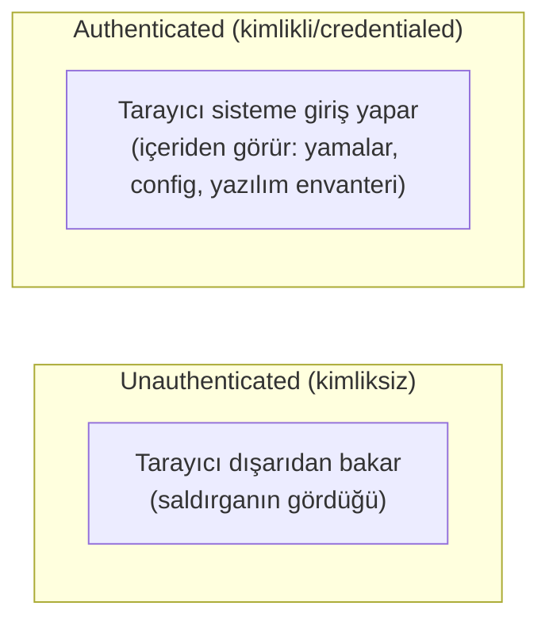
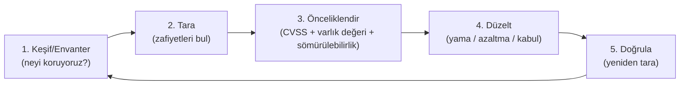

# 🔎 Zafiyet Tarama ve Yönetimi (Vulnerability Scanning & Management)

Enumerasyon ([kesif-enumerasyon.md](kesif-enumerasyon.md)) bir sistemin nelerinin açık olduğunu gösterir; **zafiyet tarama (vulnerability scanning)** bir adım öteye geçip "bu açık servislerde bilinen hangi zafiyetler var?" sorusunu otomatik cevaplar. Bu dosya, zafiyet tarayıcılarını (Nessus/OpenVAS/Qualys), authenticated/unauthenticated ayrımını ve zafiyet yönetimi döngüsünü kurar — hem pentester'ın hem savunmacının (blue/purple) ortak aracıdır.

> Ön koşul: [kesif-enumerasyon.md](kesif-enumerasyon.md) (nmap, servis sürümü), [somuru-ve-sonrasi.md](somuru-ve-sonrasi.md) (CVE/CVSS). Savunma bağı: [08-grc/risk-yonetimi.md](../08-grc-yonetisim-risk-uyum/risk-yonetimi.md) (önceliklendirme), [13-devsecops](../13-guvenli-kodlama-devsecops/devsecops-ssdlc.md) (SCA ile örtüşme).

---

## 1. Tarayıcı ne yapar (ve ne yapmaz)?

Bir zafiyet tarayıcısı: hedefleri tarar → açık portları/servisleri ve sürümlerini tespit eder ([kesif-enumerasyon.md](kesif-enumerasyon.md) `nmap -sV` gibi) → bunları bir **zafiyet veritabanıyla** (CVE, plugin) eşleştirir → bir rapor + ciddiyet puanı ([somuru-ve-sonrasi.md](somuru-ve-sonrasi.md) CVSS) üretir.

> **Kritik nüans — tarama ≠ sömürü:** Bir zafiyet tarayıcısı çoğunlukla zafiyeti **fiilen sömürmez**, "muhtemelen zafiyetli" der (sürüm/banner/pasif kontrol temelli). Bu yüzden çıktısı **yanlış pozitif (false positive)** içerir — bir yamanın geriye taşındığı (backport) ama sürüm numarasının değişmediği bir serviste tarayıcı "zafiyetli" der ama değildir. Pentester tarama çıktısını bir **başlangıç noktası** olarak alır, sonra elle doğrular ([metodoloji-ve-rules-of-engagement.md](metodoloji-ve-rules-of-engagement.md)); tarama sonucunu doğrulamadan rapora yazmak acemi işidir. Bu, "açık port ≠ zafiyet" ilkesinin bir üst katmanıdır.

### Tarama vs pentest
| | Zafiyet tarama | Sızma testi (pentest) |
|---|----------------|----------------------|
| Ne | Bilinen zafiyetleri otomatik listeler | Zafiyetleri sömürüp gerçek etkiyi kanıtlar |
| Kim | Otomatik araç | İnsan + araç |
| Bulur | "Muhtemelen zafiyetli" (potansiyel) | "Fiilen sömürülebilir" (kanıtlı) + zincirleme |
| Yanlış pozitif | Yüksek | Düşük (elle doğrulanır) |
| İş mantığı hatası | Bulamaz (IDOR, yetki atlama) | Bulur |
| Sıklık | Sürekli/otomatik | Periyodik/proje |

> Tarama, "geniş ama sığ"; pentest "dar ama derin"dir. İkisi tamamlayıcıdır: tarama yüzeyi haritalar, pentest kritik noktaları kanıtlar.

---

## 2. Adlandırılmış tarayıcılar

| Araç | Not |
|------|-----|
| **Nessus** (Tenable) | Endüstri standardı, ticari; Nessus Essentials sürümü sınırlı/ücretsiz. Geniş plugin kütüphanesi. |
| **OpenVAS / Greenbone** | Açık kaynak; Nessus'un açık alternatifi (kaynak: [greenbone.net](https://www.greenbone.net/)). |
| **Qualys** | Bulut tabanlı, kurumsal zafiyet yönetimi platformu. |
| **Nexpose / InsightVM** (Rapid7) | Metasploit ile aynı ekosistem. |

Bunlar ağ/host tarayıcılarıdır. Web'e özel tarayıcılar ayrıdır (Burp Scanner, OWASP ZAP → [../04-web-guvenligi/burp-suite-rehberi.md](../04-web-guvenligi/burp-suite-rehberi.md)); bağımlılık/kod için SCA/SAST ([../13-guvenli-kodlama-devsecops/devsecops-ssdlc.md](../13-guvenli-kodlama-devsecops/devsecops-ssdlc.md)) kullanılır. Aynı "bilinen zafiyeti otomatik bul" fikrinin farklı katmanlardaki uygulamalarıdır.

---

## 3. Authenticated vs unauthenticated tarama (kritik ayrım)

| | Unauthenticated | Authenticated (credentialed) |
|---|-----------------|------------------------------|
| Bakış | Dışarıdan (saldırgan perspektifi) | İçeriden (kimlikle giriş yaparak) |
| Görür | Açık servis, banner, uzaktan tespit edilebilir zafiyet | Eksik yamalar, yerel yazılım sürümleri, yanlış yapılandırma, zayıf ayarlar |
| Doğruluk | Daha çok tahmin → daha çok yanlış pozitif | Kesin (dosya/registry/paket okur) → az yanlış pozitif |
| Kapsam | Sınırlı | Derin ve geniş |

> **Neden authenticated tarama daha değerli (ama daha riskli):** İçeriden bakınca tarayıcı, banner tahmini yerine gerçek paket/yama envanterini okur — çok daha doğru sonuç. Ama bunun için tarayıcıya **ayrıcalıklı kimlik bilgisi** verilir; bu kimlik ele geçirilirse ([en az ayrıcalık](../00-baslangic/terminoloji-sozlugu.md) ihlali) tüm ortama erişim demektir. Savunmacılar iç zafiyet yönetiminde authenticated tarama tercih eder; dış saldırgan simülasyonunda unauthenticated bakış kullanılır. İkisi farklı soruları cevaplar: "dışarıdan ne görünüyorum?" vs "içeride ne kadar yamasızım?".

---

## 4. Zafiyet yönetimi döngüsü (savunma tarafı)

Tarama tek seferlik bir eylem değil, sürekli bir **döngüdür** — bu, savunmacının (blue team) işidir ve NIST CSF'in Identify/Protect fonksiyonlarına ([../08-grc-yonetisim-risk-uyum/cerceveler-nist-iso.md](../08-grc-yonetisim-risk-uyum/cerceveler-nist-iso.md)) bağlanır:

> **Önceliklendirme her şeydir:** Bir tarama binlerce bulgu üretir; hepsini aynı anda yamalamak imkânsız. Hangisi önce? Karar CVSS puanı ([somuru-ve-sonrasi.md](somuru-ve-sonrasi.md)) **tek başına değil**, varlığın değeri + zafiyetin gerçekten sömürülüp sömürülmediği (ör. CISA KEV — Known Exploited Vulnerabilities listesi) + erişilebilirlik ile birlikte belirlenir. İnternete açık, aktif sömürülen, kritik bir sunucudaki CVSS 7.0, iç ağda erişilemeyen bir CVSS 9.8'den daha acildir. Bu, [risk-yonetimi.md](../08-grc-yonetisim-risk-uyum/risk-yonetimi.md)'nin (olasılık × etki) doğrudan uygulamasıdır.

---

## 5. Saldırı–savunma kesişimi (özet)

- **Aynı araç, iki niyet:** Savunmacı "yamalanmamış neyim var?" diye tarar; saldırgan (yetkiliyse, RoE dahilinde) "nereden içeri girerim?" diye tarar. Çıktı aynı, kullanım farklı — bu yüzden zafiyet yönetimi tipik bir **purple team** faaliyetidir.
- **Tarama gürültülüdür:** Zafiyet taraması hedef loglarında ([../11-soc-mavi-takim/log-analizi.md](../11-soc-mavi-takim/log-analizi.md)) belirgin iz bırakır (çok sayıda bağlantı, plugin denemesi); bu yüzden gizli (stealth) bir saldırgan taramaz, elle ve yavaş enumere eder. Savunmacı bu gürültüyü bir IOA olarak tespit edebilir.
- **Yama yönetimi en yüksek getirili savunmadır:** Sömürülen zafiyetlerin çoğu **aylardır yaması olan** bilinen CVE'lerdir. Düzenli tarama + önceliklendirilmiş yama, egzotik saldırılardan çok daha fazla ihlali önler.

> **İlgili:** [somuru-ve-sonrasi.md](somuru-ve-sonrasi.md) (bulunan zafiyeti sömürme), [../13-guvenli-kodlama-devsecops/devsecops-ssdlc.md](../13-guvenli-kodlama-devsecops/devsecops-ssdlc.md) (bağımlılık/kod tarama).
