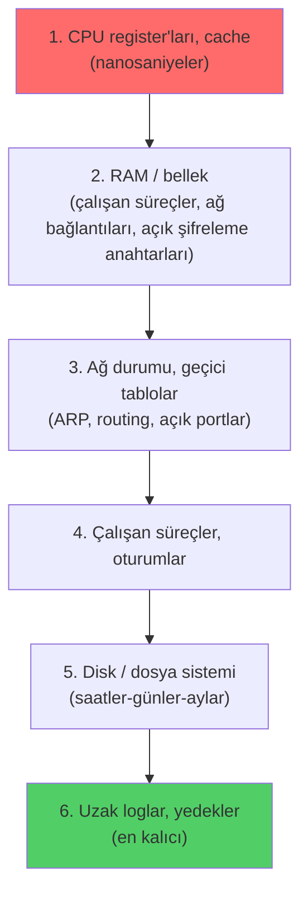

# 🔬 Dijital Adli Analiz (Digital Forensics)

Dijital adli analiz (digital forensics), bir güvenlik olayından sonra "ne oldu, nasıl oldu, ne kaybettik, kanıt nerede?" sorularını **mahkemede geçerli olabilecek titizlikle** cevaplama disiplinidir. SOC'un ([siem-edr-soar.md](siem-edr-soar.md)) tespit ettiği bir olay ciddiyse, adli analiz devreye girer ve olay müdahalesinin ([olay-mudahale-ir.md](olay-mudahale-ir.md)) "Identification/Eradication" aşamalarını besler.

> Bu dosya, forensics'in bir uzmanlık alanı (DFIR analisti) hâline gelmeden **sistemi anlamak için** bilinmesi gereken çekirdeğini kurar: kanıtın nasıl toplanıp bozulmadan korunduğu. Ön koşul: [surecler-ve-bellek.md](../03-isletim-sistemi-ici/surecler-ve-bellek.md) (bellek uçuculuğu), [linux-temelleri.md](../02-linux-windows/linux-temelleri.md) / [windows-temelleri.md](../02-linux-windows/windows-temelleri.md) (dosya sistemleri).

---

## 1. Temel gerilim: analiz etmek, kanıtı bozmadan

Adli analizin bütün zorluğu tek cümlede: **incelediğin şeyi değiştirmeden incelemek zorundasın.** Sıradan bir dosyayı açmak bile onun "son erişim zamanını" (access time) değiştirir; çalışan bir makineye dokunmak RAM'i değiştirir. Kanıtı kirletirsen (contamination) hem teknik olarak yanıltıcı olur hem hukuki değerini yitirir.

Bu yüzden forensics iki temel ilke etrafında döner:
- **Kanıt bütünlüğü (evidence integrity):** Toplanan kanıt, toplandığı andan itibaren hiç değişmemiş olmalı — ve bunu **kanıtlayabilmelisin** (hash ile).
- **Tekrarlanabilirlik (reproducibility):** Başka bir analist aynı adımları izleyip aynı sonuca ulaşabilmeli.

---

## 2. Delil zinciri (chain of custody)

**Chain of custody (delil zinciri)**, bir kanıtın toplandığı andan mahkemeye sunulduğu ana kadar **kimin, ne zaman, nerede, nasıl** eline geçtiğini kesintisiz belgeleyen kayıttır. Tek bir boşluk (kanıt 2 saat kayıp kaldı, kim tuttuğu belli değil) tüm kanıtı çürütebilir — çünkü "bu süre içinde değiştirilmiş olabilir mi?" sorusuna cevap veremezsin.

Bir delil zinciri kaydı şunları içerir:

| Alan | İçerik |
|------|--------|
| Ne | Kanıtın tanımı (seri no, model, kapasite) |
| Kim | Toplayan/teslim alan kişi |
| Ne zaman | Her el değiştirme tarih-saati |
| Nerede | Fiziksel konum (kasa, kilitli dolap) |
| Nasıl | Toplama/aktarma yöntemi |
| Hash | Kanıtın kriptografik parmak izi (aşağıda) |

> **Kesişim — hash burada bütünlük kanıtıdır:** Bir disk imajı alındığında SHA-256 hash'i ([temel-kavramlar.md](../05-kriptografi/temel-kavramlar.md)) hesaplanır ve kayda geçirilir. Aylar sonra mahkemede aynı hash yeniden hesaplanır; eşleşiyorsa imaj değişmemiştir. Bu, hash'in "gizlilik için değil **bütünlük** için" var olduğunun ([00-baslangic/bilgisayar-temelleri.md](../00-baslangic/bilgisayar-temelleri.md) kodlama≠şifreleme≠hash) en somut örneğidir — parolayı gizlemez, değişmediğini kanıtlar.

---

## 3. Uçuculuk sırası (order of volatility)

Bir olayda kanıt her yerdedir ama hepsi aynı hızda **kaybolur**. RAM saniyeler içinde değişir; disk aylarca durur. Kanıtı en uçucudan (volatile) en kalıcıya doğru toplamak gerekir — yoksa en değerli kanıt sen ona ulaşmadan buharlaşır. Bu sıra [RFC 3227](https://www.rfc-editor.org/rfc/rfc3227) ile standartlaşmıştır:



> **"Önce fişi çekme" kuralının nedeni budur:** RAM uçucu olduğu için ([surecler-ve-bellek.md](../03-isletim-sistemi-ici/surecler-ve-bellek.md)), makineyi kapatmak; çalışan zararlıyı, şifreleme anahtarlarını, ağ bağlantılarını ve bellekte açık duran kimlik bilgilerini (Mimikatz'in okuduğu LSASS içeriği → [windows-temelleri.md](../02-linux-windows/windows-temelleri.md)) **kalıcı olarak yok eder**. Doğru sıra: önce canlı bellek imajı al, sonra izole et. Bu, [olay-mudahale-ir.md](olay-mudahale-ir.md)'deki "Containment" aşamasının kritik nüansıdır.

---

## 4. Canlı analiz (live) vs ölü analiz (dead)

| | Canlı analiz (live) | Ölü analiz (dead / post-mortem) |
|---|---------------------|--------------------------------|
| Sistem | Açık, çalışıyor | Kapalı, disk imajı üzerinde |
| Yakalar | Uçucu veri (RAM, ağ, süreç) | Kalıcı veri (dosya, log, kayıt) |
| Risk | Sistemi değiştirir; zararlı devrede | Uçucu kanıt kaybolmuş olur |
| Ne zaman | RAM'deki kanıt kritikse (fileless malware, şifreleme anahtarı) | Bütünlük önceliğinde, standart durum |

**Pratik denge:** Modern olaylarda genellikle **önce hızlı bir canlı yakalama** (RAM imajı + uçucu veri) yapılır, **sonra** sistem kapatılıp **ölü analiz** için disk imajı alınır. Fileless malware ([log-analizi.md](log-analizi.md) — PowerShell `-enc` süreç zinciri) yalnızca RAM'de yaşadığı için canlı yakalama olmadan kaçırılabilir.

---

## 5. Disk imaging ve write blocker

**Disk imaging**, bir depolama aygıtının **bit-bit birebir kopyasını** (forensic image) almaktır — silinmiş ama üzerine yazılmamış veriler (unallocated space), slack space ve dosya sistemi meta verisi dahil. Sıradan bir dosya kopyası bunları kaçırır; forensic imaj kaçırmaz.

```bash
# dd ile ham imaj + anında hash (Linux) — imajın bütünlük parmak izi
sudo dd if=/dev/sdb of=kanit.img bs=4M conv=noerror,sync status=progress
sha256sum kanit.img > kanit.img.sha256

# dcfldd/dc3dd: dd'nin forensics için geliştirilmiş sürümü (yerleşik hash + doğrulama)
sudo dcfldd if=/dev/sdb of=kanit.img hash=sha256 hashlog=kanit.hash

# Adli standart format: EWF/E01 (metadata + sıkıştırma + hash gömülü)
sudo ewfacquire /dev/sdb
```

> ⚠️ **Yön kritik:** `dd`'de `if` (input) kaynak disk, `of` (output) hedef imajdır. Bunları karıştırmak (`of=/dev/sdb`) **kanıt diskini sıfırlar** — geri dönüşü yoktur. Bu, komutu ezberleyen ile ne yaptığını anlayan arasındaki farktır.

### Write blocker (yazma engelleyici)
Kanıt diskini bir analiz makinesine bağlamak bile onu değiştirebilir — işletim sistemi otomatik olarak dosya sistemi meta verisi yazabilir (journal, son bağlanma zamanı). **Write blocker**, kaynak ile analiz makinesi arasına giren, **yalnızca okumaya izin verip tüm yazma komutlarını donanım/yazılım düzeyinde engelleyen** bir aygıttır. Kanıtın "toplama sırasında bile değişmediğini" garanti eder — chain of custody'nin teknik dayanağıdır.

```bash
# Yazılımsal salt-okunur bağlama (write blocker yoksa, dikkatli alternatif)
sudo mount -o ro,noload,noexec /dev/sdb1 /mnt/kanit
```

---

## 6. Nerede kanıt aranır? (artefaktlar)

Sistemi anlayan analist, işletim sisteminin nerede iz bıraktığını bilir — çünkü bu izler [02-linux-windows](../02-linux-windows/windows-temelleri.md) modülündeki mekanizmaların yan ürünüdür:

| Kaynak | Ne anlatır | İlgili mekanizma |
|--------|-----------|------------------|
| **RAM imajı** | Çalışan süreçler, ağ bağlantıları, enjekte kod, açık anahtarlar | [surecler-ve-bellek.md](../03-isletim-sistemi-ici/surecler-ve-bellek.md) |
| **Windows Registry** | Kalıcılık (Run anahtarları), USB geçmişi, çalıştırılan programlar | [windows-temelleri.md](../02-linux-windows/windows-temelleri.md) |
| **Windows Event Log** | Giriş/çıkış, süreç oluşturma, servis kurulumu | [log-analizi.md](log-analizi.md) Event ID'ler |
| **Prefetch / Amcache / ShimCache** | Hangi program, ne zaman, kaç kez çalıştı | Windows yürütme kanıtı |
| **`$MFT` (NTFS Master File Table)** | Her dosyanın meta verisi, silinenler dahil | NTFS |
| **Linux `/var/log`, `.bash_history`, `~/.ssh`** | Giriş, komut geçmişi, anahtarlar | [linux-temelleri.md](../02-linux-windows/linux-temelleri.md) |
| **Tarayıcı geçmişi/cache** | Ziyaret, indirme, oturum | — |

### Bellek forensics — Volatility
RAM imajını analiz etmenin standart açık kaynak aracı **Volatility**'dir. Süreç listesi, ağ bağlantıları, enjekte kod, komut geçmişi gibi uçucu kanıtı imajdan çıkarır:

```bash
# Volatility 3 — imajdaki süreçleri listele
python3 vol.py -f bellek.raw windows.pslist

# Süreç ağacı (şüpheli ebeveyn-çocuk: winword.exe -> powershell.exe)
python3 vol.py -f bellek.raw windows.pstree

# Ağ bağlantıları (C2'ye giden bağlantı?)
python3 vol.py -f bellek.raw windows.netscan

# Bir süreçten şüpheli enjekte kod
python3 vol.py -f bellek.raw windows.malfind
```

> **Kesişim:** `pstree` çıktısındaki `winword.exe → powershell.exe` zinciri, [log-analizi.md](log-analizi.md) Senaryo B'deki Sysmon süreç ağacının RAM'deki karşılığıdır — biri canlı log, diğeri bellek imajı, ama aynı saldırı davranışını (IOA → [tehdit-istihbarati-ioc-ioa.md](../07-tehdit-modelleme-cerceveler/tehdit-istihbarati-ioc-ioa.md)) gösterir.

---

## 7. Nüans: zaman damgaları ve anti-forensics

- **MAC times (dosya zaman damgaları):** Modified (değişme), Accessed (erişim), Created (oluşturma) — NTFS'te ayrıca MFT Entry Modified ile birlikte "MACE". Bir dosyanın zaman çizelgesini kurmak (timeline analysis) saldırının sırasını ortaya çıkarır.
- **Timestomping (anti-forensics):** Saldırgan, bıraktığı dosyanın zaman damgalarını meşru sistem dosyalarınınkiyle değiştirerek (`timestomp`, ATT&CK T1070.006 → [mitre-attck.md](../07-tehdit-modelleme-cerceveler/mitre-attck.md)) izini gizler. İyi analist `$MFT`'deki iki ayrı zaman kümesinin (SI vs FN) tutarsızlığından bunu yakalar.
- **Log temizleme:** Saldırgan yerel logları siler ([log-analizi.md](log-analizi.md) Event 1102), ama merkezî SIEM'e ([siem-edr-soar.md](siem-edr-soar.md)) gitmiş loglar durur — bu yüzden log merkezîleştirme forensics'in sigortasıdır.
- **Slack space / silinmiş veri:** "Sil" komutu veriyi silmez, "alanı boş" işaretler ([surecler-ve-bellek.md](../03-isletim-sistemi-ici/surecler-ve-bellek.md) bellek kalıntısı fikriyle aynı); üzerine yazılana dek forensic imajdan (file carving) kurtarılabilir.

---

## 8. Saldırı–savunma kesişimi (özet)

- **Forensics, saldırının tersine mühendisliğidir:** Saldırgan ([10-pentest](../10-pentest-metodolojisi/somuru-ve-sonrasi.md)) iz bırakır (süreç, dosya, log, registry); forensics bu izleri okuyup saldırı anlatısını kurar. Saldırıyı bilmeyen izini de okuyamaz — bu yüzden kırmızı ve mavi takım birbirini besler.
- **Uçuculuk sırası bir yarıştır:** En değerli kanıt (RAM) en hızlı kaybolur; müdahale ekibinin ilk dakikaları bunu belirler.
- **Bütünlük = güvenilirlik:** Hash + write blocker + chain of custody olmadan toplanan kanıt teknik olarak doğru olsa bile hukuken ve analitik olarak çürütülebilir.

> **Sonraki:** [malware-analiz.md](malware-analiz.md) (ele geçirilen şüpheli dosyayı analiz etme) veya [olay-mudahale-ir.md](olay-mudahale-ir.md) (tüm müdahale döngüsü).
