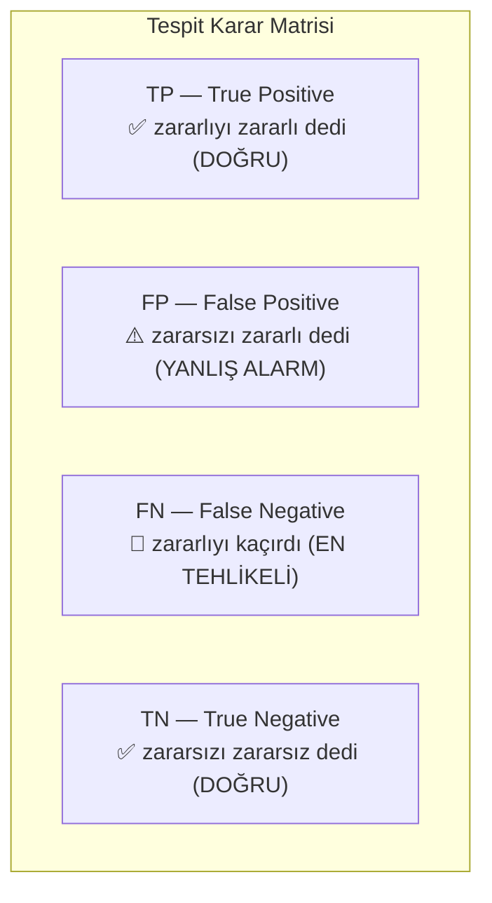
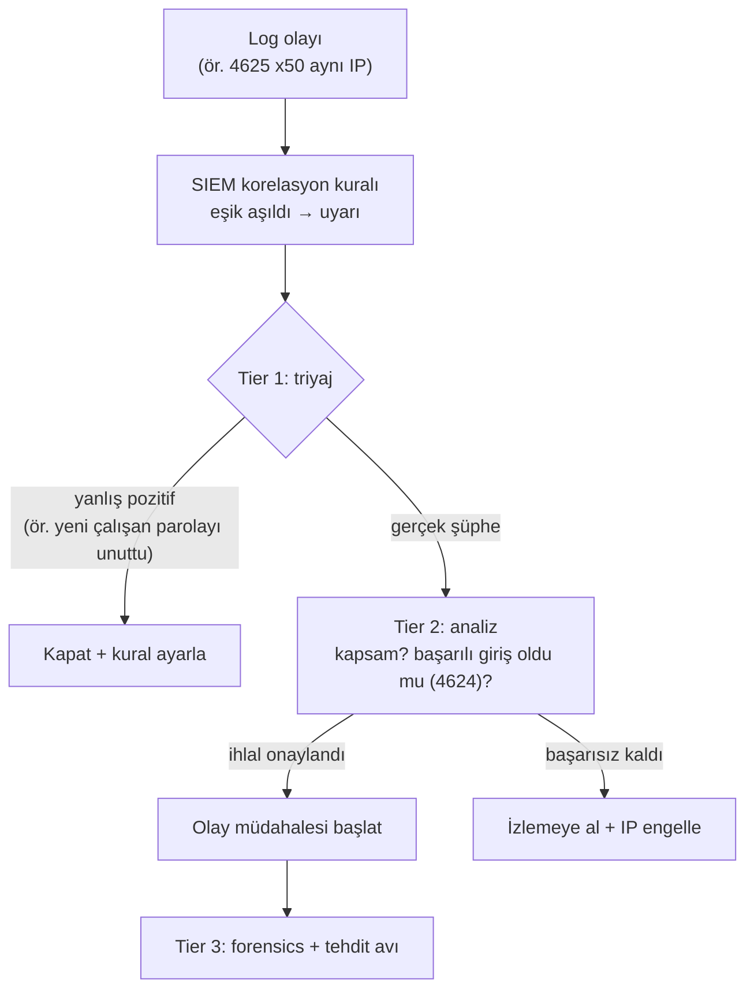

# 📊 Log Analizi

Loglar, bir sistemde ne olduğunun kaydıdır — savunmanın hafızası ve tespit yeteneğinin ham maddesi. İyi bir SOC analisti, log okuma sanatında ustadır: gürültü içinde sinyali bulur. Bu dosya Windows Event ID'lerini, Sysmon'u, tespit metriklerini (TP/FP/FN) ve olay müdahalesini kurar.

> Ön koşul: [siem-edr-soar.md](siem-edr-soar.md). Pratik: [pratik-lab/log-analiz-alistirmasi.md](pratik-lab/log-analiz-alistirmasi.md). İlgili: [linux-komut-referansi.md](../02-linux-windows/linux-komut-referansi.md) (grep/awk).

---

## 1. Tespit metrikleri: TP / FP / FN / TN

Her tespit sistemi (SIEM kuralı, EDR, IDS) bir karar verir: "bu zararlı mı?" Bu kararın dört olası sonucu vardır — bu matris, tespit kalitesini anlamanın temelidir.



| | Gerçekte zararlı | Gerçekte zararsız |
|---|:---:|:---:|
| **Alarm verdi** | ✅ TP (doğru pozitif) | ⚠️ FP (yanlış pozitif) |
| **Alarm vermedi** | 🔴 FN (yanlış negatif) | ✅ TN (doğru negatif) |

> **Kritik ödünleşme:**
> - **FP (yanlış pozitif)** çok olursa → uyarı yorgunluğu ([siem-edr-soar.md](siem-edr-soar.md)), analist gerçek tehdidi kaçırır.
> - **FN (yanlış negatif)** en tehlikelisidir → **gerçek saldırı sessizce geçti**, kimse fark etmedi.
> - Kural çok gevşek → çok FP; çok katı → çok FN. İyi tespit mühendisliği bu dengeyi kurar. "Her şeyi yakala" (çok FP) ile "hiçbir şeyi kaçırma" (imkânsız) arasında pratik bir orta yol.

---

## 2. Windows olay günlükleri (Event Logs) ve kritik Event ID'ler

Windows, her olayı numaralı **Event ID**'lerle kaydeder (tam referans: [Microsoft — Security auditing events](https://learn.microsoft.com/en-us/windows/security/threat-protection/auditing/basic-security-audit-policy-settings)). SOC analistinin ezbere bilmesi gereken kritik olanlar (özellikle **Security** logunda). Bu Event ID'lerin çoğu, [02-linux-windows/windows-temelleri.md](../02-linux-windows/windows-temelleri.md)'de anlatılan kimlik/oturum/servis kavramlarının log izidir; ör. 4625 (başarısız giriş), Linux'taki `/var/log/auth.log` "Failed password" satırının ([02-linux-windows/linux-temelleri.md](../02-linux-windows/linux-temelleri.md)) Windows karşılığıdır:

| Event ID | Olay | Neden önemli |
|----------|------|--------------|
| **4624** | Başarılı oturum açma | Normal + şüpheli girişleri ayırt et (logon type!) |
| **4625** | **Başarısız oturum açma** | Brute-force / password spraying tespiti |
| **4634 / 4647** | Oturum kapatma | Oturum süresi analizi |
| **4672** | Ayrıcalıklı oturum (admin) | Yüksek yetkili giriş — izle |
| **4688** | **Yeni süreç oluşturma** | Şüpheli süreç zinciri ([surecler-ve-bellek.md](../03-isletim-sistemi-ici/surecler-ve-bellek.md)) |
| **4720** | Kullanıcı hesabı oluşturuldu | Saldırgan kalıcılık/backdoor hesabı? |
| **4728/4732** | Gruba üye eklendi | Ayrıcalık yükseltme (admin grubuna ekleme) |
| **4768/4769** | Kerberos bileti (TGT/TGS) | Kerberoasting tespiti ([windows-temelleri.md](../02-linux-windows/windows-temelleri.md)) |
| **7045** | Yeni servis kuruldu | Kalıcılık (persistence) göstergesi |
| **1102** | **Güvenlik logu temizlendi** | Saldırgan iz siliyor — büyük kırmızı bayrak |

### Logon Type nüansı (4624/4625)
`4624`'te **Logon Type** kritiktir:
- **Type 2** = interaktif (konsol), **Type 3** = ağ (SMB/paylaşım), **Type 10** = RDP.
- Bir hizmet hesabının gece yarısı **Type 10 (RDP)** ile girmesi → şüpheli. Bağlam olmadan Event ID tek başına yeterli değildir.

---

## 3. Sysmon — derin görünürlük

Windows'un yerleşik logları sınırlıdır. **Sysmon** (System Monitor), Microsoft Sysinternals'ın çok daha ayrıntılı telemetri sağlayan ücretsiz aracıdır — tehdit avının ve EDR benzeri görünürlüğün temeli (kaynak: [Microsoft Sysmon](https://learn.microsoft.com/en-us/sysinternals/downloads/sysmon)).

| Sysmon Event ID | Yakalar |
|-----------------|---------|
| **1** | Süreç oluşturma (tam komut satırı + hash + ebeveyn!) |
| **3** | Ağ bağlantısı (hangi süreç nereye bağlandı) |
| **7** | DLL yükleme |
| **8** | CreateRemoteThread (process injection göstergesi) |
| **11** | Dosya oluşturma |
| **13** | Registry değişikliği (Run anahtarları → kalıcılık) |
| **22** | DNS sorgusu (C2/tünelleme tespiti → [dns-derinlemesine.md](../01-ag-networking/dns-derinlemesine.md)) |

> **Kesişim — süreç soy ağacı altındır:** Sysmon Event ID 1, ebeveyn süreci de kaydeder. `winword.exe → cmd.exe → powershell.exe → (ağ bağlantısı)` zinciri klasik bir saldırı imzasıdır (makro'lu phishing → [12-phishing](../12-sosyal-muhendislik-phishing/phishing-analizi.md)). Bu davranış ([tehdit-istihbarati-ioc-ioa.md](../07-tehdit-modelleme-cerceveler/tehdit-istihbarati-ioc-ioa.md) IOA), dosya imzasından çok daha güvenilir bir tespittir.

---

## 4. Linux log analizi

Linux tarafında loglar `/var/log` altındadır ([linux-temelleri.md](../02-linux-windows/linux-temelleri.md)); analiz `grep/awk/sort/uniq` ([linux-komut-referansi.md](../02-linux-windows/linux-komut-referansi.md)) ile yapılır.

```bash
# Başarısız SSH girişleri (brute-force tespiti)
grep "Failed password" /var/log/auth.log

# En çok deneme yapan IP'ler (saldırgan kaynağı)
grep "Failed password" /var/log/auth.log \
  | grep -oE '([0-9]{1,3}\.){3}[0-9]{1,3}' \
  | sort | uniq -c | sort -rn | head

# Başarılı sudo kullanımı
grep "sudo:" /var/log/auth.log | grep "COMMAND"

# Belirli zaman aralığında değişen dosyalar (adli analiz)
find /var/www -type f -mtime -1
```

---

## 5. SOC katman eskalasyonu (bir uyarının yolculuğu)

Bir log olayının uyarıdan çözüme yolculuğu:



---

## 6. Log analizinden olay müdahalesine

Bir uyarı "gerçek olay" olarak onaylandığında (TP), iş log analizinden **yapılandırılmış olay müdahalesine** (incident response) geçer. Kısaca: bir olay Hazırlık → Tanımlama → Sınırlama → Yok Etme → Kurtarma → Dersler döngüsünden geçer (SANS PICERL / NIST SP 800-61). En kritik nüans, log/kanıt açısından şudur: **sınırlama sırasında makineyi kapatmak, RAM'deki uçucu kanıtı ([surecler-ve-bellek.md](../03-isletim-sistemi-ici/surecler-ve-bellek.md)) yok eder** — doğru sıra "önce bellek imajı, sonra ağdan izolasyon"dur.

> Tam müdahale yaşam döngüsü, her aşamanın nüansları (kısa/uzun vadeli containment, yeniden kurulum vs temizleme, out-of-band iletişim, yasal bildirim) ayrı bir dosyada işlenir → **detay: [olay-mudahale-ir.md](olay-mudahale-ir.md)**. Olay ciddiyse kanıt toplama [dijital-forensics.md](dijital-forensics.md), şüpheli dosya analizi [malware-analiz.md](malware-analiz.md) devreye girer.

---

## 7. Saldırı–savunma kesişimi (özet)

- **Loglar saldırganın kör noktası:** Saldırgan yerel logları silse ([1102](#), [linux-temelleri.md](../02-linux-windows/linux-temelleri.md)) bile, merkezî SIEM'de ([siem-edr-soar.md](siem-edr-soar.md)) kalır — bu yüzden log silme girişimi (1102) kendisi bir alarmdır.
- **Davranış > imza:** Sysmon süreç zincirleri ve DNS sorguları (IOA), saldırganın araçlarını değiştirse bile onu yakalar → [Pyramid of Pain](../07-tehdit-modelleme-cerceveler/pyramid-of-pain-diamond-model.md) tepesi.
- **Metrik dengesi hayat kurtarır:** FP/FN dengesini kuramamak, ya analistleri boğar (FP) ya saldırıyı kaçırır (FN). Tespit mühendisliği bir sanat kadar bilimdir.

> **Sonraki:** [pratik-lab/log-analiz-alistirmasi.md](pratik-lab/log-analiz-alistirmasi.md).
