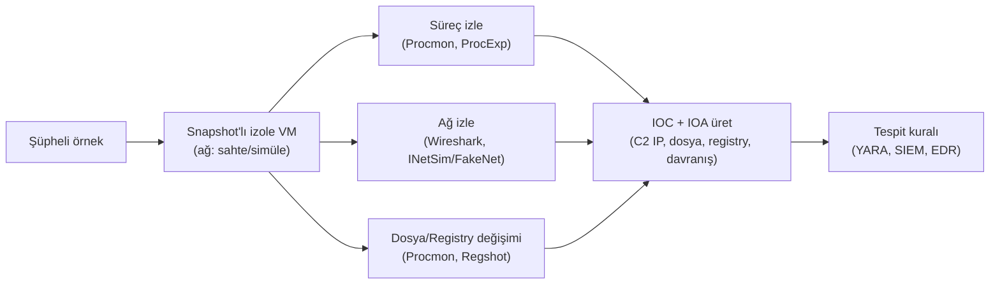
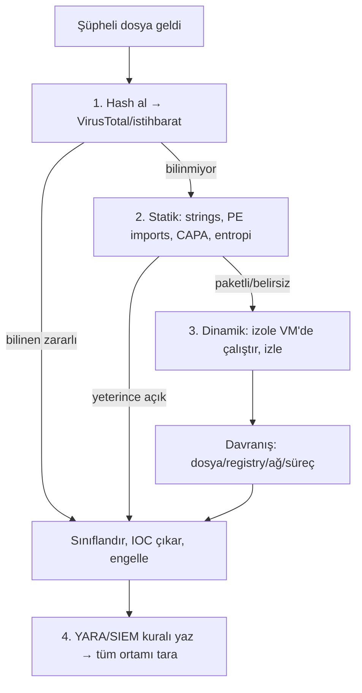

# 🦠 Zararlı Yazılım Analizi (Malware Analysis)

Bir SOC analisti veya olay müdahale ekibi, şüpheli bir dosyayı ("bu ek zararlı mı? ne yapıyor?") değerlendirmek zorunda kalır. Zararlı yazılım analizi (malware analysis), bir örneğin (sample) **ne yaptığını, nasıl yaptığını ve nasıl tespit edileceğini** ortaya çıkarma disiplinidir. Bu dosya, malware reverse engineer uzmanı olmadan — yani disassembler'da makine kodu okumaya dalmadan — sistemi anlamak için gereken triyaj ve analiz çekirdeğini kurar.

> Ön koşul: [surecler-ve-bellek.md](../03-isletim-sistemi-ici/surecler-ve-bellek.md) (süreç/enjeksiyon), [dijital-forensics.md](dijital-forensics.md) (kanıt bütünlüğü), [tehdit-istihbarati-ioc-ioa.md](../07-tehdit-modelleme-cerceveler/tehdit-istihbarati-ioc-ioa.md) (IOC/IOA üretimi).

> ⚠️ Zararlı örnekler **yalnızca izole edilmiş, ağ-bağlantısız bir analiz ortamında (VM, snapshot'lı)** çalıştırılır. Bir örneği ana makinede/kurumsal ağda çalıştırmak, tam da saldırganın istediği şeydir.

---

## 1. İki temel yaklaşım: statik vs dinamik

Bir örneği anlamanın iki yolu vardır ve ikisi birbirini tamamlar:

| | Statik analiz (static) | Dinamik analiz (dynamic) |
|---|------------------------|--------------------------|
| Ne | Örneği **çalıştırmadan** inceler | Örneği **kontrollü ortamda çalıştırıp** davranışı gözler |
| Bakar | Dosya yapısı, string'ler, imports, imza | Süreç, dosya, registry, ağ değişiklikleri |
| Güçlü | Güvenli (kod çalışmaz), hızlı triyaj | Gerçek davranışı görür (gizlenmiş niyet) |
| Zayıf | Paketlenmiş/şifrelenmiş kodu göremez | Örnek analiz-farkında (anti-VM) ise saklanır |
| Analoji | Bombayı X-ray ile incelemek | Bombayı güvenli bir odada patlatmak |

Pratikte: **önce statik triyaj** (hızlı, güvenli — "bu ne olabilir?"), sonra gerekirse **dinamik analiz** (davranışı doğrula).

---

## 2. Statik analiz — çalıştırmadan çıkarım

### Hash ve itibar (reputation)
İlk adım her zaman örneğin hash'ini almak ve tehdit istihbaratına sormaktır:
```bash
sha256sum supheli.exe          # örneğin kimliği (→ dijital-forensics.md, IOC)
```
Bu hash **VirusTotal** gibi bir servise sorulur — daha önce görülmüş, bilinen bir zararlı mı? (Not: kurumsal ortamda gizli/hedefli örnekleri VT'ye yüklemek, saldırgana "yakalandın" sinyali verebilir ve örneği ifşa eder — bu bir nüanstır.) Hash bir **IOC**'dur ([tehdit-istihbarati-ioc-ioa.md](../07-tehdit-modelleme-cerceveler/tehdit-istihbarati-ioc-ioa.md)) ama [Pyramid of Pain](../07-tehdit-modelleme-cerceveler/pyramid-of-pain-diamond-model.md)'in en alt (en kolay değiştirilen) katmanıdır — tek bit değişince hash değişir.

### String'ler
Bir çalıştırılabilirin içindeki okunabilir metinler (URL'ler, IP'ler, dosya yolları, komutlar, hata mesajları) niyet hakkında çok şey söyler:
```bash
strings -n 8 supheli.exe | less        # en az 8 karakterlik string'ler
strings -e l supheli.exe               # Unicode (16-bit) string'ler (Windows)
```
`http://c2-sunucu.xyz`, `powershell -enc`, `\Software\Microsoft\Windows\CurrentVersion\Run` gibi string'ler görmek → C2, indir-çalıştır, kalıcılık ([windows-temelleri.md](../02-linux-windows/windows-temelleri.md) Run anahtarı) sinyalleridir.

### PE yapısı ve imports
Windows çalıştırılabilirleri **PE (Portable Executable)** formatındadır. İçe aktardığı fonksiyonlar (imports/IAT) yeteneklerini ele verir:
- `VirtualAlloc` + `WriteProcessMemory` + `CreateRemoteThread` → **process injection** ([surecler-ve-bellek.md](../03-isletim-sistemi-ici/surecler-ve-bellek.md)).
- `InternetOpenUrl`, `WinHttpConnect` → ağ/C2.
- `CryptEncrypt` + dosya gezme → **ransomware** şüphesi.

```bash
# PE inceleme (Linux)
pecheck supheli.exe          # veya: pev, peframe
# Windows analiz ortamında: PE-bee, PEStudio, CFF Explorer
```

### Paketlenme (packing) tespiti
Zararlı yazılım genellikle **paketlenir** (packed) — gerçek kod sıkıştırılıp/şifrelenip ancak çalışma anında bellekte açılır, böylece statik analizden ve imzalardan kaçar. Yüksek **entropi** (rastgelelik) ve az sayıda anlamlı string, paketlenmenin işaretidir. Bu, statik analizin sınırıdır ve dinamik analize geçmenin nedenidir.
```bash
# Entropi/packer tespiti
diec supheli.exe             # Detect It Easy
```

### CAPA — yetenek tespiti
**CAPA** (Mandiant/FLARE), bir örneğin **yeteneklerini** (capabilities) makine kodu kalıplarından ve API çağrılarından çıkarıp insan-okunur ATT&CK teknikleriyle eşler — "bu örnek dosya şifreliyor, kalıcılık kuruyor, C2 ile konuşuyor" der (kaynak: [mandiant/capa](https://github.com/mandiant/capa)):
```bash
capa supheli.exe             # ATT&CK teknikleriyle eşlenmiş yetenek raporu
```
> **Kesişim:** CAPA'nın çıktısı doğrudan [MITRE ATT&CK](../07-tehdit-modelleme-cerceveler/mitre-attck.md) tekniklerine (T-numaraları) eşlendiği için, tek bir örnekten savunmacının tespit kuralı yazabileceği TTP listesi doğar.

---

## 3. Dinamik analiz — çalıştırıp gözlemleme

Örneği izole bir VM'de çalıştırıp **sistemi nasıl değiştirdiğini** gözlersin:



- **Süreç/dosya/registry izleme:** Sysinternals **Process Monitor (Procmon)** ve **Process Explorer**, örneğin çalışırken hangi dosyaları yazdığını, hangi registry anahtarlarına dokunduğunu ([windows-temelleri.md](../02-linux-windows/windows-temelleri.md)), hangi süreçleri başlattığını canlı gösterir. **Regshot** çalıştırma öncesi/sonrası registry farkını çıkarır.
- **Ağ izleme:** Zararlı C2'sine bağlanmaya çalışır. Gerçek internete izin vermek yerine **INetSim** veya **FakeNet-NG** ile sahte servisler (DNS, HTTP, SMB) sunulur — örnek "başarılı bağlandım" sanır, sen C2 alan adını/isteğini yakalarsın ([dns-derinlemesine.md](../01-ag-networking/dns-derinlemesine.md) DNS tünelleme tespiti mantığı).
- **Sandbox:** Tüm bu izlemeyi otomatikleştiren, örneği çalıştırıp davranış raporu üreten sistemler (Cuckoo/CAPE, ANY.RUN, Joe Sandbox). Hızlı triyaj için idealdir.

> **Nüans — anti-analiz:** Gelişmiş zararlı, bir VM/sandbox/debugger içinde olduğunu anlarsa (anti-VM, anti-debug) zararsız davranıp saklanır ("bu bir analiz ortamı, uyu"). Bu yüzden dinamik analiz tek başına yeterli değildir; statik ve dinamik birlikte kullanılır.

---

## 4. Araç ortamları ve CyberChef

| Araç/ortam | Ne | Nerede |
|------------|-----|--------|
| **REMnux** | Linux tabanlı, malware analizi araçlarıyla gelen dağıtım | Statik/ağ analiz ana platformu (kaynak: [remnux.org](https://remnux.org/)) |
| **FLARE-VM** | Windows tabanlı, analiz araçlarıyla donatılmış ortam | Windows örnekleri, dinamik analiz (kaynak: [mandiant/flare-vm](https://github.com/mandiant/flare-vm)) |
| **CyberChef** | "Siber İsviçre çakısı" — kodlama/şifre/veri dönüşümü web aracı | Base64/hex/XOR çözme, gizlenmiş yük açma (kaynak: [gchq.github.io/CyberChef](https://gchq.github.io/CyberChef/)) |
| **CAPA** | Yetenek → ATT&CK eşleme | Statik triyaj |
| **YARA** | İmza/kural tabanlı örnek eşleştirme | Tespit ve sınıflandırma (aşağıda) |

> **CyberChef neden bu kadar merkezî:** Zararlı yazılım yüklerini gizlemek için katman katman kodlama (Base64 → XOR → gzip) kullanır. CyberChef bu katmanları "tarif" (recipe) hâlinde zincirleyip görsel olarak açar. Bu doğrudan [00-baslangic/bilgisayar-temelleri.md](../00-baslangic/bilgisayar-temelleri.md)'deki "kodlama ≠ şifreleme" ayrımının pratiğidir: kodlanmış yük anahtarsız çözülür, sadece doğru dönüşüm zincirini bulman gerekir. [log-analizi.md](log-analizi.md) Senaryo B'deki `powershell -enc SQBFAFgA...` Base64 yükünü çözmek tam bir CyberChef işidir.

---

## 5. YARA — zararlıyı imzayla yakalamak

**YARA**, zararlı yazılımı içerdiği **kalıplarla** (string'ler, byte dizileri, koşullar) tanımlayıp tespit eden kural dilidir — "zararlı için regex" gibi ([regex-referans.md](../14-scripting-otomasyon/regex-referans.md)). Bir aile/kampanya için bir kez kural yazılır, sonra tüm dosyalar/bellek taranır:

```yara
rule Supheli_Reverse_Shell
{
    meta:
        author = "SOC"
        description = "PowerShell indir-calistir + C2 gostergesi"
    strings:
        $a = "IEX" nocase
        $b = "DownloadString" nocase
        $c = "-enc" nocase
        $ip = /http:\/\/[0-9]{1,3}(\.[0-9]{1,3}){3}/
    condition:
        2 of ($a, $b, $c) or $ip
}
```
```bash
yara -r kural.yar /supheli/dizin/     # bir dizini kuralla tara
```
> **Kesişim:** YARA kuralı, bir örnekten çıkarılan statik göstergeleri **tespit kuralına** dönüştürür — yani analiz (11) doğrudan tespit mühendisliğine ([siem-edr-soar.md](siem-edr-soar.md), [log-analizi.md](log-analizi.md)) besleme yapar. YARA davranış değil kalıp temellidir, bu yüzden [Pyramid of Pain](../07-tehdit-modelleme-cerceveler/pyramid-of-pain-diamond-model.md)'de araçlar/artefaktlar seviyesindedir — saldırgan string'leri değiştirirse kural körelir, o yüzden davranışsal (IOA) tespit de gerekir.

---

## 6. Triyaj akışı (pratik karar ağacı)



---

## 7. Saldırı–savunma kesişimi (özet)

- **Analiz, saldırganın işini savunmaya çevirir:** Bir örnekten çıkarılan IOC (hash, C2 IP/domain) ve IOA (davranış) → tüm ortamı tarayıp "başka nerede var?" sorusunu cevaplar; bu, bir olayın kapsamını (scope) belirleyen [olay-mudahale-ir.md](olay-mudahale-ir.md) "Identification" adımıdır.
- **Statik+dinamik birlikte:** Paketlenme statiği, anti-VM dinamiği köreltir; ikisi birlikte saldırganın saklanma alanını daraltır.
- **Görünürlük analizin temelidir:** Bir örneği anlamak için hangi dosya/registry/ağ değişikliğinin "anormal" olduğunu bilmek gerekir — bu da işletim sisteminin normalini ([02-linux-windows](../02-linux-windows/windows-temelleri.md)) bilmeyi gerektirir.

> **Sonraki:** [olay-mudahale-ir.md](olay-mudahale-ir.md) — analizden çıkanı tam müdahale döngüsüne bağlama.
