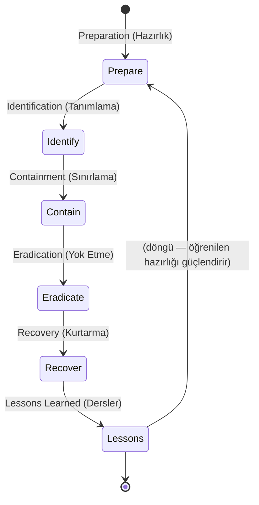
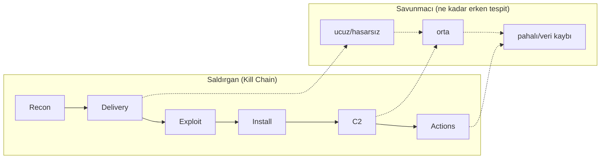

# 🚨 Olay Müdahalesi (Incident Response)

Bir güvenlik olayı tespit edildiğinde ([log-analizi.md](log-analizi.md), [siem-edr-soar.md](siem-edr-soar.md)), panikle değil **yapılandırılmış bir süreçle** yanıt verilir. Olay müdahalesi (incident response, IR), bir ihlali kontrol altına alma, kök nedeni yok etme, normale dönme ve bir daha olmaması için öğrenme disiplinidir. Bu dosya, iki standart modeli (SANS PICERL ve NIST) ve her aşamanın kritik nüanslarını kurar.

> Bu, [dijital-forensics.md](dijital-forensics.md) (kanıt toplama) ve [malware-analiz.md](malware-analiz.md) (tehdidi anlama) ile birlikte savunmanın "olay sonrası" üçlüsünü tamamlar. [08-grc/cerceveler-nist-iso.md](../08-grc-yonetisim-risk-uyum/cerceveler-nist-iso.md)'deki NIST CSF'in Respond/Recover fonksiyonlarının operasyonel karşılığıdır.

---

## 1. İki model, aynı fikir: PICERL ve NIST

İki yaygın çerçeve vardır; aynı akışı farklı gruplarla anlatırlar.

**SANS — PICERL** (6 aşama):

**NIST SP 800-61** (4 aşama, bazı adımları birleştirir; kaynak: [NIST SP 800-61](https://csrc.nist.gov/pubs/sp/800/61/r2/final)):
1. Preparation
2. Detection & Analysis
3. Containment, Eradication & Recovery
4. Post-Incident Activity

| PICERL | NIST 800-61 karşılığı |
|--------|----------------------|
| Preparation | Preparation |
| Identification | Detection & Analysis |
| Containment + Eradication + Recovery | Containment, Eradication & Recovery |
| Lessons Learned | Post-Incident Activity |

> Model seçimi önemli değil; **döngüsel olması** önemlidir. Son aşama (dersler) ilk aşamayı (hazırlık) besler — her olay, bir sonrakine hazırlığı güçlendirir.

---

## 2. Aşama aşama — mekanizma ve nüanslar

### Preparation (Hazırlık) — olaydan *önce*
En kritik ama en çok atlanan aşama. Olay anında değil, **öncesinde** yapılır: IR planı, ekip ve roller, iletişim kanalları (olay sırasında e-posta ele geçirilmiş olabilir → out-of-band iletişim), araçlar (forensics kiti, temiz imajlar), yetkiler, ve **playbook'lar** (ransomware playbook, phishing playbook). Ayrıca loglamanın ([log-analizi.md](log-analizi.md)) ve yedeklerin ([risk-yonetimi.md](../08-grc-yonetisim-risk-uyum/risk-yonetimi.md) RTO/RPO) önceden hazır olması buradadır.

> **Nüans:** "Hazırlıksız olduğun bir olayı iyi yönetemezsin." Bir ransomware anında yedeğin var mı, offline mı, test edildi mi sorusunun cevabı **olaydan önce** verilmiş olmalıdır.

### Identification (Tanımlama / Detection & Analysis)
Bir uyarının gerçek olay mı yoksa yanlış pozitif mi ([log-analizi.md](log-analizi.md) TP/FP) olduğunu belirleme ve **kapsamı (scope)** çıkarma: hangi sistemler, hangi hesaplar, ne zaman başladı, nereye yayıldı? [malware-analiz.md](malware-analiz.md)'den çıkan IOC'ler (hash, C2 IP) tüm ortamda aranarak "başka nerede var?" cevaplanır. Bu aşamada [dijital-forensics.md](dijital-forensics.md) devreye girer — uçuculuk sırasına ([dijital-forensics.md](dijital-forensics.md)) göre önce uçucu kanıt toplanır.

> **Nüans — kapsamı eksik çıkarmak felakettir:** Sadece görünen makineyi temizleyip saldırganın 5 makinede daha kalıcılığı ([somuru-ve-sonrasi.md](../10-pentest-metodolojisi/somuru-ve-sonrasi.md)) olduğunu kaçırırsan, saldırgan geri döner. "Bir makine ele geçtiyse, nereye yayıldı?" sorusu ([routing-nat-vpn.md](../01-ag-networking/routing-nat-vpn.md) yanal hareket) cevaplanmadan Eradication'a geçilmez.

### Containment (Sınırlama)
Yayılmayı durdurma. İki alt tür:
- **Kısa vadeli (short-term):** Hızlı, geçici — makineyi ağdan izole et (fişini çekme, ağ kablosunu/portu kes; EDR ile karantina → [siem-edr-soar.md](siem-edr-soar.md)), böylece uçucu kanıt korunur ([dijital-forensics.md](dijital-forensics.md) "önce fişi çekme").
- **Uzun vadeli (long-term):** Kalıcı düzeltme öncesi sistemin çalışmaya devam etmesi için (yamalı geçici sistem, sıkılaştırılmış erişim).

> **Nüans — izolasyon ≠ kapatma:** Makineyi **kapatmak** RAM'deki kanıtı yok eder; **ağdan izole etmek** yayılmayı durdurur ama kanıtı korur. [Zero Trust](../06-kimlik-erisim-yonetimi-iam/zero-trust.md) mikro-segmentasyonu, containment'ı önceden kolaylaştırır — segmentli ağda yayılma zaten sınırlıdır.

### Eradication (Yok Etme)
Tehdidi **ve kök nedeni** ortadan kaldırma: zararlıyı temizle, saldırganın tüm kalıcılık mekanizmalarını (Run anahtarları, servisler, scheduled task, backdoor hesapları → [windows-temelleri.md](../02-linux-windows/windows-temelleri.md)) kaldır, sömürülen zafiyeti yamalı hale getir, ele geçen tüm kimlik bilgilerini sıfırla.

> **Nüans — "temizlemek" yerine "yeniden kurmak":** Derin ele geçirmede (kernel rootkit, bootkit → [00-baslangic/bilgisayar-temelleri.md](../00-baslangic/bilgisayar-temelleri.md)) makineye güvenilemez; en güvenli eradication temiz imajdan **yeniden kurulumdur**. Ayrıca ele geçen tüm parolalar/anahtarlar döndürülmezse (rotate), saldırgan çalınan kimlikle geri döner.

### Recovery (Kurtarma)
Sistemleri güvenli şekilde üretime geri döndürme: temiz yedekten geri yükleme, izleme artırılmış şekilde yeniden açma, saldırganın gerçekten gittiğini doğrulama. RTO/RPO ([risk-yonetimi.md](../08-grc-yonetisim-risk-uyum/risk-yonetimi.md)) hedefleri burada gerçekleşir.

> **Nüans:** Geri getirilen sistem, saldırının başladığı andan *önceki* temiz bir duruma dönmeli — aksi halde zararlıyı yedekle birlikte geri yüklersin. Yeniden açılan sistem bir süre **yoğun izlenir** (saldırgan geri döner mi?).

### Lessons Learned (Dersler / Post-Incident Activity)
Olaydan 1-2 hafta sonra suçlama olmayan (blameless) bir toplantı: Ne oldu? Neyi iyi yaptık, neyi kaçırdık? Hangi kontrol ([guvenlik-kontrolleri-matrisi.md](../08-grc-yonetisim-risk-uyum/guvenlik-kontrolleri-matrisi.md)) olsaydı bu olay olmazdı? Çıktı: iyileştirme aksiyonları + güncellenmiş playbook'lar → **Preparation'ı güçlendirir** (döngü kapanır).

---

## 3. Kill Chain'e karşı IR — saldırıyı erken kırmak

IR'ın hedefi, saldırganı [cyber-kill-chain.md](../07-tehdit-modelleme-cerceveler/cyber-kill-chain.md)'in mümkün olan en erken halkasında yakalayıp Containment'a geçmektir. Actions on Objectives'e (veri sızması, şifreleme) ulaşmış bir saldırıyı yönetmek, Delivery aşamasında yakalanandan kat kat pahalıdır.

---

## 4. Roller ve iletişim

Bir IR sadece teknik değildir: teknik ekip (containment/forensics), yönetim (karar/kaynak), hukuk (yasal yükümlülük), İK (içeriden tehditse), iletişim/PR (müşteri/kamu bildirimi) rol alır. Özellikle **yasal bildirim yükümlülüğü** ([cerceveler-nist-iso.md](../08-grc-yonetisim-risk-uyum/cerceveler-nist-iso.md) GDPR/KVKK 72 saat) bir teknik değil hukuki-zamanlı zorunluluktur — bu yüzden hazırlık aşamasında hukuk masada olmalıdır.

> **Nüans — out-of-band iletişim:** Saldırgan kurumsal e-posta/Slack'i izliyor olabilir. IR koordinasyonu, ele geçirilmiş olabilecek kanallar dışında (ayrı telefon, imzalı kanal) yürütülür — yoksa saldırgan planınızı okur ve bir adım önde olur.

---

## 5. Saldırı–savunma kesişimi (özet)

- **IR, pentest'in aynadaki yüzüdür:** Pentester ([10-pentest](../10-pentest-metodolojisi/metodoloji-ve-rules-of-engagement.md)) recon→exploit→privesc→lateral→persistence yaparken iz bırakır; IR ekibi bu izleri forensics ([dijital-forensics.md](dijital-forensics.md)) ile okuyup her adımı tersine çevirir. Saldırının anatomisini bilmeyen, müdahaleyi de doğru yapamaz.
- **Hazırlık her şeyi belirler:** Olay anındaki başarı, aylar önce yapılan hazırlığın (plan, yedek, loglama, segmentasyon) ürünüdür.
- **Döngüsellik olgunlaştırır:** Her olayın dersleri bir sonrakine hazırlığı güçlendirir — mor takım ([siem-edr-soar.md](siem-edr-soar.md)) tatbikatları bu döngüyü olay beklemeden çalıştırır.

> **İlgili:** [dijital-forensics.md](dijital-forensics.md) (kanıt), [malware-analiz.md](malware-analiz.md) (tehdidi anlama), [log-analiz-alistirmasi.md](pratik-lab/log-analiz-alistirmasi.md) (pratik).
