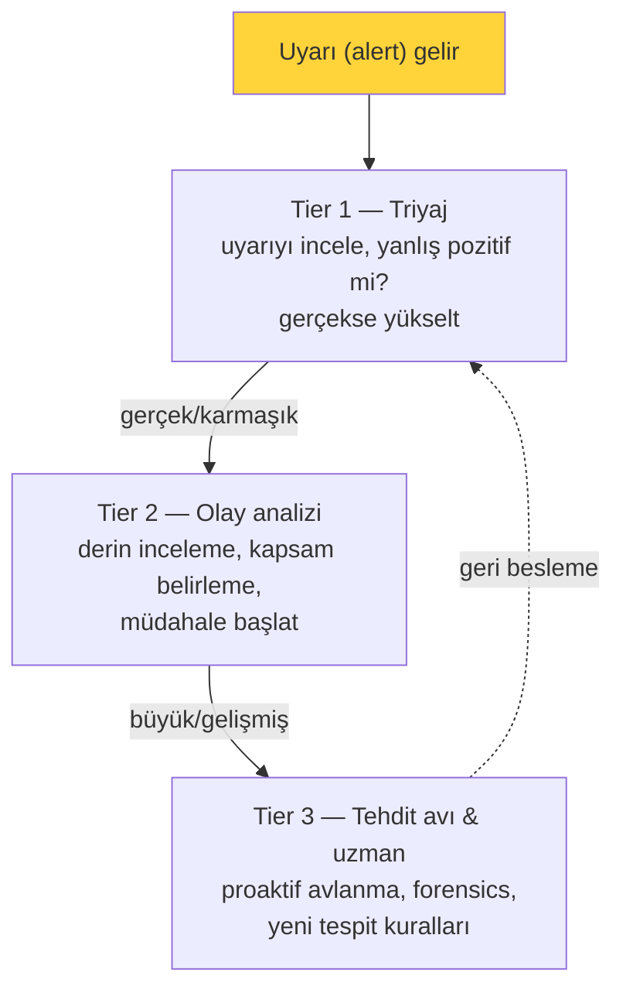
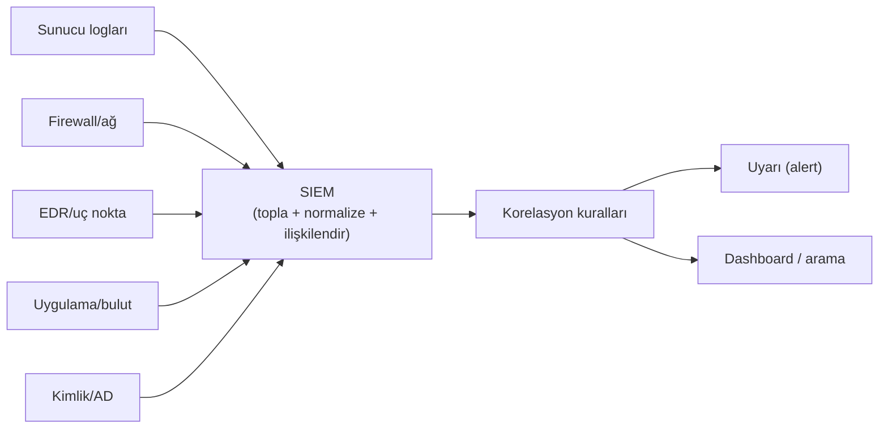
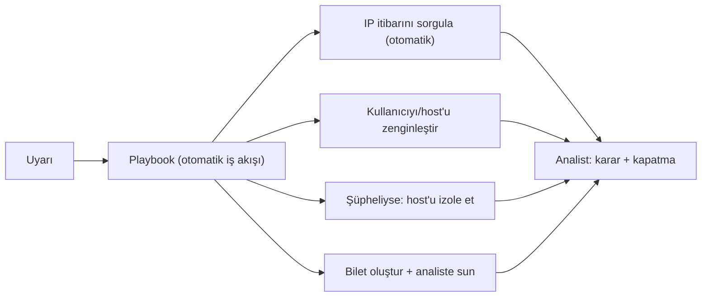
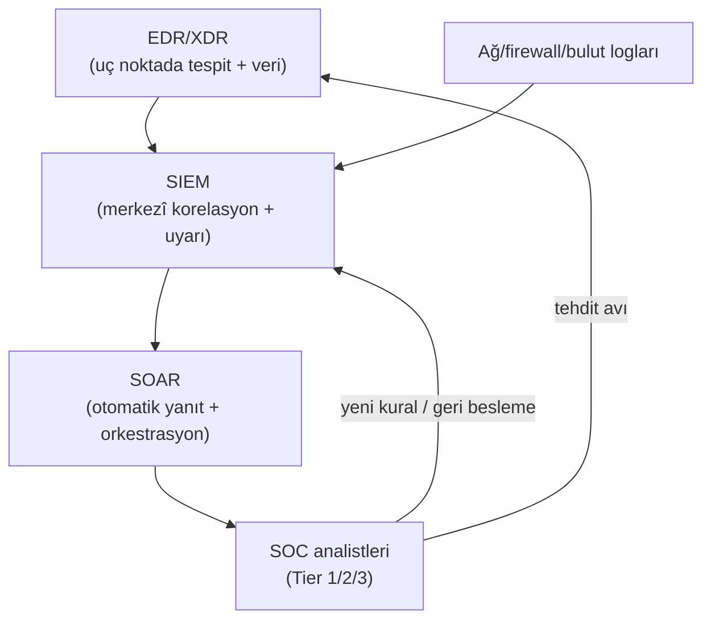

# 🔵 SIEM, EDR ve SOAR

Mavi takım (blue team) savunmanın operasyonel yüzüdür: tehditleri tespit etme, analiz etme ve müdahale etme. Bu iş, bir **SOC** (Security Operations Center — Güvenlik Operasyon Merkezi) etrafında örgütlenir ve üç temel teknoloji katmanına dayanır: SIEM (görünürlük), EDR (uç nokta), SOAR (otomasyon). Bu dosya bu ekosistemi kurar.

> Kardeş: [log-analizi.md](log-analizi.md), [pratik-lab/log-analiz-alistirmasi.md](pratik-lab/log-analiz-alistirmasi.md). Saldırgan karşılığı: [10-pentest](../10-pentest-metodolojisi/somuru-ve-sonrasi.md).

---

## 1. SOC — güvenlik operasyon merkezi

SOC, bir kuruluşun güvenlik olaylarını 7/24 izleyen, tespit eden ve müdahale eden ekip+süreç+teknoloji bütünüdür. Analistler genelde **katmanlara (tier)** ayrılır:

| Katman | Rol | Odak |
|--------|-----|------|
| **Tier 1 (Analist)** | Triyaj | Uyarıları eleme, yanlış pozitif ayıklama, yükseltme |
| **Tier 2 (Olay yanıtçısı)** | Derin analiz | Olayı araştırma, kapsam, müdahale |
| **Tier 3 (Avcı/uzman)** | Proaktif + forensics | Tehdit avı, kök neden, tespit mühendisliği |

> **Nüans — uyarı yorgunluğu (alert fatigue):** SOC'un en büyük düşmanı, işlenemeyecek kadar çok uyarıdır. Yanlış pozitif seli ([log-analizi.md](log-analizi.md)), analistleri bunaltıp gerçek tehdidin kaçırılmasına yol açar. İyi SOC, "daha çok uyarı" değil, "daha isabetli uyarı" kurar.

---

## 2. SIEM — merkezî görünürlük

**SIEM** (Security Information and Event Management), kuruluş genelindeki tüm log/olay verisini **tek yerde toplayan, ilişkilendiren (correlate) ve uyaran** platformdur. SOC'un "gözü ve hafızası"dır.

**Neden SIEM kritik:**
- **Korelasyon:** Tek başına anlamsız olaylar, birleşince saldırıyı ortaya çıkarır. Örnek: "bir başarısız giriş" önemsiz; "5 dakikada 500 farklı hesaba başarısız giriş + sonra bir başarılı" = parola püskürtme (password spraying) saldırısı.
- **Merkezîlik:** Saldırgan yerel logları silse bile ([linux-temelleri.md](../02-linux-windows/linux-temelleri.md)), loglar zaten SIEM'e gönderilmiştir → silme işe yaramaz.
- **Uyum:** GDPR/KVKK/PCI ([cerceveler-nist-iso.md](../08-grc-yonetisim-risk-uyum/cerceveler-nist-iso.md)) log tutma ve tespit yeteneği ister.

> Örnek SIEM'ler: Splunk, Elastic (ELK), Microsoft Sentinel, QRadar, Wazuh (açık kaynak). [A09 Loglama Hatası](../04-web-guvenligi/owasp-top10-tam-rehber.md) tam da SIEM/loglama eksikliğidir.

---

## 3. EDR / XDR — uç nokta tespiti

**EDR** (Endpoint Detection and Response), uç noktalardaki (laptop, sunucu) **davranışı** sürekli izleyen, zararlı aktiviteyi tespit eden ve müdahale (izole et, süreç öldür) edebilen araçtır.

- Klasik antivirüsten farkı: AV **imza** (bilinen kötü dosya) arar; EDR **davranış** ([tehdit-istihbarati-ioc-ioa.md](../07-tehdit-modelleme-cerceveler/tehdit-istihbarati-ioc-ioa.md) IOA) izler. "Word → PowerShell → şifreli bağlantı" gibi anormal süreç zincirlerini ([surecler-ve-bellek.md](../03-isletim-sistemi-ici/surecler-ve-bellek.md)) yakalar — dosya "temiz" görünse bile.
- **Müdahale yeteneği:** Şüpheli makineyi ağdan izole edebilir, süreci sonlandırabilir, kanıt toplayabilir.
- **XDR** (Extended Detection and Response): EDR'i ağ, e-posta, bulut, kimlik ile birleştirip **çapraz katman** korelasyon sağlar.

> **Kesişim:** Pentest/red team'in ([10-pentest](../10-pentest-metodolojisi/somuru-ve-sonrasi.md)) sömürü sonrası davranışları (Meterpreter, Mimikatz, PowerShell indir-çalıştır) tam olarak EDR'in avladığı şeylerdir. Bu yüzden saldırganlar EDR atlatma (evasion) teknikleri geliştirir; savunmacılar tespiti güçlendirir — sonu gelmeyen bir yarış.

---

## 4. SOAR — otomasyon ve orkestrasyon

**SOAR** (Security Orchestration, Automation and Response), tekrarlayan SOC görevlerini **otomatikleştirir** ve araçları birbirine bağlar (orkestrasyon). Amaç: analistin zamanını rutin işlerden kurtarıp gerçek analize ayırmak.

- **Playbook:** Bir uyarı türü için önceden tanımlı adımlar dizisi (ör. "phishing uyarısı gelince: göndereni engelle, benzer e-postaları ara, kurbanı bilgilendir").
- **Değer:** Ortalama müdahale süresini (MTTR) düşürür, tutarlılık sağlar, uyarı yorgunluğunu azaltır.

---

## 5. Üçü birlikte: savunma ekosistemi

| Katman | Rol | Analoji |
|--------|-----|---------|
| **EDR** | Uç noktada gözlem/müdahale | Her odadaki sensör |
| **SIEM** | Merkezî toplama/korelasyon/uyarı | Güvenlik kontrol odası |
| **SOAR** | Otomatik yanıt | Otomatik protokoller |
| **SOC** | İnsan zekâsı/karar | Güvenlik ekibi |

---

## 6. Nüans: teknoloji tek başına yetmez

- **İnsan + süreç + teknoloji:** En iyi SIEM/EDR, iyi kurulmuş süreçler ([NIST CSF Respond/Recover](../08-grc-yonetisim-risk-uyum/cerceveler-nist-iso.md)) ve yetkin analistler olmadan işe yaramaz. Araç uyarı verir; kararı insan verir.
- **Tespit mühendisliği süreklidir:** Kurallar bir kez yazılıp bırakılmaz; saldırgan TTP'leri ([mitre-attck.md](../07-tehdit-modelleme-cerceveler/mitre-attck.md)) değiştikçe kurallar güncellenir. ATT&CK kapsama haritası bu işin pusulasıdır.
- **Görünürlük olmadan tespit olmaz:** Log toplanmayan bir sistem, SIEM için görünmezdir. "Neyi loglamıyorum?" sorusu, savunmanın en önemli kör nokta testidir.

---

## 7. Saldırı–savunma kesişimi (özet)

- **Assume breach:** SIEM/EDR/SOAR, [zero-trust](../06-kimlik-erisim-yonetimi-iam/zero-trust.md)'un "ihlali varsay" ilkesinin operasyonel karşılığıdır — saldırgan içeri girse bile hızlı tespit + müdahale.
- **Kill chain'i erken kır:** SOC'un hedefi, saldırganı zincirin ([cyber-kill-chain.md](../07-tehdit-modelleme-cerceveler/cyber-kill-chain.md)) mümkün olan en erken aşamasında yakalamaktır — veri sızmadan (Exfiltration) önce.
- **Mor takım döngüsü:** Kırmızı takım ([10-pentest](../10-pentest-metodolojisi/metodoloji-ve-rules-of-engagement.md)) saldırır, mavi takım tespit eder, boşluklar kapatılır — savunma böyle olgunlaşır.

Bir uyarı gerçek bir olaya dönüştüğünde, SIEM/EDR/SOAR ile tespit bittiği yerde **olay müdahalesi** başlar: kanıtı bozmadan toplama [dijital-forensics.md](dijital-forensics.md), şüpheli örneği analiz etme [malware-analiz.md](malware-analiz.md) ve tüm süreci yönetme [olay-mudahale-ir.md](olay-mudahale-ir.md). Bu üçü, bu modüldeki tespit araçlarının doğal devamıdır — tespit olmadan müdahale kör, müdahale olmadan tespit değersizdir.

> **Sonraki:** [log-analizi.md](log-analizi.md) → [dijital-forensics.md](dijital-forensics.md) → [malware-analiz.md](malware-analiz.md) → [olay-mudahale-ir.md](olay-mudahale-ir.md).
