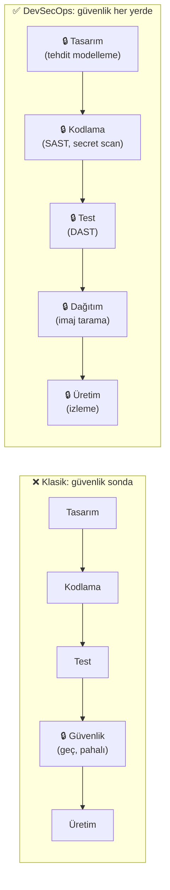
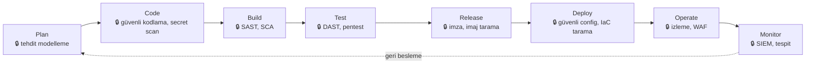
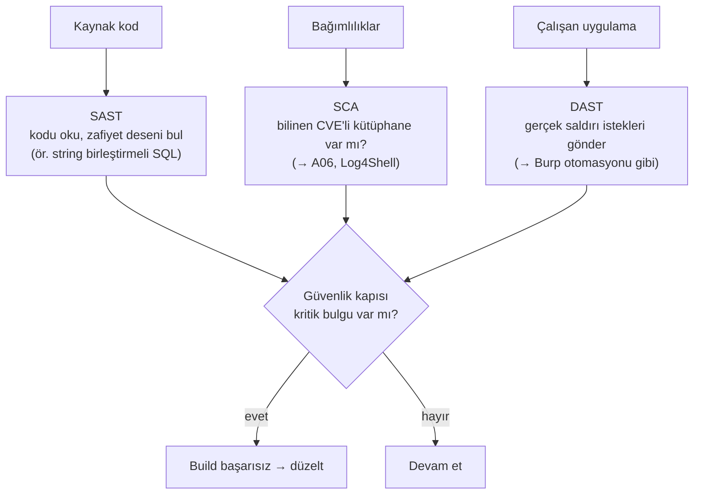
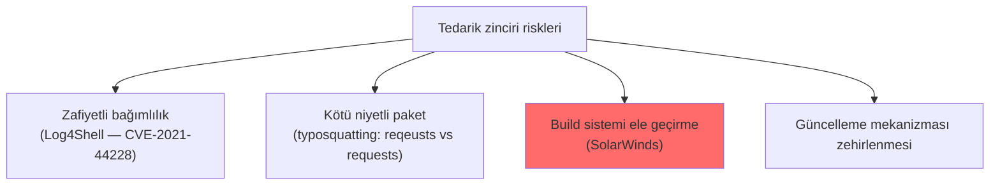

# 🔄 DevSecOps ve Güvenli Yazılım Yaşam Döngüsü (SSDLC)

Güvenli kod yazmak ([guvenli-kodlama-ilkeleri.md](guvenli-kodlama-ilkeleri.md)) tek başına yetmez — güvenliğin yazılım geliştirme **sürecinin her aşamasına** gömülmesi gerekir. DevSecOps, "güvenliği herkesin işi ve sürecin ayrılmaz parçası yapma" felsefesidir. Bu dosya SSDLC'yi, shift-left'i, otomatik güvenlik testlerini (SAST/DAST/SCA) ve tedarik zinciri güvenliğini kurar.

> Ön koşul: [guvenli-kodlama-ilkeleri.md](guvenli-kodlama-ilkeleri.md), [stride-tehdit-modelleme.md](../08-grc-yonetisim-risk-uyum/stride-tehdit-modelleme.md).

---

## 1. Shift-left: güvenliği erkene çekmek

Klasik modelde güvenlik, geliştirmenin **en sonunda** (üretimden hemen önce) bir "kapı" olarak eklenirdi — geç, pahalı ve gecikmeye neden olan. **Shift-left**, güvenliği sürecin **başına** (sola) taşır: tasarım ve kodlama aşamasından itibaren.

> **Neden shift-left:** Bir zafiyeti tasarımda bulmak dakikalar, üretimde bulmak felaket maliyetidir ([stride-tehdit-modelleme.md](../08-grc-yonetisim-risk-uyum/stride-tehdit-modelleme.md)). Güvenliği erkene çekmek hem ucuzlatır hem hızlandırır (geç kalan güvenlik kapısı, teslimatı geciktirir).

---

## 2. DevSecOps: Dev + Sec + Ops

DevOps, geliştirme (Dev) ve operasyonu (Ops) birleştirdi. **DevSecOps**, güvenliği (Sec) bu sürekli döngüye **gömer** — ayrı bir ekip/aşama değil, herkesin sorumluluğu.

**Temel ilke:** "Güvenlik, kalite gibi, herkesin işidir." Geliştirici güvenli kod yazar, boru hattı (pipeline) otomatik güvenlik testleri koşar, operasyon güvenli yapılandırır, hepsi izlenir.

---

## 3. Otomatik güvenlik testleri: SAST / DAST / SCA / IAST

DevSecOps'un motoru, CI/CD boru hattına gömülü **otomatik güvenlik araçlarıdır**:

| Araç | Ne yapar | Ne zaman | Analoji |
|------|----------|----------|---------|
| **SAST** (Static) | **Kaynak kodu** analiz eder (çalıştırmadan) | Kodlama/Build | Yazım denetimi — metni okur |
| **DAST** (Dynamic) | **Çalışan uygulamayı** dışarıdan test eder | Test | Deneme sürüşü — çalışırken dener |
| **SCA** (Software Composition) | **Bağımlılıkları** bilinen zafiyetlere karşı tarar | Build | Malzeme listesi kontrolü |
| **IAST** (Interactive) | Çalışma zamanında kod+davranış | Test | İçeriden gözlemci |

| | SAST | DAST |
|---|------|------|
| Bakış | İçeriden (kod) | Dışarıdan (kara kutu) |
| Aşama | Erken (kod) | Geç (çalışan) |
| Bulur | Kod zafiyetleri (SQLi deseni) | Çalışma zamanı zafiyetleri, yapılandırma |
| Yanlış pozitif | Daha fazla | Daha az ama daha yavaş |
| Kaçırır | Çalışma zamanı/config sorunları | Kaynak kod detayı |

> İkisi tamamlayıcıdır: SAST erken ve kod-içi, DAST gerçekçi ve dış perspektif. Birlikte kapsama artar.

---

## 4. Tedarik zinciri güvenliği (supply chain security)

Modern uygulamaların kodunun büyük kısmı **üçüncü taraf bağımlılıklardan** gelir. Bu, devasa bir güven ve saldırı yüzeyi yaratır — son yılların en kritik tehdit alanı ([A06, A08](../04-web-guvenligi/owasp-top10-tam-rehber.md)).

### Klasik dersler
- **Log4Shell (2021):** Yaygın bir loglama kütüphanesindeki tek zafiyet, milyonlarca uygulamayı uzaktan kod çalıştırmaya açtı → SCA ve hızlı yama neden kritik.
- **SolarWinds (2020):** Saldırganlar bir yazılım satıcısının **build sürecine** kod enjekte etti; imzalı, "güvenilir" güncelleme binlerce kuruma zararlı kod taşıdı → güncelleme bütünlüğü ([anahtar-degisimi-ve-imza.md](../05-kriptografi/anahtar-degisimi-ve-imza.md) imza) ve CI/CD güvenliği.

### Savunmalar
| Savunma | Ne yapar |
|---------|----------|
| **SCA / bağımlılık tarama** | Zafiyetli kütüphaneleri tespit (Dependabot, `npm audit`, Snyk, Trivy) |
| **SBOM** (Software Bill of Materials) | "Yazılım içindekiler listesi" — neyi kullandığını bil, bir CVE çıkınca hızlı bul |
| **Bağımlılık sabitleme (pinning)** | Sürümleri sabitle, beklenmedik güncelleme gelmesin |
| **İmza doğrulama** | Paket/güncelleme imzasını doğrula |
| **CI/CD sertleştirme** | Build ortamını koru (en az ayrıcalık, izole) |

---

## 5. Altyapı olarak kod (IaC) ve konteyner güvenliği

Modern dağıtım, altyapıyı da kod olarak tanımlar (Terraform, Ansible) — bu, yapılandırmayı da taranabilir yapar:
- **IaC tarama:** Terraform/CloudFormation dosyalarında yanlış yapılandırma (açık port, geniş IAM) tespiti ([temel-kavramlar.md](../09-cloud-virtualizasyon/temel-kavramlar.md) CSPM).
- **Konteyner imaj tarama:** İmajdaki zafiyetli paketleri tara ([container-guvenligi.md](../09-cloud-virtualizasyon/container-guvenligi.md)) — Trivy, Grype.
- **Secret scanning:** Kod/commit'lerde sızmış sırları ([guvenli-kodlama-ilkeleri.md](guvenli-kodlama-ilkeleri.md)) yakala (git-secrets, TruffleHog).

---

## 6. Nüans: kültür, araç değil

- **DevSecOps bir araç seti değil, kültürdür:** SAST/DAST satın almak DevSecOps yapmaz. Asıl mesele, güvenliği geliştiricinin sahiplendiği, hızı yavaşlatmadan gömülü bir sorumluluğa dönüştürmektir.
- **Otomasyon şart ama yeterli değil:** Araçlar yanlış pozitif üretir ([log-analizi.md](../11-soc-mavi-takim/log-analizi.md) TP/FP); insan gözü (kod incelemesi, tehdit modelleme) hâlâ gerekli.
- **Hız vs güvenlik yanlış ikilem:** İyi DevSecOps, güvenliği yavaşlatan bir kapı değil, otomatik ve erken olduğu için aslında **hızlandıran** bir yapıdır (geç bulunan zafiyet en çok geciktirendir).

---

## 7. Saldırı–savunma kesişimi (özet)

- **Shift-left = en ucuz savunma:** Zafiyeti tasarım/kod aşamasında yakalamak, üretimde saldırganın bulmasını beklemekten kat kat ucuz — bu modülün ve [STRIDE](../08-grc-yonetisim-risk-uyum/stride-tehdit-modelleme.md)'in ortak tezi.
- **Tedarik zinciri yeni ön cephe:** SolarWinds/Log4Shell gösterdi ki en güvenli kodun bile bir bağımlılığı onu düşürebilir → SCA + SBOM + imza artık zorunlu.
- **Bir kurucu için:** [PQC şirketin](../05-kriptografi/post-kuantum-kriptografi.md) ürünü de bir yazılım tedarik zincirinin parçası olacak — DevSecOps ve kripto çevikliği, güvenilir bir güvenlik ürünü sunmanın temeli.

> **Modül 13 tamamlandı.** Sonraki: [14-scripting-otomasyon/python-guvenlik-icin.md](../14-scripting-otomasyon/python-guvenlik-icin.md).
