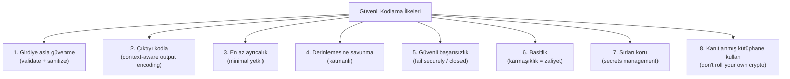

# 🧑‍💻 Güvenli Kodlama İlkeleri

Güvenlik açıklarının çoğu, sömürüldükleri yerde değil, **yazıldıkları yerde** — kaynak kodda — doğar. Güvenli kodlama, zafiyetleri var olmadan önlemektir; bu, onları sonradan yamalamaktan kat kat ucuz ve etkilidir. Bu dosya, dile bağımsız güvenli kodlama ilkelerini kurar ve önceki modüllerdeki zafiyetleri kod perspektifinden birleştirir.

> Zafiyet karşılıkları: [04-web-guvenligi](../04-web-guvenligi/owasp-top10-tam-rehber.md), [bellek-zafiyetleri-giris.md](../03-isletim-sistemi-ici/bellek-zafiyetleri-giris.md). Süreç: [devsecops-ssdlc.md](devsecops-ssdlc.md).

---

## 1. Temel felsefe: güvenlik sonradan eklenmez

> **Güvenlik bir özellik değil, bir kalitedir.** Bir uygulamaya sonradan "güvenlik ekleyemezsin" — güvenlik, her tasarım ve kodlama kararının içine örülür. Bu, [insecure design (A04)](../04-web-guvenligi/owasp-top10-tam-rehber.md) ve [shift-left](devsecops-ssdlc.md) fikirlerinin kod düzeyindeki karşılığıdır.

Maliyet gerçeği ([stride-tehdit-modelleme.md](../08-grc-yonetisim-risk-uyum/stride-tehdit-modelleme.md)): bir zafiyeti kodlama aşamasında düzeltmek birkaç dakika; üretimde ise ihlal + itibar + yasal maliyet. Bu yüzden güvenli kodlama en yüksek getirili yatırımdır.

---

## 2. Güvenli kodlamanın temel ilkeleri



### İlke 1: Girdiye asla güvenme (input validation)
Tüm dış girdi (kullanıcı, API, dosya, ağ) **güvenilmezdir** ([web-mimarisi.md](../04-web-guvenligi/web-mimarisi.md)). Sunucu tarafında doğrula.
- **Allow-list > deny-list:** "Neyin iyi olduğunu" tanımla ("kullanıcı adı sadece a-z0-9"), "neyin kötü olduğunu" engellemeye çalışma ([enjeksiyon-aileleri.md](../04-web-guvenligi/zafiyet-siniflari/enjeksiyon-aileleri.md)).
- Tür, uzunluk, format, aralık doğrula.

### İlke 2: Çıktıyı bağlama göre kodla (output encoding)
Veriyi bir yoruma (HTML, SQL, shell) yerleştirirken, o bağlama uygun kodla/kaçış yap → XSS ([xss.md](../04-web-guvenligi/zafiyet-siniflari/xss.md)), SQLi ([sqli.md](../04-web-guvenligi/zafiyet-siniflari/sqli.md)) önlenir. En iyisi: kod/veriyi **ayır** (parametreli sorgu, `textContent`).

### İlke 3: En az ayrıcalık
Kod, veritabanı kullanıcısı, servis hesabı — her biri minimum yetkiyle çalışsın ([terminoloji-sozlugu.md](../00-baslangic/terminoloji-sozlugu.md)). Bir SQLi olsa bile DB kullanıcısının `DROP` yetkisi yoksa hasar sınırlı.

### İlke 4: Derinlemesine savunma
Tek bir kontrole güvenme. Girdi doğrulama + parametreli sorgu + en az ayrıcalık + WAF — biri başarısız olsa diğeri tutar.

### İlke 5: Güvenli başarısızlık (fail securely)
Hata durumunda **güvenli** tarafa düş: erişimi reddet (fail closed), varsayılan olarak izin verme. Ayrıca:
```python
# KÖTÜ — hata mesajı bilgi sızdırır (bkz. A05, error-based SQLi)
except Exception as e:
    return f"Veritabanı hatası: {e}"   # stack trace kullanıcıya!

# İYİ — genel mesaj, detay sadece loga
except Exception as e:
    logger.error(f"DB hatası: {e}")     # detay logda
    return "Bir hata oluştu, tekrar deneyin."   # kullanıcıya genel
```

### İlke 6: Basitlik (KISS)
Karmaşıklık zafiyetin dostudur. Anlaşılması zor kod, güvenlik hatalarını gizler. Basit, okunabilir kod daha güvenlidir.

### İlke 7: Sırları koru (secrets management)
```python
# KÖTÜ — sabit kodlu sır (kaynak koda, git geçmişine sızar!)
API_KEY = "sk_live_abc123..."          # ASLA
DB_PASSWORD = "P@ssw0rd"

# İYİ — ortam değişkeni / gizli yöneticisi
import os
API_KEY = os.environ["API_KEY"]        # veya Vault/Secrets Manager
```
Sırlar asla kaynak kodda/git'te olmaz → `.gitignore` ([devsecops-ssdlc.md](devsecops-ssdlc.md) secret scanning).

### İlke 8: Kendi kriptonu yazma
"Don't roll your own crypto" ([temel-kavramlar.md](../05-kriptografi/temel-kavramlar.md)). Kanıtlanmış kütüphaneleri kullan (parola için Argon2/bcrypt, şifreleme için libsodium/AES-GCM). Kendi algoritman neredeyse kesinlikle kırıktır.

---

## 3. Zafiyet → güvenli kod eşlemesi (bütünsel özet)

Önceki modüllerdeki her zafiyet, bir güvenli kodlama ilkesinin ihlalidir:

| Zafiyet | İhlal edilen ilke | Güvenli kod |
|---------|-------------------|-------------|
| [SQLi](../04-web-guvenligi/zafiyet-siniflari/sqli.md) | Girdiye güven + kod/veri karışımı | Parametreli sorgu |
| [XSS](../04-web-guvenligi/zafiyet-siniflari/xss.md) | Çıktı kodlama yok | Output encoding / `textContent` / CSP |
| [Command injection](../04-web-guvenligi/zafiyet-siniflari/enjeksiyon-aileleri.md) | Girdiye güven | `subprocess` liste + `shell=False` |
| [IDOR](../04-web-guvenligi/zafiyet-siniflari/idor-erisim-kontrolu.md) | Yetki kontrolü eksik | Her istekte sahiplik doğrulama |
| [Buffer overflow](../03-isletim-sistemi-ici/bellek-zafiyetleri-giris.md) | Sınır kontrolü yok | Bellek-güvenli dil / `fgets` |
| Zayıf parola saklama | Kendi kripton / eski hash | Argon2 + salt |
| Sabit kodlu sır | Secrets management yok | Ortam değişkeni / Vault |

> **Birleştirici görüş:** Neredeyse tüm zafiyetler birkaç ilkenin ihlaline indirgenir: *girdiye güvenmek*, *kod ile veriyi karıştırmak*, *yetki/kontrol atlamak*, *aşırı ayrıcalık*. Bu ilkeleri içselleştirmek, hiç görmediğin zafiyet türlerine karşı bile doğru refleksi verir.

---

## 4. Dil seçimi bir güvenlik kararıdır

- **Bellek-güvenli diller** (Rust, Go, Java, C#, Python), tüm bir zafiyet sınıfını (buffer overflow, use-after-free → [bellek-zafiyetleri-giris.md](../03-isletim-sistemi-ici/bellek-zafiyetleri-giris.md)) dil düzeyinde ortadan kaldırır. Yeni sistem projelerinde CISA/NSA bunları tavsiye eder.
- **Rust'ın ownership modeli**, use-after-free'yi derleme zamanında imkânsız kılar — çalışma zamanı maliyeti olmadan.
- Bu, "savunma katmanı eklemek" değil, "zafiyeti var olmadan engellemek"tir — en güçlü savunma budur.

---

## 5. Güvenli kodlama pratikleri

- **Kod gözden geçirme (code review):** Güvenlik gözüyle akran incelemesi — insan gözü otomatik araçların kaçırdığını yakalar.
- **Güvenli varsayılanlar (secure defaults):** Framework'ün güvenli özelliklerini (ORM, otomatik CSRF token, çıktı kodlama) kullan; güvenliği kapatmak bilinçli bir karar olsun.
- **Bağımlılık hijyeni:** Kullandığın kütüphaneleri güncel tut, zafiyet taraması yap ([A06](../04-web-guvenligi/owasp-top10-tam-rehber.md), [devsecops-ssdlc.md](devsecops-ssdlc.md)).
- **Tehdit modelleme:** Kod yazmadan önce "burada ne ters gidebilir?" ([stride-tehdit-modelleme.md](../08-grc-yonetisim-risk-uyum/stride-tehdit-modelleme.md)).

---

## 6. Saldırı–savunma kesişimi (özet)

- **Kök nedeni kapatmak > belirtiyi yamalamak:** WAF bir SQLi'yi filtreleyebilir (belirti), ama parametreli sorgu onu **var olmaktan** çıkarır (kök neden). Güvenli kodlama kök nedene odaklanır.
- **Geliştirici = ilk savunma hattı:** Güvenlik ekibi her satırı gözden geçiremez; güvenli kodlama kültürü ([devsecops-ssdlc.md](devsecops-ssdlc.md)) güvenliği geliştiriciye taşır (shift-left).
- **Bir mimar/kurucu için:** [PQC hedefin](../05-kriptografi/post-kuantum-kriptografi.md) için bile, kripto çevikliği ve güvenli kripto kullanımı birer güvenli kodlama disiplinidir — güçlü algoritma, kötü kodla boşa gider.

> **Sonraki:** [devsecops-ssdlc.md](devsecops-ssdlc.md).
