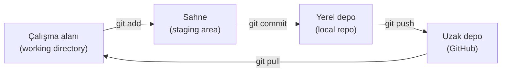
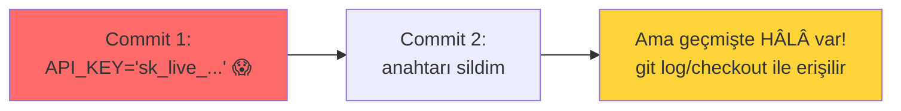

# 🌿 Git Temelleri

Git, sürüm kontrolünün fiili standardıdır — kodun, betiklerin ve dokümantasyonun (bu repo dahil!) değişim geçmişini yönetir. Bir güvenlik uzmanı için Git hem günlük araç (araçları versiyonla, işbirliği yap) hem güvenlik alanı (sızmış sırlar, geçmiş sömürüsü) hem portföy vitrini (GitHub) demektir. Bu dosya Git temellerini ve güvenlik boyutunu kurar.

> Portföy bağlamı: bu repo Git ile yönetiliyor → [README.md](../README.md). Güvenlik kesişimi: [devsecops-ssdlc.md](../13-guvenli-kodlama-devsecops/devsecops-ssdlc.md) (secret scanning).

---

## 1. Git nedir ve neden?

Git, **dağıtık sürüm kontrol sistemidir**: her değişikliği (commit) kaydeder, geçmişe dönmeyi, dallanmayı (branch) ve işbirliğini sağlar. "Dağıtık" = her kopyada tam geçmiş vardır (merkezî sunucuya bağımlı değil).

**Neden güvenlikçi için önemli:**
- **Araç yönetimi:** Yazdığın betikleri ([python-guvenlik-icin.md](python-guvenlik-icin.md)) versiyonla, değişikliği izle.
- **İşbirliği + portföy:** GitHub, bu reponun ([README.md](../README.md)) yayınlanacağı yer — CV vitrini.
- **Güvenlik alanı:** Git geçmişi bir saldırı yüzeyidir (aşağıda — sızmış sırlar).

---

## 2. Temel iş akışı



```bash
# Başlangıç
git init                        # yeni depo başlat
git clone <url>                 # var olanı kopyala

# Günlük döngü
git status                      # ne değişti?
git add dosya.py                # değişikliği sahnele
git add .                       # tüm değişiklikleri sahnele
git commit -m "açıklayıcı mesaj" # kaydet (yerel)
git push                        # uzağa gönder (GitHub)
git pull                        # uzaktan güncel al

# İnceleme
git log --oneline               # commit geçmişi
git diff                        # sahnelenmemiş değişiklikler
git show <commit>               # bir commit'in detayı
```

---

## 3. Dallanma (branching) ve işbirliği

```bash
git branch                      # dalları listele
git checkout -b yeni-ozellik    # yeni dal oluştur + geç
git merge yeni-ozellik          # dalı birleştir
git checkout main               # ana dala dön
```

- **Branch (dal):** Ana koddan bağımsız çalışma hattı — bir özelliği/düzeltmeyi ana kodu bozmadan geliştir.
- **Pull Request (PR):** GitHub'da bir dalın ana koda katılmasını önerme + gözden geçirme (kod incelemesi → [guvenli-kodlama-ilkeleri.md](../13-guvenli-kodlama-devsecops/guvenli-kodlama-ilkeleri.md)).

---

## 4. ⚠️ Git güvenliği: sızmış sırlar

> **En kritik Git güvenlik dersi:** Git **her şeyi hatırlar.** Bir sırrı (API anahtarı, parola) yanlışlıkla commit edip sonraki commit'te silsen bile, **geçmişte kalır** ve klonlayan herkes onu görebilir. `git rm` yeter sanmak en tehlikeli yanılgıdır.



### Savunma
- **`.gitignore`:** Sırların/hassas dosyaların ([.gitignore](../.gitignore)) hiç eklenmemesini sağla:
  ```gitignore
  *.env
  *.key
  *.pem
  secrets.*
  config.local.*
  ```
- **Secret scanning:** Commit öncesi/sonrası tarama (git-secrets, TruffleHog, GitHub secret scanning) → [devsecops-ssdlc.md](../13-guvenli-kodlama-devsecops/devsecops-ssdlc.md).
- **Sır sızdıysa:** (1) Sırrı **hemen iptal et/döndür** (rotate) — geçmişten silmek yetmez, çünkü zaten klonlanmış olabilir. (2) Sonra geçmişten temizle (`git filter-repo` / BFG). **Önce iptal, sonra temizlik.**
- **Pre-commit hook:** Commit öncesi otomatik sır/kalite kontrolü.

> **Kesişim:** Saldırganlar GitHub'ı **açık sır** (exposed secrets) için sürekli tarar — bir AWS anahtarı public commit'e sızdığında, botlar dakikalar içinde bulup kötüye kullanır (OWASP Top 10:2025 [A02 Misconfiguration + A04 Cryptographic Failures](../04-web-guvenligi/owasp-top10-tam-rehber.md)). Bu, [tehdit istihbaratının](../07-tehdit-modelleme-cerceveler/tehdit-istihbarati-ioc-ioa.md) ve otomatik keşfin gerçek bir örneğidir.

---

## 5. Bu repoyu GitHub'a yükleme (pratik)

Bu deponun ([README.md](../README.md)) portföy olarak yayınlanması:

```bash
# Repo kök dizininde (zaten git init yapıldı)
git add .
git commit -m "Siber güvenlik temelleri reposu: ilk sürüm"

# GitHub'da boş bir repo oluştur (web arayüzünden), sonra:
git remote add origin https://github.com/<kullanici>/siber-guvenlik-temelleri.git
git branch -M main
git push -u origin main
```

> **Yüklemeden önce kontrol:** `.gitignore`'un ([.gitignore](../.gitignore)) sırları/kişisel veriyi dışladığından emin ol; `assets/screenshots/` içine yüklediğin ekran görüntülerinde hassas bilgi (gerçek IP, kimlik, token) olmadığını doğrula. Portföy public olacak → sızıntı riski.

---

## 6. Faydalı Git komutları (hızlı referans)

```bash
git stash                       # değişiklikleri geçici sakla
git stash pop                   # geri getir
git reset --soft HEAD~1         # son commit'i geri al (değişiklikleri koru)
git revert <commit>             # bir commit'i tersine çeviren yeni commit
git log --oneline --graph --all # görsel commit ağacı
git blame dosya                 # her satırı kim/ne zaman değiştirdi (adli)
git diff HEAD~3 HEAD            # 3 commit önceki ile şimdi arası fark
```

> `git blame` ve `git log`, bir kod adli analizinde ("bu zafiyeti kim, ne zaman ekledi?") kullanışlıdır.

---

## 7. Saldırı–savunma kesişimi (özet)

- **Git geçmişi = kalıcı hafıza:** Sızmış sırlar silinmez, iptal edilir. Bu, [güvenli kodlamanın](../13-guvenli-kodlama-devsecops/guvenli-kodlama-ilkeleri.md) secrets management ilkesinin neden bu kadar kritik olduğunu gösterir.
- **Portföy güvenliği:** Bu repo public olacak; yüklemeden önce sır/kişisel veri kontrolü hem güvenlik hem profesyonellik gereği.
- **Tedarik zinciri bağlantısı:** Git/GitHub, yazılım tedarik zincirinin ([devsecops-ssdlc.md](../13-guvenli-kodlama-devsecops/devsecops-ssdlc.md)) merkezidir; depo güvenliği (erişim, imzalı commit, korumalı dal) modern güvenliğin parçası.

> **Modül 14 tamamlandı.** Sonraki: [15-projeler/proje-onerileri.md](../15-projeler/proje-onerileri.md).
