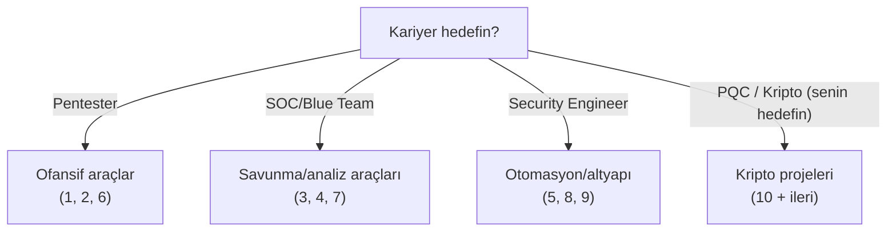

# 🚀 Proje Önerileri

Bu repoyu okumak bilgi verir; **proje yapmak beceri verir.** Bu dosya, bu depoyu bitirdikten sonra yapabileceğin, portföy-kalite (public GitHub'da sergilenebilir → [git-temelleri.md](../14-scripting-otomasyon/git-temelleri.md)) 10 proje önerir. Her biri, öğrendiğin modülleri gerçek bir ürüne dönüştürür.

> Nasıl kullanılır: Bir proje seç, kendi GitHub reposunu aç, README + kod + ekran görüntüleriyle belgele. Bunlar CV'nde "yaptım" diyebileceğin somut kanıtlardır.

---

## Projeler nasıl seçilir?

Her projeyi **"basit çalışan sürüm → portföy sürümü"** olarak düşün: önce çalıştır, sonra README/test/hata yönetimi/CLI ile cilalayıp sergilenebilir yap.

---

## Proje 1 — Gelişmiş Port Tarayıcı 🔴
**Zorluk:** Başlangıç · **Modüller:** [01-ağ](../01-ag-networking/tcp-ip-protokoller.md), [14-python](../14-scripting-otomasyon/python-guvenlik-icin.md)

Depodaki [port_tarayici.py](../01-ag-networking/pratik-scriptler/port_tarayici.py)'yi portföy kalitesine yükselt:
- Çok iş parçacıklı (threading) → hız.
- Banner grabbing (servis sürümü tespiti).
- Sonuçları JSON/CSV rapor olarak dışa aktar.
- `argparse` ile düzgün CLI, renkli çıktı.
- **Öğrenilen:** Ağ programlama, eşzamanlılık, temiz araç tasarımı.

---

## Proje 2 — Subnet Hesaplayıcı + Görselleştirici 🔴
**Zorluk:** Başlangıç · **Modüller:** [subnetting](../01-ag-networking/subnetting-cidr.md), [14-python](../14-scripting-otomasyon/python-guvenlik-icin.md)

[subnet_calculator.py](../01-ag-networking/pratik-scriptler/subnet_calculator.py)'yi genişlet:
- VLSM planlayıcı (host gereksinimlerinden alt ağları otomatik böl).
- Web arayüzü (Flask) veya güzel CLI tablosu.
- Görsel bit-bölünmesi çıktısı.
- **Öğrenilen:** Ağ matematiği, (isteğe bağlı) web geliştirme.

---

## Proje 3 — Log Analiz Aracı 🔵
**Zorluk:** Başlangıç-Orta · **Modüller:** [log-analizi](../11-soc-mavi-takim/log-analizi.md), [regex](../14-scripting-otomasyon/regex-referans.md)

Bir log dosyasını (auth.log, access.log) analiz eden araç:
- Brute-force tespiti (eşik üstü başarısız giriş → IP).
- Anormallik/tarama tespiti (çok sayıda 404).
- Özet rapor + basit görselleştirme (grafik).
- **Öğrenilen:** Regex, log analizi, savunma düşüncesi, veri görselleştirme.

---

## Proje 4 — Phishing E-posta Analizörü 🔵
**Zorluk:** Orta · **Modüller:** [phishing](../12-sosyal-muhendislik-phishing/phishing-analizi.md), [dns](../01-ag-networking/dns-derinlemesine.md)

Bir e-posta (.eml) dosyasını analiz eden araç:
- Başlıkları ayrıştır, SPF/DKIM/DMARC sonucunu çıkar.
- Şüpheli link/alan adı tespiti (typosquatting benzerlik).
- Risk skoru üret.
- **Öğrenilen:** E-posta güvenliği, DNS, tehdit analizi.

---

## Proje 5 — Otomatik Güvenlik Sertleştirme Denetleyici ⚙️
**Zorluk:** Orta · **Modüller:** [hardening](../02-linux-windows/pratik-lab/linux-hardening-checklist.md), [bash](../14-scripting-otomasyon/bash-otomasyon.md)

Bir Linux sistemini CIS Benchmark benzeri kurallara göre denetleyen araç:
- SSH config, izinler, açık portlar, kullanıcı hesapları.
- Skor + düzeltme önerileri raporu.
- **Öğrenilen:** Sistem sertleştirme, betikleme, uyum düşüncesi.

---

## Proje 6 — Web Zafiyet Laboratuvarı (kendi savunmanı yaz) 🔴🔵
**Zorluk:** Orta · **Modüller:** [04-web](../04-web-guvenligi/owasp-top10-tam-rehber.md), [güvenli-kodlama](../13-guvenli-kodlama-devsecops/guvenli-kodlama-ilkeleri.md)

Kasıtlı zafiyetli **VE** güvenli iki sürümlü bir mini web uygulaması yaz:
- Zafiyetli sürüm: SQLi, XSS, IDOR içersin.
- Güvenli sürüm: aynı özellik, doğru savunmalarla (parametreli sorgu, output encoding, yetki kontrolü).
- Yan yana karşılaştırma + açıklama.
- **Öğrenilen:** Hem saldırı hem savunmayı **kodla** — en öğretici proje.

---

## Proje 7 — Mini SIEM / Log Korelasyon Motoru 🔵
**Zorluk:** Orta-İleri · **Modüller:** [siem](../11-soc-mavi-takim/siem-edr-soar.md), [python](../14-scripting-otomasyon/python-guvenlik-icin.md)

Birden çok log kaynağını alıp kurallarla ilişkilendiren basit bir motor:
- Korelasyon kuralı (ör. "5 dk'da 10 başarısız + 1 başarılı giriş → uyarı").
- Basit web dashboard.
- **Öğrenilen:** SIEM mantığı, korelasyon, tespit mühendisliği.

---

## Proje 8 — Parola Gücü + Sızıntı Denetleyici ⚙️
**Zorluk:** Orta · **Modüller:** [kripto](../05-kriptografi/temel-kavramlar.md), [hash lab](../05-kriptografi/pratik-lab/hash_kirma_john_hashcat.md)

Bir parolayı değerlendiren araç:
- Entropi/güç hesabı.
- "Have I Been Pwned" API ile sızıntı kontrolü (k-anonymity — parolayı göndermeden hash öneki ile).
- Argon2 ile güvenli hash örneği.
- **Öğrenilen:** Parola güvenliği, hash, güvenli API kullanımı, k-anonymity.

---

## Proje 9 — Bağımlılık/Tedarik Zinciri Tarayıcı ⚙️
**Zorluk:** Orta-İleri · **Modüller:** [devsecops](../13-guvenli-kodlama-devsecops/devsecops-ssdlc.md)

Bir projenin bağımlılıklarını bilinen zafiyetlere (CVE) karşı tarayan araç:
- `requirements.txt`/`package.json` ayrıştır.
- Bir zafiyet veritabanı API'sine sorgula.
- SBOM üret, risk raporu.
- **Öğrenilen:** Tedarik zinciri güvenliği, SCA, API entegrasyonu.

---

## Proje 10 — PQC Keşif ve Karşılaştırma Aracı ⚛️ (senin hedefin)
**Zorluk:** İleri · **Modüller:** [post-kuantum](../05-kriptografi/post-kuantum-kriptografi.md), [openssl lab](../05-kriptografi/pratik-lab/openssl_ile_sertifika_pratikleri.md)

Uzun vadeli PQC hedefinle ([post-kuantum-kriptografi.md](../05-kriptografi/post-kuantum-kriptografi.md)) doğrudan hizalı:
- **Kripto envanteri tarayıcı:** Bir kod tabanında/sertifika deposunda kullanılan kripto algoritmalarını (RSA/ECC/AES) tespit edip "kuantum riski" raporu üret — bu, gerçek PQC geçiş hizmetinin ilk adımıdır (envanter).
- **Klasik vs PQC karşılaştırma:** liboqs/oqs-provider ile ML-KEM vs RSA anahtar boyutu/hız/imza boyutu ölç ve karşılaştır.
- **Hibrit el sıkışması demo:** Klasik + PQC birlikte anahtar değişimi örneği.
- **Öğrenilen:** PQC pratiği, kripto envanteri, geçiş mühendisliği — **kuracağın şirketin çekirdek yeteneği.**

> Bu proje, matematik mühendisliği arka planınla (kafes/LWE matematiği) birleştiğinde, hem güçlü bir portföy parçası hem de gelecekteki iş fikrinin prototipi olur.

---

## Proje çalışması: portföy standartları

Her projeyi sergilerken ([git-temelleri.md](../14-scripting-otomasyon/git-temelleri.md)):
- [ ] Net bir **README** (ne yapar, nasıl kurulur, nasıl kullanılır, ekran görüntüsü).
- [ ] Temiz, yorumlu kod ([guvenli-kodlama-ilkeleri.md](../13-guvenli-kodlama-devsecops/guvenli-kodlama-ilkeleri.md)).
- [ ] Etik/yasal not (araç izinli kullanım için).
- [ ] `.gitignore` + sır sızıntısı kontrolü.
- [ ] (Bonus) Testler, CI, lisans.

> **Kalite > nicelik:** İyi belgelenmiş, cilalı 3 proje, yarım bırakılmış 10 projeden çok daha değerlidir.

> **Sonraki:** [spesifikasyon-sonrasi-yol-haritasi.md](spesifikasyon-sonrasi-yol-haritasi.md).
