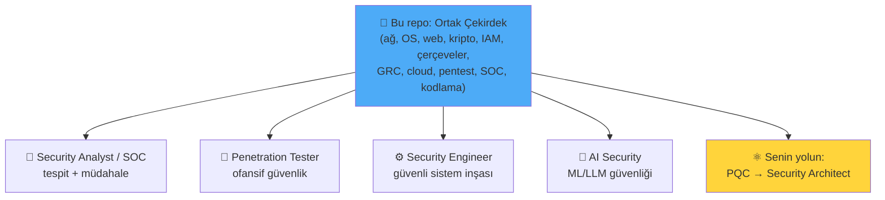
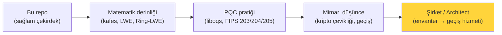

# 🧭 Spesifikleşme Sonrası Yol Haritası

Bu repo, siber güvenliğin **spesifikleşme öncesi ortak çekirdeğini** kurar — herkesin bilmesi gereken temel. Bu temeli tamamladığında, bir dalda derinleşme zamanı gelir. Bu dosya, dört ana dala (Security Analyst, Penetration Tester, Security Engineer, AI Security) ve senin özel hedefine (PQC → Security Architect) giden yolları özetler.

> Bu, deponun **kapanış** dosyasıdır. Ortak çekirdek: tüm önceki 15 modül. Projeler: [proje-onerileri.md](proje-onerileri.md).

---

## 1. Genel harita: çekirdekten dallara

Hiçbir dal çekirdeği "geride bırakmaz" — hepsi bu temelin üstüne inşa edilir. İyi bir uzman, kendi dalında derin, çekirdekte sağlamdır.

---

## 2. 🔵 Security Analyst / Blue Team / SOC

**Ne yapar:** Tehditleri tespit eder, olaylara müdahale eder, savunmayı işletir.

**Bu repodaki temeli:** [11-soc](../11-soc-mavi-takim/siem-edr-soar.md), [07-tehdit-modelleme](../07-tehdit-modelleme-cerceveler/mitre-attck.md), [log-analizi](../11-soc-mavi-takim/log-analizi.md).

**Derinleşme yolu:**
- SIEM ustalığı (Splunk, Elastic, Sentinel), tespit mühendisliği (Sigma kuralları).
- Dijital adli analiz ve olay müdahalesi (DFIR), bellek/disk forensics.
- Tehdit avcılığı (threat hunting), zararlı yazılım analizi.
- **Sertifikalar:** BTL1/BTL2, GCIA, GCIH, CySA+.
- **Pratik:** TryHackMe SOC Level 1/2 yolu, Blue Team Labs Online, LetsDefend.

---

## 3. 🔴 Penetration Tester / Red Team / Offensive

**Ne yapar:** Sistemleri saldırganı taklit ederek test eder, zafiyetleri bulur ve raporlar.

**Bu repodaki temeli:** [10-pentest](../10-pentest-metodolojisi/metodoloji-ve-rules-of-engagement.md), [04-web](../04-web-guvenligi/owasp-top10-tam-rehber.md), [02-linux-windows](../02-linux-windows/windows-temelleri.md) (AD).

**Derinleşme yolu:**
- Web app pentest derinleşmesi (PortSwigger Academy'yi bitir).
- Active Directory saldırıları (Kerberoasting, BloodHound, yanal hareket).
- Exploit geliştirme (buffer overflow → [bellek-zafiyetleri](../03-isletim-sistemi-ici/bellek-zafiyetleri-giris.md), ileri: ROP).
- **Sertifikalar:** PNPT, **OSCP** (altın standart), CRTP/CRTO (AD), OSWE (web).
- **Pratik:** HackTheBox, TryHackMe Offensive Pentesting, VulnHub, bug bounty (HackerOne/Bugcrowd).

> **Sorumlu ifşa/bug bounty:** Gerçek sistemlerde ([metodoloji-ve-rules-of-engagement.md](../10-pentest-metodolojisi/metodoloji-ve-rules-of-engagement.md)) yalnızca yetkili programlarda çalış.

---

## 4. ⚙️ Security Engineer / DevSecOps / Cloud Security

**Ne yapar:** Güvenli sistemler inşa eder, güvenliği altyapıya ve boru hattına gömer.

**Bu repodaki temeli:** [13-devsecops](../13-guvenli-kodlama-devsecops/devsecops-ssdlc.md), [09-cloud](../09-cloud-virtualizasyon/temel-kavramlar.md), [06-iam](../06-kimlik-erisim-yonetimi-iam/zero-trust.md), [14-scripting](../14-scripting-otomasyon/python-guvenlik-icin.md).

**Derinleşme yolu:**
- Bulut güvenliği derinleşmesi (AWS/Azure/GCP güvenlik servisleri, IAM ustalığı).
- Kubernetes/konteyner güvenliği ([container-guvenligi.md](../09-cloud-virtualizasyon/container-guvenligi.md)), IaC güvenliği.
- Otomasyon, güvenlik boru hatları, sıfır güven mimarisi.
- **Sertifikalar:** AWS/Azure Security Specialty, CKS (Kubernetes), GCSA.
- **Pratik:** Kendi güvenli altyapını kur (Terraform + tarama), CTF'lerin cloud kategorileri.

---

## 5. 🤖 AI Security (yükselen alan)

**Ne yapar:** Yapay zeka/ML sistemlerini saldırılara karşı güvenli kılar ve AI'yı güvenlik için kullanır.

**Bu repodaki temeli:** [04-web](../04-web-guvenligi/owasp-top10-tam-rehber.md) (LLM uygulamaları web'dir), [13-güvenli-kodlama](../13-guvenli-kodlama-devsecops/guvenli-kodlama-ilkeleri.md), [enjeksiyon-aileleri](../04-web-guvenligi/zafiyet-siniflari/enjeksiyon-aileleri.md) (prompt injection = enjeksiyon ailesinin yeni üyesi!).

**Derinleşme yolu:**
- **OWASP Top 10 for LLM Applications** — prompt injection, veri sızıntısı, güvensiz çıktı işleme.
- Adversarial ML (model kandırma), veri zehirleme, model çalma.
- AI'yı savunmada kullanma (anomali tespiti, otomatik triyaj).
- **Not:** Bu alan hızla olgunlaşıyor; matematik arka planın ([post-kuantum](../05-kriptografi/post-kuantum-kriptografi.md) ile aynı avantaj) burada da değerli.

> **Kesişim:** Prompt injection, [enjeksiyon-aileleri.md](../04-web-guvenligi/zafiyet-siniflari/enjeksiyon-aileleri.md)'nin "kod/veri karışması" kök nedeninin LLM çağındaki hâlidir — çekirdek bilgin doğrudan transfer olur.

---

## 6. ⚛️ Senin Yolun: PQC → Security Architect

Bu repo boyunca vurgulandığı gibi, senin hedefin özel: **post-kuantum kriptografi alanında şirket kurmak ve Security Architect seviyesine ulaşmak.** İşte bu temelden oraya giden özel yol:

### Somut adımlar
1. **Kripto derinliği:** [post-kuantum-kriptografi.md](../05-kriptografi/post-kuantum-kriptografi.md) ve [zorluk-varsayimlari.md](../05-kriptografi/zorluk-varsayimlari.md)'yi temel al; matematik mühendisliği arka planınla **kafes teorisi, LWE/Ring-LWE, SVP/CVP** matematiğine derinleş (bu senin doğal avantajın — çoğu güvenlikçi bu matematiğe sahip değil).
2. **PQC pratiği:** Open Quantum Safe (liboqs, oqs-provider) ile ML-KEM/ML-DSA'yı elle uygula ([openssl lab](../05-kriptografi/pratik-lab/openssl_ile_sertifika_pratikleri.md) uzantısı, [Proje 10](proje-onerileri.md)). NIST PQC sürecini ve standartları yakından izle.
3. **Mimari düşünce:** Security Architect, tek tek zafiyetlerden çok **sistem tasarımı, tehdit modelleme ([stride](../08-grc-yonetisim-risk-uyum/stride-tehdit-modelleme.md)), risk ([risk-yonetimi.md](../08-grc-yonetisim-risk-uyum/risk-yonetimi.md)), kripto çevikliği** ile ilgilenir — bu repodaki GRC/çerçeve/tasarım modüllerini derinleştir.
4. **İş fikri:** [post-kuantum-kriptografi.md](../05-kriptografi/post-kuantum-kriptografi.md)'deki 6-adımlı geçiş yol haritası (envanter → önceliklendir → çeviklik → hibrit → doğrula → geçiş) senin şirketinin sunacağı hizmetin iskeleti. Kuruluşların en büyük darboğazı: kendi kripto envanterlerini çıkaramamak ve çevik olmayan mimariler. [Proje 10](proje-onerileri.md) bunun prototipi.
5. **Sertifika/kimlik:** Uzun vadede CISSP (mimar/yönetim dili), ilgili kripto/bulut sertifikaları; ama asıl fark **derin kripto + mimari + iş** birleşiminde.

> **Neden bu kesişim güçlü:** PQC hem derin matematik (senin arka planın) hem mühendislik (bu repo) hem stratejik zamanlama (CNSA 2.0 → 2030, HNDL bugün) gerektiriyor. Bu üçünü birleştirebilen az; talep 2030'a doğru katlanarak artacak. Erken ve derin başlamak senin en büyük avantajın.

---

## 7. Genel tavsiyeler (her dal için)

- **Çekirdeği taze tut:** Bu repoyu bir referans olarak sakla; dalında derinleşirken temele geri dön.
- **Pratik > teori:** Her kavramı bir lab/CTF/projeyle pekiştir — Anki hafızayı, projeler beceriyi kurar ([nasil-calisilir.md](../00-baslangic/nasil-calisilir.md)).
- **Topluluk:** Yerel/çevrimiçi güvenlik toplulukları, konferanslar, CTF takımları.
- **Etik pusula:** Tüm teknikler yalnızca izinli/yasal bağlamda ([metodoloji-ve-rules-of-engagement.md](../10-pentest-metodolojisi/metodoloji-ve-rules-of-engagement.md)) — kariyerin buna dayanır.
- **Yaz ve paylaş:** Öğrendiğini yaz (bu repo gibi!), projelerini sergile ([git-temelleri.md](../14-scripting-otomasyon/git-temelleri.md)) — hem pekiştirir hem portföy kurar.

---

> 🎉 **Tebrikler.** Bu repoyu bitirdiysen, siber güvenliğin ortak çekirdeğini kurmuş oldun ve spesifikleşmeye hazırsın. Yol uzun ama sağlam bir temelin var. **Başarılar — ve PQC yolunda görüşmek üzere. ⚛️**

> Ana sayfaya dön: [README.md](../README.md)
