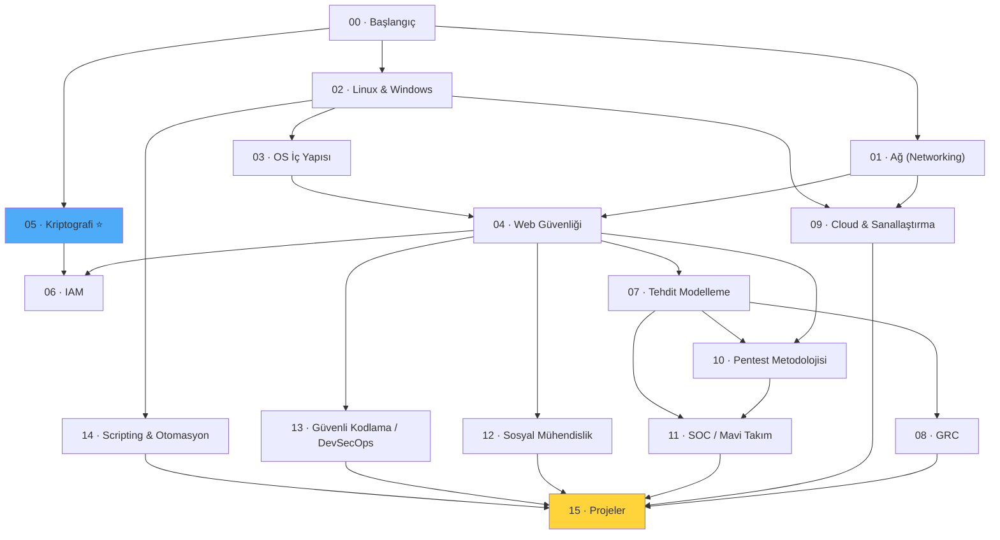

# 🛡️ Siber Güvenlik Temelleri

**Sıfırdan spesifikleşmeye: Türkçe, derinlemesine, pratiğe dayalı bir siber güvenlik el kitabı ve laboratuvarı.**

A comprehensive, from-scratch cybersecurity knowledge base written in Turkish — covering networking, systems, web security, cryptography (with deep post-quantum coverage), IAM, threat modeling, GRC, cloud, offensive/defensive security, and secure coding. Built as both a personal long-term reference and a hands-on lab for the practical skills that spaced-repetition flashcards deliberately don't cover.


---

## 🎯 Neden bu repo var?

Matematik Mühendisliği öğrencisiyim. Uzun vadeli hedefim **post-kuantum kriptografi (PQC)** alanında bir şirket kurmak ve yolda **Security Architect** seviyesine ulaşmak. TryHackMe'nin *Pre Security* ve *Cyber Security 101* path'lerini ve bunların ötesinde geniş bir "spesifikleşme öncesi ortak çekirdek" müfredatını 1383 kartlık bir Anki destesiyle tamamladım.

Bu repo, o bilgiyi **yazılı, aranabilir, canlı bir referansa** dönüştürme girişimi: hem gelecekte geri dönüp bakacağım bir el kitabı, hem de Anki'nin *kasıtlı olarak* kart yapmadığı — çünkü ezbere değil pratiğe dayanan — becerileri (subnetting çözmek, log okumak, script yazmak, kendi PKI'nı kurmak) geliştirdiğim bir çalışma alanı.

**Kimin için:** Sıfırdan başlayıp Security Analyst / Penetration Tester / Security Engineer / AI Security dallarından birine spesifikleşmek isteyen herkes için tasarlandı — sadece benim için değil.

---

## 📚 İçindekiler

- [Modül Haritası](#-modül-haritası)
- [İlerleme Tablosu](#-i̇lerleme-tablosu)
- [Modül Özetleri](#-modül-özetleri)
- [Nasıl Çalışılır?](#-nasıl-çalışılır)
- [Repo Yapısı](#-repo-yapısı)
- [Katkı](#-katkı)
- [Lisans](#-lisans)
- [Etiketler](#-etiketler-topics)

---

## 🗺️ Modül Haritası



> Oklar önerilen öğrenme sırasını gösterir; her modül bağımsız da okunabilir. Detaylı sıra + tahmini süre + TryHackMe eşlemesi için → [ROADMAP.md](ROADMAP.md).

---

## ✅ İlerleme Tablosu

- [x] [00 · Başlangıç](00-baslangic/bilgisayar-temelleri.md) — Bilgisayar temelleri, terminoloji sözlüğü, kullanım kılavuzu
- [x] [01 · Ağ (Networking)](01-ag-networking/temel-kavramlar.md) — OSI, TCP/IP, subnetting/CIDR (★ en derin), DNS, HTTP, routing/NAT/VPN
- [x] [02 · Linux & Windows](02-linux-windows/linux-temelleri.md) — Dosya sistemi, izinler, AD/Kerberos, komut referansları, sertleştirme lab'ı
- [x] [03 · OS İç Yapısı](03-isletim-sistemi-ici/surecler-ve-bellek.md) — Süreç/bellek, kullanıcı/çekirdek modu, bellek zafiyetleri
- [x] [04 · Web Güvenliği](04-web-guvenligi/web-mimarisi.md) — OWASP Top 10, SQLi/XSS/CSRF/SSRF/IDOR, Burp Suite, Juice Shop lab
- [x] [05 · Kriptografi](05-kriptografi/temel-kavramlar.md) — Simetrik/asimetrik, PKI, **post-kuantum kriptografi** (★★ en derin dosya)
- [x] [06 · Kimlik ve Erişim Yönetimi](06-kimlik-erisim-yonetimi-iam/aaa-ve-mfa.md) — MFA, OAuth2/OIDC/SAML, RBAC/ABAC, Zero Trust
- [x] [07 · Tehdit Modelleme ve Çerçeveler](07-tehdit-modelleme-cerceveler/mitre-attck.md) — MITRE ATT&CK, Kill Chain, Pyramid of Pain
- [x] [08 · GRC (Yönetişim, Risk, Uyum)](08-grc-yonetisim-risk-uyum/guvenlik-kontrolleri-matrisi.md) — Risk yönetimi, NIST CSF 2.0, STRIDE
- [x] [09 · Cloud ve Sanallaştırma](09-cloud-virtualizasyon/temel-kavramlar.md) — IaaS/PaaS/SaaS, paylaşılan sorumluluk, konteyner güvenliği
- [x] [10 · Pentest Metodolojisi](10-pentest-metodolojisi/metodoloji-ve-rules-of-engagement.md) — RoE, Nmap, sömürü/privesc, Metasploit
- [x] [11 · SOC / Mavi Takım](11-soc-mavi-takim/siem-edr-soar.md) — SIEM/EDR/SOAR, log analizi, olay müdahalesi
- [x] [12 · Sosyal Mühendislik ve Phishing](12-sosyal-muhendislik-phishing/phishing-analizi.md) — Phishing analizi, SPF/DKIM/DMARC
- [x] [13 · Güvenli Kodlama ve DevSecOps](13-guvenli-kodlama-devsecops/guvenli-kodlama-ilkeleri.md) — Güvenli kodlama ilkeleri, SSDLC
- [x] [14 · Scripting ve Otomasyon](14-scripting-otomasyon/python-guvenlik-icin.md) — Python, Bash, Regex, Git
- [x] [15 · Projeler](15-projeler/proje-onerileri.md) — 10 portföy projesi + spesifikleşme sonrası yol haritası

**16/16 modül tamamlandı.** 🎉

---

## 📖 Modül Özetleri

| Modül | Tek cümlelik özet |
|-------|-------------------|
| [00-baslangic](00-baslangic/) | Bilgisayarın temel çalışma mantığı ve tüm repoda kullanılan terimlerin merkezî sözlüğü. |
| [01-ag-networking](01-ag-networking/) | Bir paketin bir cihazdan diğerine giderken geçtiği tüm katmanlar — OSI'den subnetting'e, DNS'e, HTTP'ye. |
| [02-linux-windows](02-linux-windows/) | İki büyük işletim sistemi ailesinin dosya, izin, kullanıcı ve komut düzeyinde çalışma mantığı. |
| [03-isletim-sistemi-ici](03-isletim-sistemi-ici/) | Süreç/bellek yönetimi ve kullanıcı/çekirdek ayrımı — ayrıcalık yükseltmenin ve bellek zafiyetlerinin temeli. |
| [04-web-guvenligi](04-web-guvenligi/) | OWASP Top 10 ve en kritik web zafiyet sınıflarının mekanizması, PoC'u ve savunması. |
| [05-kriptografi](05-kriptografi/) | Şifrelemeden dijital imzaya, PKI'dan **post-kuantum kriptografiye** kadar tüm kripto yığını. |
| [06-kimlik-erisim-yonetimi-iam](06-kimlik-erisim-yonetimi-iam/) | Kimliğin nasıl doğrulandığı, federe edildiği ve erişimin nasıl kontrol edildiği — Zero Trust dahil. |
| [07-tehdit-modelleme-cerceveler](07-tehdit-modelleme-cerceveler/) | Saldırgan davranışını sistematik anlamanın çerçeveleri: ATT&CK, Kill Chain, Pyramid of Pain. |
| [08-grc-yonetisim-risk-uyum](08-grc-yonetisim-risk-uyum/) | Riskin nicel/nitel ölçümü, güvenlik çerçeveleri (NIST/ISO) ve tasarım-aşaması tehdit modelleme (STRIDE). |
| [09-cloud-virtualizasyon](09-cloud-virtualizasyon/) | Bulut hizmet modelleri, paylaşılan sorumluluk ve konteyner/VM izolasyonunun sınırları. |
| [10-pentest-metodolojisi](10-pentest-metodolojisi/) | Bir sızma testinin yasal çerçevesinden keşif, sömürü ve raporlamaya tüm yaşam döngüsü. |
| [11-soc-mavi-takim](11-soc-mavi-takim/) | Savunmanın operasyonel yüzü: SIEM/EDR/SOAR, log analizi ve olay müdahalesi. |
| [12-sosyal-muhendislik-phishing](12-sosyal-muhendislik-phishing/) | İnsanı hedef alan saldırılar ve e-posta kimlik doğrulama savunmaları (SPF/DKIM/DMARC). |
| [13-guvenli-kodlama-devsecops](13-guvenli-kodlama-devsecops/) | Zafiyetleri kaynağında önlemek için güvenli kodlama ilkeleri ve DevSecOps kültürü. |
| [14-scripting-otomasyon](14-scripting-otomasyon/) | Python, Bash, Regex ve Git ile güvenlik işlerini otomatikleştirme becerisi. |
| [15-projeler](15-projeler/) | Bu temeli portföy-kalite projelere ve bir sonraki kariyer adımına dönüştürme rehberi. |

---

## 🚀 Nasıl Çalışılır?

1. **Önce oku:** [00-baslangic/nasil-calisilir.md](00-baslangic/nasil-calisilir.md) — repo'nun dört-katmanlı derinlik modelini (Ne / Neden / Nüans / Saldırı-savunma kesişimi) ve genel kullanım felsefesini anlatır.
2. **Sırasıyla veya seçerek ilerle:** Önerilen sıra + tahmini süre + TryHackMe path eşlemesi için [ROADMAP.md](ROADMAP.md).
3. **Elle pratik yap:** Her modülde bir `pratik-lab/` klasörü var — Anki'nin bilerek atladığı becerileri burada geliştir.
4. **Projelerle pekiştir:** [15-projeler/proje-onerileri.md](15-projeler/proje-onerileri.md) — öğrendiğini portföy-kalite bir ürüne dönüştür.

---

## 📁 Repo Yapısı

```
siber-guvenlik-temelleri/
├── README.md                    ← şu an buradasın
├── ROADMAP.md                   ← önerilen sıra + THM eşlemesi
├── LICENSE (MIT)
├── assets/
│   ├── diagrams/                ← Mermaid yedekleri
│   └── screenshots/              ← kullanıcı lab görselleri (.gitkeep)
├── 00-baslangic/ → 15-projeler/  ← 16 modül, ~64 içerik dosyası
```

Her modül klasörü, konuya özel `.md` dosyaları ve (çoğu modülde) bir `pratik-lab/` veya `pratik-scriptler/` alt klasörü içerir.

---

## 🖼️ Ekran Görüntüleri Hakkında

Bu repo bir yapay zeka tarafından üretildiği için gerçek araç ekran görüntüleri (Burp Suite, Wireshark, terminal çıktısı) içermiyor. `pratik-lab/` dosyalarında ekran görüntüsünün mantıklı olacağı yerler **açıkça işaretlendi** (`📸 EKRAN GÖRÜNTÜSÜ EKLENECEK` notlarıyla). Bu depoyu kullanarak lab'ları çözdükçe kendi görsellerini `assets/screenshots/` altına ekleyip ilgili dosyalardaki placeholder'ları güncelleyebilirsin.

---

## 🤝 Katkı

Bu repo şu an kişisel bir öğrenme projesi. Yine de bir hata, eksik bağlantı veya güncel olmayan bir bilgi (özellikle standart numaraları/tarihler — bkz. dosya içi "doğrulanmalı" notları) fark edersen, bir issue açmaktan çekinme.

## 📜 Lisans

Bu proje [MIT lisansı](LICENSE) ile lisanslanmıştır — özgürce kullan, değiştir, paylaş.

## 📬 İletişim

Sorular veya işbirliği önerileri için bir GitHub issue açabilirsin.

---

## 🏷️ Etiketler (Topics)

`cybersecurity` `siber-guvenlik` `tryhackme` `post-quantum-cryptography` `pqc` `security-learning-path` `türkçe` `owasp` `penetration-testing` `blue-team` `soc` `cryptography` `network-security` `security-architecture` `mitre-attack` `devsecops`
