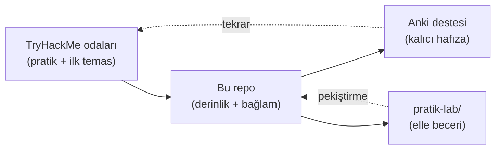

# 🗺️ Yol Haritası (Roadmap)

Bu belge, deponun modüllerini önerilen okuma sırasıyla, tahmini sürelerle ve TryHackMe **Pre Security** / **Cyber Security 101** path'leriyle eşleştirir. Repo bağımsız da okunabilir, TryHackMe ile paralel de takip edilebilir.

> Genel kullanım kılavuzu için önce [00-baslangic/nasil-calisilir.md](00-baslangic/nasil-calisilir.md)'yi oku.

---

## Önerilen okuma sırası ve tahmini süre

| # | Modül | Tahmini süre | Öncelik |
|---|-------|:---:|:---:|
| 00 | [Başlangıç](00-baslangic/bilgisayar-temelleri.md) | 3-4 saat | Temel |
| 01 | [Ağ (Networking)](01-ag-networking/temel-kavramlar.md) | 10-14 saat | ⭐ Yüksek |
| 02 | [Linux & Windows](02-linux-windows/linux-temelleri.md) | 8-10 saat | Temel |
| 03 | [OS İç Yapısı](03-isletim-sistemi-ici/surecler-ve-bellek.md) | 4-6 saat | Temel |
| 04 | [Web Güvenliği](04-web-guvenligi/web-mimarisi.md) | 12-16 saat | Temel |
| 05 | [Kriptografi](05-kriptografi/temel-kavramlar.md) | 10-14 saat | ⭐⭐ En Yüksek |
| 06 | [IAM](06-kimlik-erisim-yonetimi-iam/aaa-ve-mfa.md) | 6-8 saat | Temel |
| 07 | [Tehdit Modelleme](07-tehdit-modelleme-cerceveler/mitre-attck.md) | 5-7 saat | Temel |
| 08 | [GRC](08-grc-yonetisim-risk-uyum/guvenlik-kontrolleri-matrisi.md) | 6-8 saat | Temel |
| 09 | [Cloud & Sanallaştırma](09-cloud-virtualizasyon/temel-kavramlar.md) | 4-6 saat | Temel |
| 10 | [Pentest Metodolojisi](10-pentest-metodolojisi/metodoloji-ve-rules-of-engagement.md) | 8-10 saat | Temel |
| 11 | [SOC / Mavi Takım](11-soc-mavi-takim/siem-edr-soar.md) | 6-8 saat | Temel |
| 12 | [Sosyal Mühendislik](12-sosyal-muhendislik-phishing/phishing-analizi.md) | 3-4 saat | Temel |
| 13 | [Güvenli Kodlama & DevSecOps](13-guvenli-kodlama-devsecops/guvenli-kodlama-ilkeleri.md) | 4-6 saat | Temel |
| 14 | [Scripting & Otomasyon](14-scripting-otomasyon/python-guvenlik-icin.md) | 6-8 saat | Temel |
| 15 | [Projeler](15-projeler/proje-onerileri.md) | Sürekli | Uygulama |

**Toplam tahmini süre:** ~95-135 saat (yoğunluğa göre 2-4 ay, haftada 8-10 saat ile).

> ⭐ İki dosya en yüksek önceliklidir ve en derin işlenmiştir: [subnetting-cidr.md](01-ag-networking/subnetting-cidr.md) (elle pratik) ve [post-kuantum-kriptografi.md](05-kriptografi/post-kuantum-kriptografi.md) (kariyer hedefi).

---

## TryHackMe Path Eşlemesi

### Pre Security path ↔ Repo modülleri

| TryHackMe Pre Security konusu | Karşılık gelen repo modülü |
|-------------------------------|----------------------------|
| How the Web Works | [01-ag/http-web-iletisimi.md](01-ag-networking/http-web-iletisimi.md) |
| Networking (OSI, TCP/IP, subnetting) | [01-ag-networking/](01-ag-networking/temel-kavramlar.md) (tamamı) |
| Linux Fundamentals | [02-linux-windows/linux-temelleri.md](02-linux-windows/linux-temelleri.md) |
| Windows Fundamentals | [02-linux-windows/windows-temelleri.md](02-linux-windows/windows-temelleri.md) |
| Cryptography Basics | [05-kriptografi/temel-kavramlar.md](05-kriptografi/temel-kavramlar.md) |

### Cyber Security 101 path ↔ Repo modülleri

| TryHackMe CS101 konusu | Karşılık gelen repo modülü |
|--------------------------|----------------------------|
| Cyber Security Introduction | [00-baslangic/](00-baslangic/nasil-calisilir.md) |
| Offensive Security Intro | [10-pentest-metodolojisi/](10-pentest-metodolojisi/metodoloji-ve-rules-of-engagement.md) |
| Defensive Security Intro | [11-soc-mavi-takim/](11-soc-mavi-takim/siem-edr-soar.md) |
| Web Hacking Fundamentals | [04-web-guvenligi/](04-web-guvenligi/owasp-top10-tam-rehber.md) |
| Burp Suite | [04-web-guvenligi/burp-suite-rehberi.md](04-web-guvenligi/burp-suite-rehberi.md) |
| Network Security | [01-ag-networking/routing-nat-vpn.md](01-ag-networking/routing-nat-vpn.md) |
| Cryptography | [05-kriptografi/](05-kriptografi/anahtar-degisimi-ve-imza.md) |
| GRC / Governance | [08-grc-yonetisim-risk-uyum/](08-grc-yonetisim-risk-uyum/cerceveler-nist-iso.md) |
| SOC Level 1 | [11-soc-mavi-takim/](11-soc-mavi-takim/log-analizi.md) |

### "Spesifikleşme öncesi ortak çekirdek" ekstra modülleri (THM path'lerinin ötesinde)

Bu repo, THM path'lerinin kapsamadığı ama derinlemesine bir temel için gerekli gördüğüm konuları da ekler:
- [03-isletim-sistemi-ici](03-isletim-sistemi-ici/surecler-ve-bellek.md) — OS internals derinliği
- [06-kimlik-erisim-yonetimi-iam](06-kimlik-erisim-yonetimi-iam/federasyon-sso.md) — OAuth/OIDC/SAML/Zero Trust
- [07-tehdit-modelleme-cerceveler](07-tehdit-modelleme-cerceveler/mitre-attck.md) — MITRE ATT&CK, Kill Chain
- [09-cloud-virtualizasyon](09-cloud-virtualizasyon/temel-kavramlar.md) — Bulut/konteyner güvenliği
- [13-guvenli-kodlama-devsecops](13-guvenli-kodlama-devsecops/guvenli-kodlama-ilkeleri.md) — Güvenli kodlama, DevSecOps
- [14-scripting-otomasyon](14-scripting-otomasyon/python-guvenlik-icin.md) — Python/Bash/Regex/Git
- [05-kriptografi/post-kuantum-kriptografi.md](05-kriptografi/post-kuantum-kriptografi.md) — PQC (kariyer hedefime özel derinlik)

---

## Paralel çalışma modeli

Önerilen döngü: Bir THM odasını çöz → ilgili repo dosyasını oku (bağlamı derinleştir) → Anki'ye yeni kart ekle (varsa yeni izole gerçek) → repo'nun `pratik-lab/`'ında elle uygula.

---

## Sonraki adım

Yol haritasını okudun. Şimdi [00-baslangic/nasil-calisilir.md](00-baslangic/nasil-calisilir.md) ile başla veya doğrudan [README.md](README.md)'deki ilerleme tablosundan bir modül seç.
